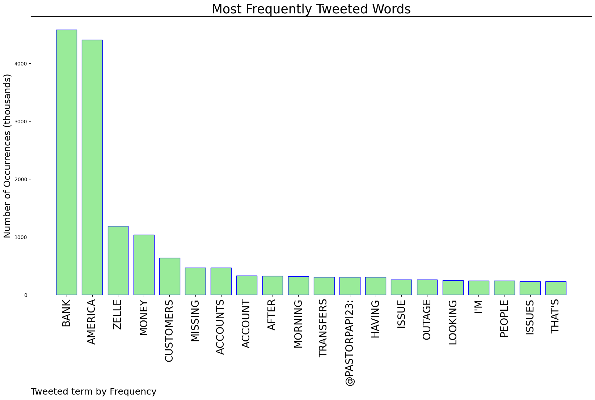
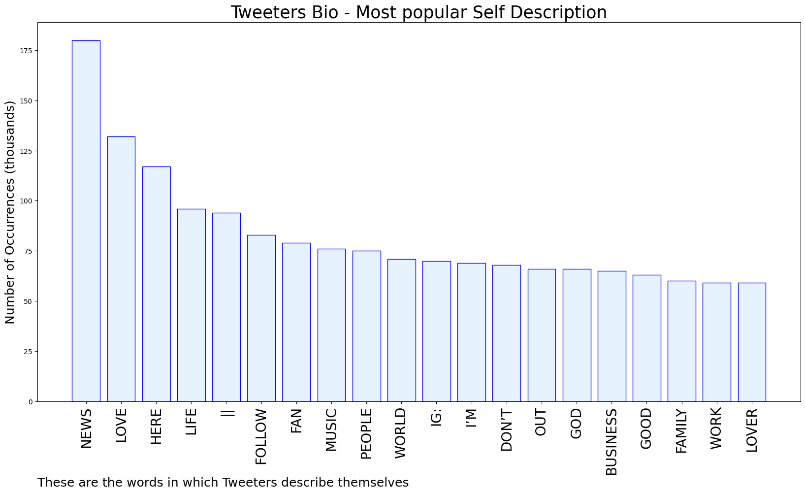

# MURCHIE85 TWITTER PROCESSING 
&#x1F34E; **TOPIC = "Bank of America"**

## AUTOMATED RESEARCH SUMMARY

*note: Image pulled from web automatically, not connected to author.
  
<b> This report is AUTOMATED and not hand crafted, it is designed for pulling metrics on a given keyword or hashtag and performs a series of reporting and analysis.</b>

|                **Sample-Tweets**        |
| :-------------: |
| RT @RiOTcomedy: Bank of America to their customers #boa https://t.co/OrjgjUiUL3 |
| Bank of America trending for something bad? Noooo can’t be. Not the same place that wouldn’t allow me to deposit cash 🤦🏾‍♂️ |
| RT @GNCordova: So, I woke up to find hella Zelle deposits missing from my Bank of America account. When I called customer service they said… |

The most popular user is: **Dontjackkthat**

 RT @GRDecter: Bank of America just posted a $1.1 billion provision for credit losses

JP Morgan’s was $2.3 billion

This is a very bad sign…

## RELATED METRICS 
| Metric | Value |
| ------------- | ------------- |
| #1 Most tweeted to  | **pastorpapi23** |
| #2 Most tweeted to  | **Feven_Kay** |
| #3 Most tweeted to  | **thePLAINESTjane** |
| NewProfiles (less than 10 days) | 0.34%  |
| Tweeters with < 10 followers  | 3.22%|
| Tweeters with > 1000000 followers  | 0.18%  |

## MOST POPULAR TWEET TERMS 

| Popularity Rank  | Term |
| ------------- | ------------- |
| first  | **BANK**  |
| second  | **AMERICA**  |
| third  | **ZELLE** |
| fourth  | **MONEY**  |
| fifth  | **CUSTOMERS**  |

## Twitter Bio Analysis
### SENTIMENT ANALYSIS

VIEWS WERE : **SUBJECTIVE**  (26.67%) & **NEGATIVELY-SUBJECTIVE** (26.67%) **OBJECTIVE** (46.67%)

### TWEET SAMPLE 
| Random value picked from array |
| ------------- |
|RT @BankBetterGuy: “Bank of America referred all questions to Zelle”A Zelle spokesperson said “Customers should refer to the bank if they… |

### MOST RETWEETED 

| The most retweeted user is: **Dontjackkthat**  |
| ------------- |
| RT @GRDecter: Bank of America just posted a $1.1 billion provision for credit lossesJP Morgan’s was $2.3 billionThis is a very bad sign… |

### CONCLUSION & EXTERNAL ANALYSIS

*This is my [Adam McMurchie`s] opinion on the data from the tweets, it serves as no objective truth.Since the tweets themselves are a mixture of fact & opinion. 
Authors analytical summary on request.
**RECOMMENDATIONS** WILL BE UPDATED IN NEXT  24 HOURS  