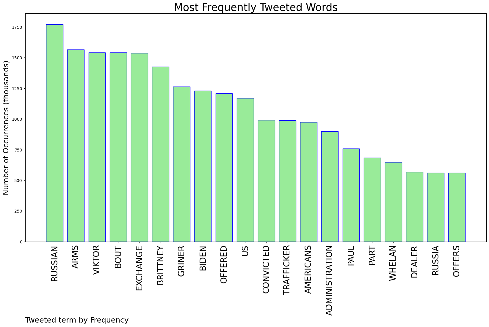
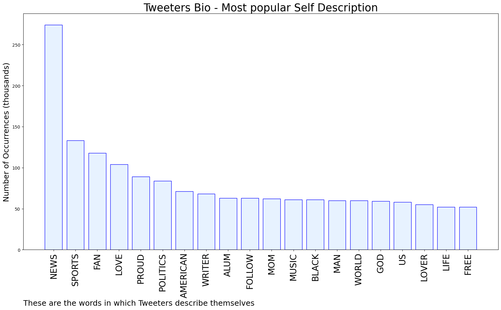

# MURCHIE85 TWITTER PROCESSING 
&#x1F34E; **TOPIC = "Paul Whelan"**

## AUTOMATED RESEARCH SUMMARY

*note: Image pulled from web automatically, not connected to author.
  
<b> This report is AUTOMATED and not hand crafted, it is designed for pulling metrics on a given keyword or hashtag and performs a series of reporting and analysis.</b>

|                **Sample-Tweets**        |
| :-------------: |
| RT @AP: The Biden administration has offered a deal to Russia aimed at bringing home WNBA star Brittney Griner and another jailed American… |
| RT @NishScott_Ham: “the Biden administration has offered to exchange Viktor Bout, a convicted Russian arms trafficker serving a 25-year US… |
| Trevor Reed says White House is 'not doing enough' to bring Brittney Griner and Paul Whelan home - NBC News https://t.co/s79Jcuf2oZ |

The most popular user is: **ws_whelan**

 RT @UncvrngTheTruth: Let’s set the record straight. Marjorie Taylor Greene spoke at a Neo-Nazi convention because she is a Nazi. Paul Gosar…

## RELATED METRICS 
| Metric | Value |
| ------------- | ------------- |
| #1 Most tweeted to  | **BleacherReport** |
| #2 Most tweeted to  | **cnnbrk** |
| #3 Most tweeted to  | **NatSecCNN** |
| NewProfiles (less than 10 days) | 0.38%  |
| Tweeters with < 10 followers  | 2.74%|
| Tweeters with > 1000000 followers  | 0.93%  |

## MOST POPULAR TWEET TERMS 

| Popularity Rank  | Term |
| ------------- | ------------- |
| first  | **RUSSIAN**  |
| second  | **ARMS**  |
| third  | **VIKTOR** |
| fourth  | **BOUT**  |
| fifth  | **EXCHANGE**  |

## Twitter Bio Analysis
### SENTIMENT ANALYSIS

VIEWS WERE : **SUBJECTIVE**  (6.67%) & **NEGATIVELY-SUBJECTIVE** (0.0%) **OBJECTIVE** (93.33%)

### TWEET SAMPLE 
| Random value picked from array |
| ------------- |
|RT @Phil_Lewis_: WASHINGTON (AP) — Blinken says US has made substantial offer to Russia for release of American detainees Paul Whelan and B… |

### MOST RETWEETED 

| The most retweeted user is: **ws_whelan**  |
| ------------- |
| RT @UncvrngTheTruth: Let’s set the record straight. Marjorie Taylor Greene spoke at a Neo-Nazi convention because she is a Nazi. Paul Gosar… |

### CONCLUSION & EXTERNAL ANALYSIS

*This is my [Adam McMurchie`s] opinion on the data from the tweets, it serves as no objective truth.Since the tweets themselves are a mixture of fact & opinion. 
Authors analytical summary on request.
**RECOMMENDATIONS** WILL BE UPDATED IN NEXT  24 HOURS  