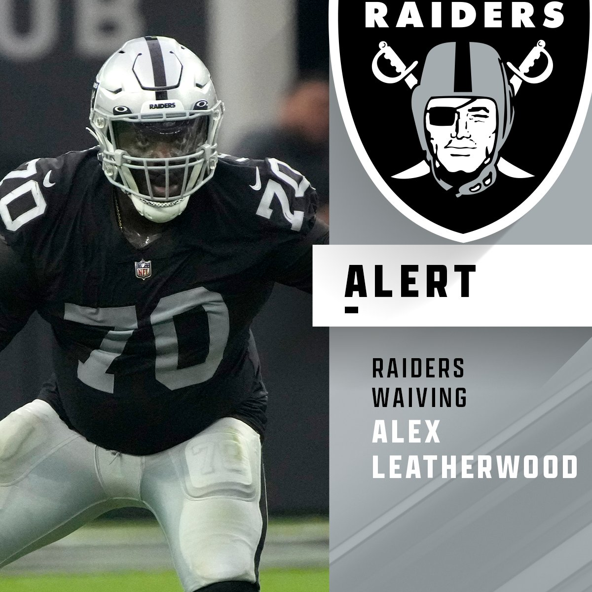
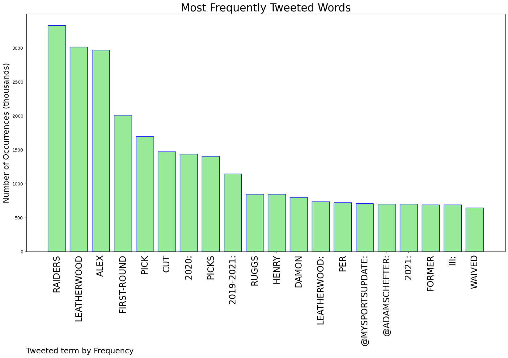
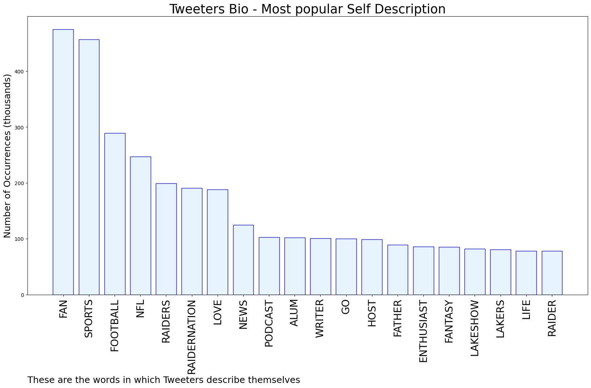

# MURCHIE85 TWITTER PROCESSING 
&#x1F34E; **TOPIC = "Leatherwood"**

## AUTOMATED RESEARCH SUMMARY

*note: Image pulled from web automatically, not connected to author.
  
<b> This report is AUTOMATED and not hand crafted, it is designed for pulling metrics on a given keyword or hashtag and performs a series of reporting and analysis.</b>

|                **Sample-Tweets**        |
| :-------------: |
| RT @nflrums: #Raiders first-round picks from Mike Mayock2021: Alex Leatherwood: Released2020: Henry Ruggs III: Released2020: Damon Arne… |
| RT @MySportsUpdate: The #Raiders are releasing OT Alex Leatherwood, the 17th overall pick in last year’s draft, per @AdamSchefter. New regi… |
| RT @FieldYates: Raiders first-round picks from 2019-2021:2019: DE Clelin Ferrell, RB Josh Jacobs and S Jonathan Abram: 5th-year options… |

The most popular user is: **Austin_DeLeon77**

 RT @AdamSchefter: Raiders waived former first-round pick Alex Leatherwood, per source.

## RELATED METRICS 
| Metric | Value |
| ------------- | ------------- |
| #1 Most tweeted to  | **AdamSchefter** |
| #2 Most tweeted to  | **MySportsUpdate** |
| #3 Most tweeted to  | **FieldYates** |
| NewProfiles (less than 10 days) | 0.42%  |
| Tweeters with < 10 followers  | 3.2%|
| Tweeters with > 1000000 followers  | 0.16%  |

## MOST POPULAR TWEET TERMS 

| Popularity Rank  | Term |
| ------------- | ------------- |
| first  | **RAIDERS**  |
| second  | **LEATHERWOOD**  |
| third  | **ALEX** |
| fourth  | **FIRST-ROUND**  |
| fifth  | **PICK**  |

## Twitter Bio Analysis
### SENTIMENT ANALYSIS

VIEWS WERE : **SUBJECTIVE**  (20.0%) & **NEGATIVELY-SUBJECTIVE** (6.67%) **OBJECTIVE** (73.33%)

### TWEET SAMPLE 
| Random value picked from array |
| ------------- |
|RT @NFL: Raiders waiving 2021 1st-round pick Alex Leatherwood. (via @TomPelissero) https://t.co/6dTwqQo3ZM |

### MOST RETWEETED 

| The most retweeted user is: **Austin_DeLeon77**  |
| ------------- |
| RT @AdamSchefter: Raiders waived former first-round pick Alex Leatherwood, per source. |

### CONCLUSION & EXTERNAL ANALYSIS

*This is my [Adam McMurchie`s] opinion on the data from the tweets, it serves as no objective truth.Since the tweets themselves are a mixture of fact & opinion. 
Authors analytical summary on request.
**RECOMMENDATIONS** WILL BE UPDATED IN NEXT  24 HOURS  