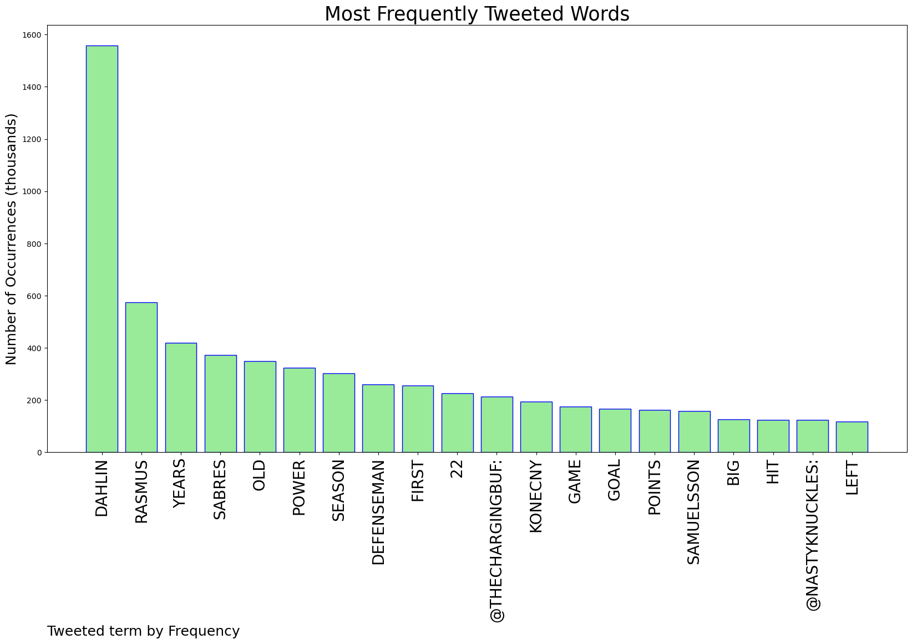
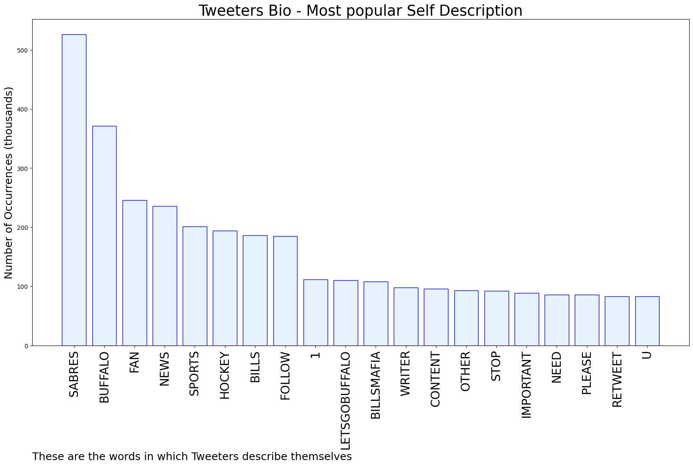

# MURCHIE85 TWITTER PROCESSING 
&#x1F34E; **TOPIC = "Dahlin"**

## AUTOMATED RESEARCH SUMMARY

*note: Image pulled from web automatically, not connected to author.
  
<b> This report is AUTOMATED and not hand crafted, it is designed for pulling metrics on a given keyword or hashtag and performs a series of reporting and analysis.</b>

|                **Sample-Tweets**        |
| :-------------: |
| RT @Highpresshockey: The Rasmus Dahlin special https://t.co/PZxOZD5J0M |
| RT @TheChargingBUF: Rasmus Dahlin has taken his game to another level this season. He is now the first #Sabres defenseman to hit 50+ poin… |
| RT @SabresPR: Rasmus Dahlin's goal tonight is his 11th of the season. It's the most goals a Sabres defenseman has scored in a single season… |

The most popular user is: **ally_dahlin**

 RT @ClimateHuman: I'm grateful we tried. Man, oh, man, did we try. https://t.co/TlYrwwGB8v

## RELATED METRICS 
| Metric | Value |
| ------------- | ------------- |
| #1 Most tweeted to  | **TheChargingBUF** |
| #2 Most tweeted to  | **NastyKnuckles** |
| #3 Most tweeted to  | **BuffaloSabres** |
| NewProfiles (less than 10 days) | 0.21%  |
| Tweeters with < 10 followers  | 3.05%|
| Tweeters with > 1000000 followers  | 0.13%  |

## MOST POPULAR TWEET TERMS 

| Popularity Rank  | Term |
| ------------- | ------------- |
| first  | **DAHLIN**  |
| second  | **RASMUS**  |
| third  | **YEARS** |
| fourth  | **SABRES**  |
| fifth  | **OLD**  |

## Twitter Bio Analysis
### SENTIMENT ANALYSIS

VIEWS WERE : **SUBJECTIVE**  (26.67%) & **NEGATIVELY-SUBJECTIVE** (0.0%) **OBJECTIVE** (73.33%)

### TWEET SAMPLE 
| Random value picked from array |
| ------------- |
|RT @PR_NHL: Rasmus Dahlin is the first @BuffaloSabres defenseman in 26 years to record 50 points in a season.#NHLStats: https://t.co/Nx7m… |

### MOST RETWEETED 

| The most retweeted user is: **ally_dahlin**  |
| ------------- |
| RT @ClimateHuman: I'm grateful we tried. Man, oh, man, did we try. https://t.co/TlYrwwGB8v |

### CONCLUSION & EXTERNAL ANALYSIS

*This is my [Adam McMurchie`s] opinion on the data from the tweets, it serves as no objective truth.Since the tweets themselves are a mixture of fact & opinion. 
Authors analytical summary on request.
**RECOMMENDATIONS** WILL BE UPDATED IN NEXT  24 HOURS  