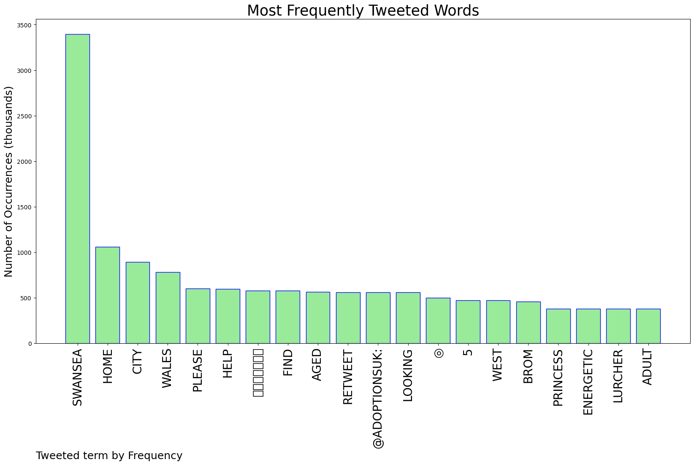
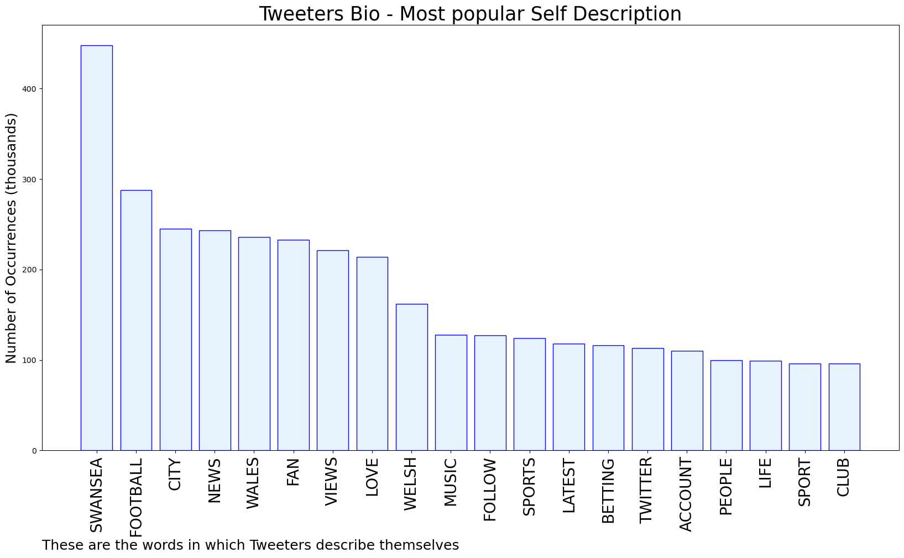

# MURCHIE85 TWITTER PROCESSING 
&#x1F34E; **TOPIC = "Swansea"**

## AUTOMATED RESEARCH SUMMARY

*note: Image pulled from web automatically, not connected to author.
  
<b> This report is AUTOMATED and not hand crafted, it is designed for pulling metrics on a given keyword or hashtag and performs a series of reporting and analysis.</b>

|                **Sample-Tweets**        |
| :-------------: |
| RT @UpdateBolabola: Starting XI IPSWICH U23 vs Swansea City U23Hayes, Stewart, Elkan Baggott (C), Armin, Vincent-Young, El Mizouni, Humph… |
| RT @Squawka: The last 10 League Cup winners:◎ 2012: Liverpool◉ 2013: Swansea City◎ 2014: Man City◎ 2015: Chelsea◎ 2016: Man City◎ 20… |
| RT @AdoptionsUk: Please retweet to help Princess find a home #SWANSEA #WALES 🏴󠁧󠁢󠁷󠁬󠁳󠁿Energetic Lurcher aged 5, looking for an adult home to… |

The most popular user is: **swansea_sia**

 RT @kingbealestreet: SPEAK! 🗣🗣 https://t.co/AvtpbAzYmU

## RELATED METRICS 
| Metric | Value |
| ------------- | ------------- |
| #1 Most tweeted to  | **AdoptionsUk** |
| #2 Most tweeted to  | **SportySuz21** |
| #3 Most tweeted to  | **SwansOfficial** |
| NewProfiles (less than 10 days) | 0.56%  |
| Tweeters with < 10 followers  | 4.16%|
| Tweeters with > 1000000 followers  | 0.16%  |

## MOST POPULAR TWEET TERMS 

| Popularity Rank  | Term |
| ------------- | ------------- |
| first  | **SWANSEA**  |
| second  | **HOME**  |
| third  | **CITY** |
| fourth  | **WALES**  |
| fifth  | **PLEASE**  |

## Twitter Bio Analysis
### SENTIMENT ANALYSIS

VIEWS WERE : **SUBJECTIVE**  (40.0%) & **NEGATIVELY-SUBJECTIVE** (6.67%) **OBJECTIVE** (53.33%)

### TWEET SAMPLE 
| Random value picked from array |
| ------------- |
|RT @SwanseaCityLive: Swansea City headlines as Martin 'has what it takes' to get club to Premier League and surprise name makes team of tou… |

### MOST RETWEETED 

| The most retweeted user is: **swansea_sia**  |
| ------------- |
| RT @kingbealestreet: SPEAK! 🗣🗣 https://t.co/AvtpbAzYmU |

### CONCLUSION & EXTERNAL ANALYSIS

*This is my [Adam McMurchie`s] opinion on the data from the tweets, it serves as no objective truth.Since the tweets themselves are a mixture of fact & opinion. 
Authors analytical summary on request.
**RECOMMENDATIONS** WILL BE UPDATED IN NEXT  24 HOURS  