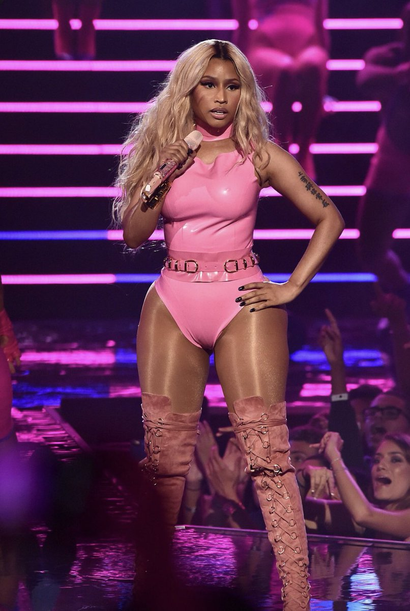
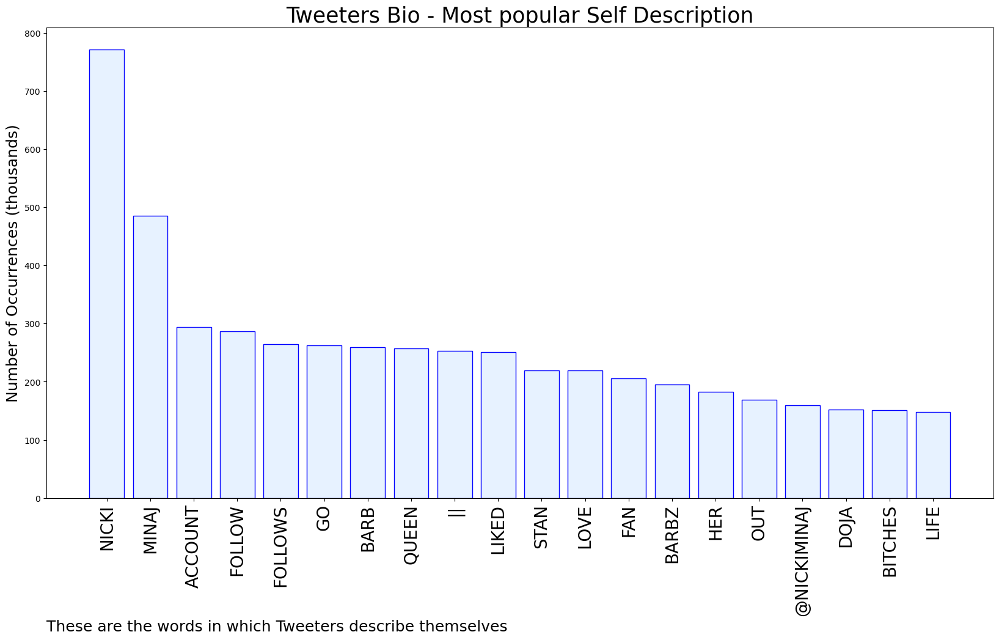

# MURCHIE85 TWITTER PROCESSING 
&#x1F34E; **TOPIC = "NICKI WEEK"**

## AUTOMATED RESEARCH SUMMARY

*note: Image pulled from web automatically, not connected to author.
  
<b> This report is AUTOMATED and not hand crafted, it is designed for pulling metrics on a given keyword or hashtag and performs a series of reporting and analysis.</b>

|                **Sample-Tweets**        |
| :-------------: |
| @flyneworleans Nicki Week |
| RT @YoungMoneySite: NICKI WEEK |
| @DONBAWBIE NICKI WEEK 6 |

The most popular user is: **nicki_millie**

 RT @chartdata: .@NICKIMINAJ's 'Beam Me Up Scotty' re-enters this week's Billboard 200.

## RELATED METRICS 
| Metric | Value |
| ------------- | ------------- |
| #1 Most tweeted to  | **YoungMoneySite** |
| #2 Most tweeted to  | **QCWorldwide** |
| #3 Most tweeted to  | **nickistreamteam** |
| NewProfiles (less than 10 days) | 2.48%  |
| Tweeters with < 10 followers  | 3.72%|
| Tweeters with > 1000000 followers  | 0.0%  |

## MOST POPULAR TWEET TERMS 

| Popularity Rank  | Term |
| ------------- | ------------- |
| first  | **NICKI**  |
| second  | **WEEK**  |
| third  | **WEEKRT** |
| fourth  | **“NICKI**  |
| fifth  | **WEEK”**  |

## Twitter Bio Analysis
### SENTIMENT ANALYSIS

VIEWS WERE : **SUBJECTIVE**  (6.67%) & **NEGATIVELY-SUBJECTIVE** (0.0%) **OBJECTIVE** (93.33%)

### TWEET SAMPLE 
| Random value picked from array |
| ------------- |
|RT @QCWorldwide: Nicki Week is currently trending #8 Worldwide. https://t.co/tZbMEbfdwa |

### MOST RETWEETED 

| The most retweeted user is: **nicki_millie**  |
| ------------- |
| RT @chartdata: .@NICKIMINAJ's 'Beam Me Up Scotty' re-enters this week's Billboard 200. |

### CONCLUSION & EXTERNAL ANALYSIS

*This is my [Adam McMurchie`s] opinion on the data from the tweets, it serves as no objective truth.Since the tweets themselves are a mixture of fact & opinion. 
Authors analytical summary on request.
**RECOMMENDATIONS** WILL BE UPDATED IN NEXT  24 HOURS  