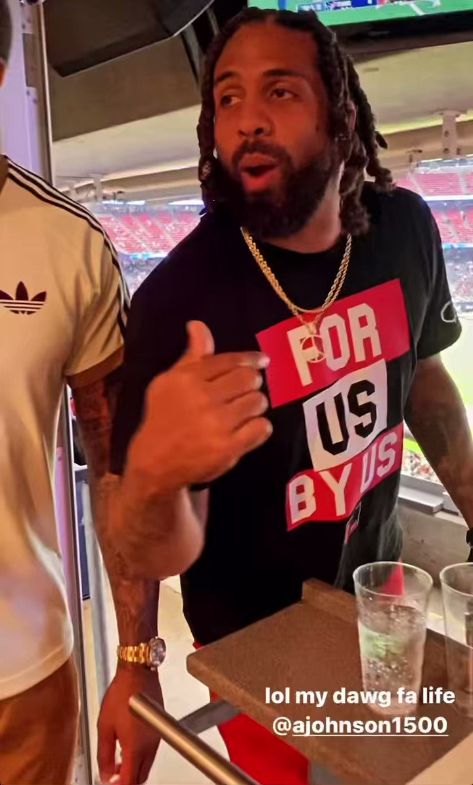
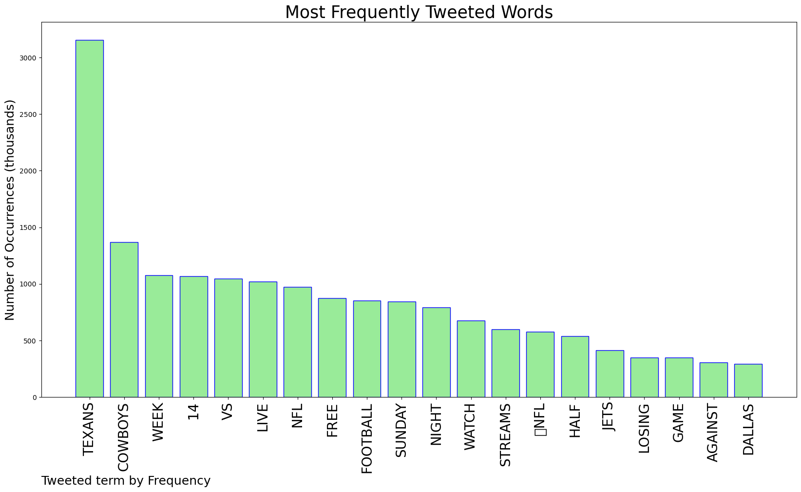
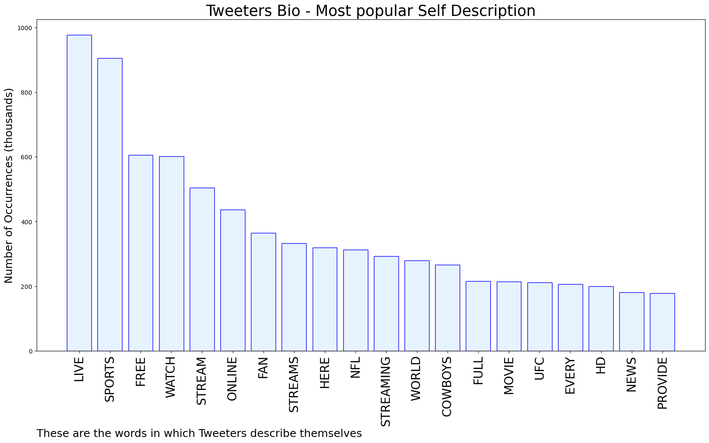
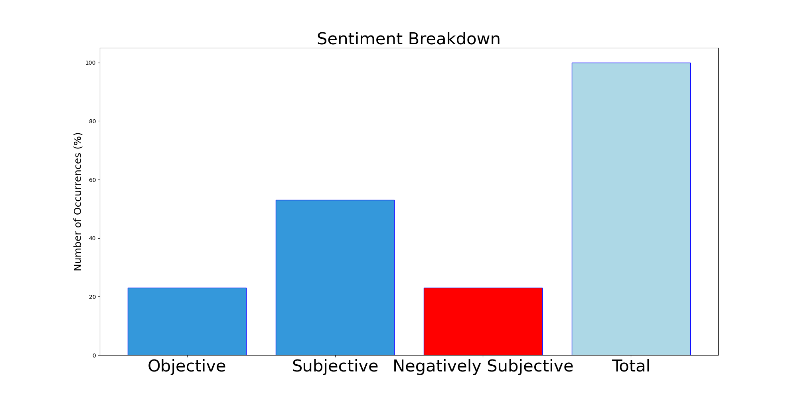

# MURCHIE85 TWITTER PROCESSING 
&#x1F34E; **TOPIC = "Texans"**

## AUTOMATED RESEARCH SUMMARY

*note: Image pulled from web automatically, not connected to author.
  
<b> This report is AUTOMATED and not hand crafted, it is designed for pulling metrics on a given keyword or hashtag and performs a series of reporting and analysis.</b>

|                **Sample-Tweets**        |
| :-------------: |
| RT @reddit2streams: 🔴NFL Week 14 Live📺@nfl_streams_ Watch NFL Sunday Night Football Week 14 Live Streams Free🔴NFL TV📺@nfl_streams_ Je… |
| Who had #Texans 1H? |
| RT @NFLonFOX: The Texans retake the lead over the Cowboys! 👏(via @NFL)https://t.co/UealhWCsLm |

The most popular user is: **Alpha_Animosity**

 RT @RoobNBCS: TDs after halftime allowed by Eagles' defense last 6 games:

0 … Steelers 
0 … Texans 
0 … Commanders
0 … Colts
1 … Packers
0…

## RELATED METRICS 
| Metric | Value |
| ------------- | ------------- |
| #1 Most tweeted to  | **nfl_streams_** |
| #2 Most tweeted to  | **reddit2streams** |
| #3 Most tweeted to  | **nflstreamshdnow** |
| NewProfiles (less than 10 days) | 1.78%  |
| Tweeters with < 10 followers  | 6.66%|
| Tweeters with > 1000000 followers  | 0.04%  |

## MOST POPULAR TWEET TERMS 

| Popularity Rank  | Term |
| ------------- | ------------- |
| first  | **TEXANS**  |
| second  | **COWBOYS**  |
| third  | **WEEK** |
| fourth  | **14**  |
| fifth  | **VS**  |

## Twitter Bio Analysis
### SENTIMENT ANALYSIS

VIEWS WERE : **SUBJECTIVE**  (53.85%) & **NEGATIVELY-SUBJECTIVE** (23.08%) **OBJECTIVE** (23.08%)

### TWEET SAMPLE 
| Random value picked from array |
| ------------- |
|We look like we spent way too much time courting OBJ instead for focusing on the Texans  smh!! Losing to the Texans |

### MOST RETWEETED 

| The most retweeted user is: **Alpha_Animosity**  |
| ------------- |
| RT @RoobNBCS: TDs after halftime allowed by Eagles' defense last 6 games:0 … Steelers 0 … Texans 0 … Commanders0 … Colts1 … Packers0… |

### CONCLUSION & EXTERNAL ANALYSIS

*This is my [Adam McMurchie`s] opinion on the data from the tweets, it serves as no objective truth.Since the tweets themselves are a mixture of fact & opinion. 
Authors analytical summary on request.
**RECOMMENDATIONS** WILL BE UPDATED IN NEXT  24 HOURS  