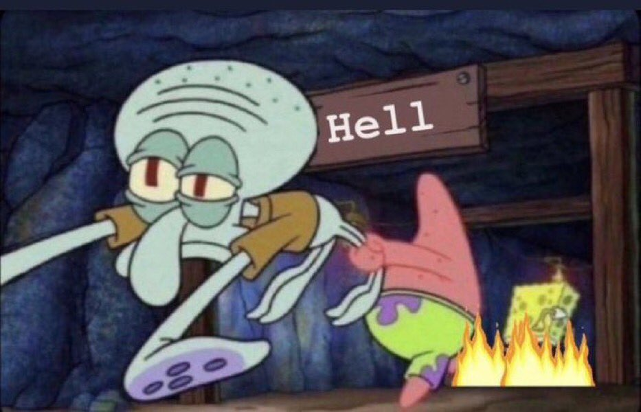
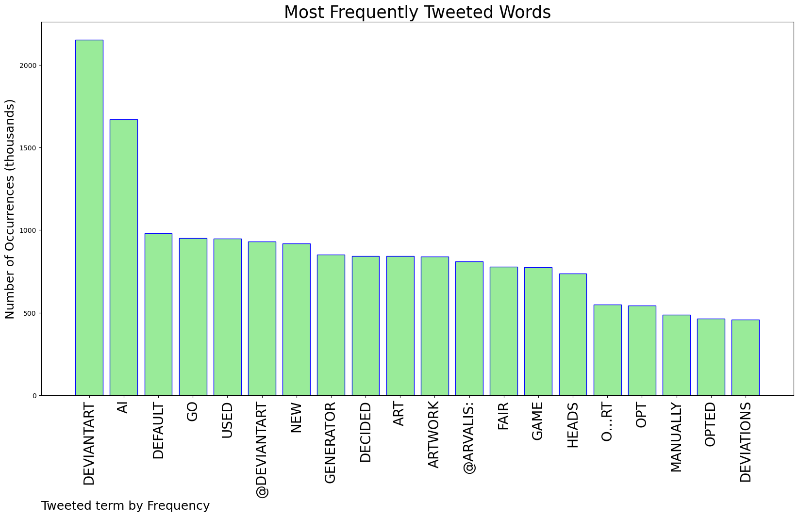
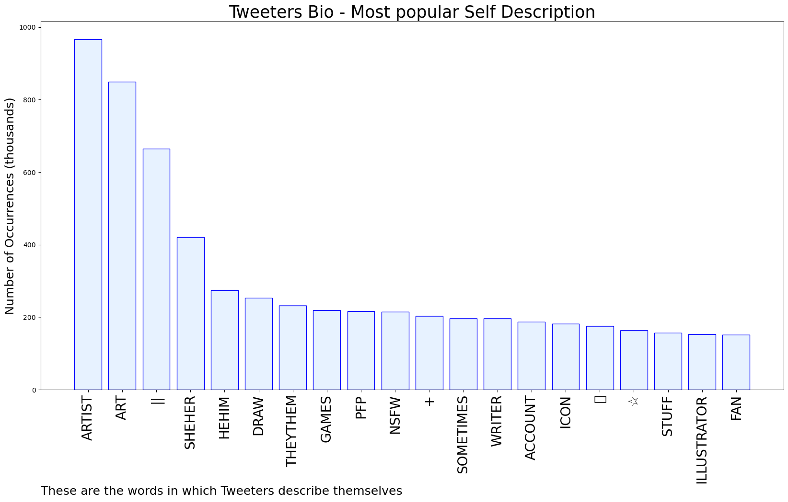

# MURCHIE85 TWITTER PROCESSING 
&#x1F34E; **TOPIC = "DeviantArt"**

## AUTOMATED RESEARCH SUMMARY

*note: Image pulled from web automatically, not connected to author.
  
<b> This report is AUTOMATED and not hand crafted, it is designed for pulling metrics on a given keyword or hashtag and performs a series of reporting and analysis.</b>

|                **Sample-Tweets**        |
| :-------------: |
| Just when you think that you might be able to find safety on one platform, you end up having the rug pulled out for… https://t.co/xJR2a54xW8 |
| oh cool! https://t.co/NGMqFZyebb |
| @E_Aria_Eia @ItsGreliz @endwa1ker @DeviantArt yes - deviations uploaded to DA are already *NOT* included in the dat… https://t.co/b2zcjnEJpi |

The most popular user is: **TimetoDream4**

 RT @arvalis: DeviantArt has decided your artwork there is fair game to be used in their new AI generator by default. You have to go to an o…

## RELATED METRICS 
| Metric | Value |
| ------------- | ------------- |
| #1 Most tweeted to  | **DeviantArt** |
| #2 Most tweeted to  | **arvalis** |
| #3 Most tweeted to  | **IanFayArt** |
| NewProfiles (less than 10 days) | 0.32%  |
| Tweeters with < 10 followers  | 1.88%|
| Tweeters with > 1000000 followers  | 0.0%  |

## MOST POPULAR TWEET TERMS 

| Popularity Rank  | Term |
| ------------- | ------------- |
| first  | **DEVIANTART**  |
| second  | **AI**  |
| third  | **DEFAULT** |
| fourth  | **GO**  |
| fifth  | **USED**  |

## Twitter Bio Analysis
### SENTIMENT ANALYSIS

VIEWS WERE : **SUBJECTIVE**  (46.67%) & **NEGATIVELY-SUBJECTIVE** (13.33%) **OBJECTIVE** (40.0%)

### TWEET SAMPLE 
| Random value picked from array |
| ------------- |
|RT @IanFayArt: Heads up, DeviantArt turned heel and as far as i can tell all of your existing deviations will have to be manually opted out… |

### MOST RETWEETED 

| The most retweeted user is: **TimetoDream4**  |
| ------------- |
| RT @arvalis: DeviantArt has decided your artwork there is fair game to be used in their new AI generator by default. You have to go to an o… |

### CONCLUSION & EXTERNAL ANALYSIS

*This is my [Adam McMurchie`s] opinion on the data from the tweets, it serves as no objective truth.Since the tweets themselves are a mixture of fact & opinion. 
Authors analytical summary on request.
**RECOMMENDATIONS** WILL BE UPDATED IN NEXT  24 HOURS  