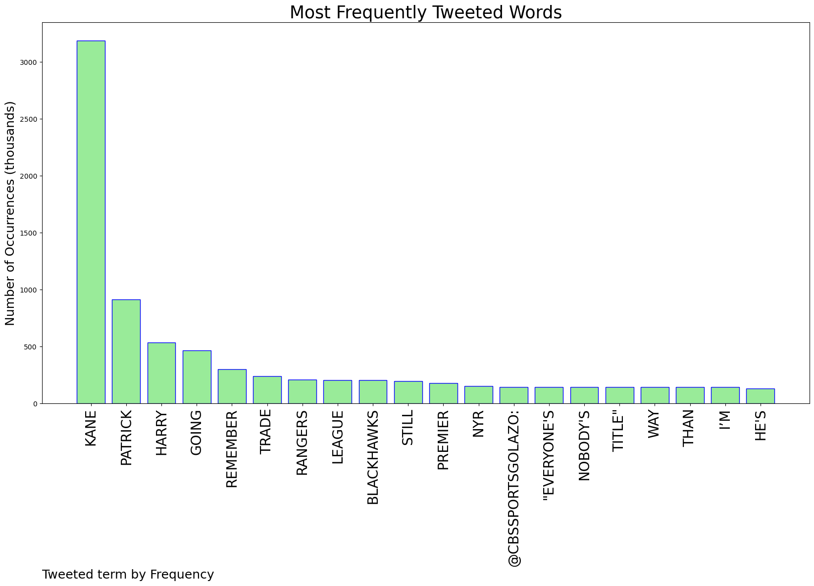
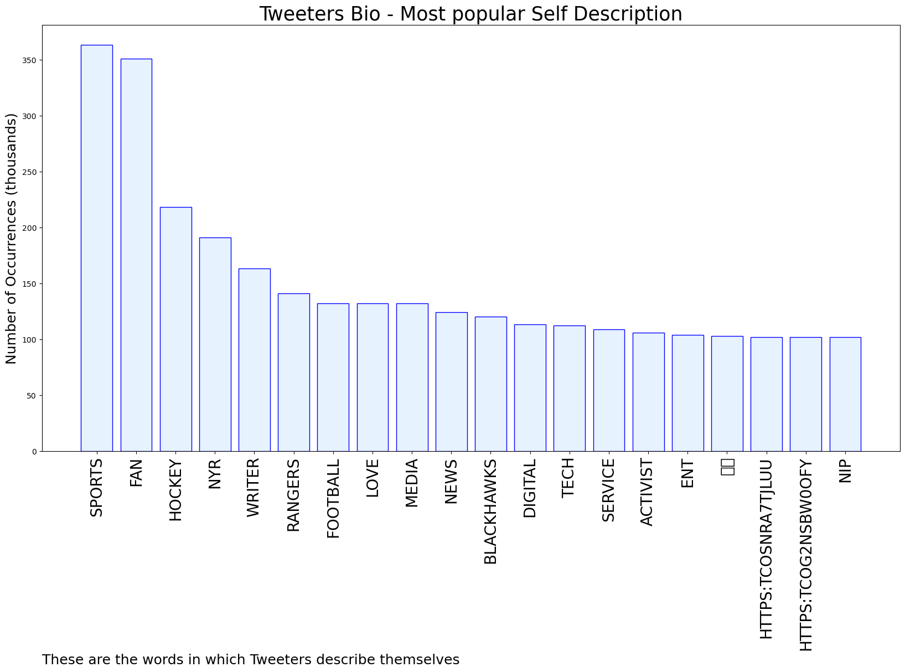

# MURCHIE85 TWITTER PROCESSING 
&#x1F34E; **TOPIC = "Kane"**

## AUTOMATED RESEARCH SUMMARY

*note: Image pulled from web automatically, not connected to author.
  
<b> This report is AUTOMATED and not hand crafted, it is designed for pulling metrics on a given keyword or hashtag and performs a series of reporting and analysis.</b>

|                **Sample-Tweets**        |
| :-------------: |
| RT @JLazzy23: “So now Kane is recalibrating again. I believe he's asked to explore if going to the Rangers is still an option. It's not imp… |
| RT @timandfriends: "Dog 💩 saves Stuey." First win in a month for Stuart Skinner but Evander Kane won't let him enjoy it 🤣 #LetsGoOilers @… |
| OFFICIALS for tonight's contest vs Erie R - Mike Marley,  Brendan Kane, L - Justin Herrington, Nick Arcan, https://t.co/MbueweXB0I |

The most popular user is: **kane_rep**

 RT @IHayato: 🔥🔥🔥MASSIVE FREEMINT🔥🔥🔥

#CNP , No.1 project in Japan, will hold its largest-ever FREEMINT!

☑ Follow @cnp_en @ihayato
☑ Like a…

## RELATED METRICS 
| Metric | Value |
| ------------- | ------------- |
| #1 Most tweeted to  | **JLazzy23** |
| #2 Most tweeted to  | **CBSSportsGolazo** |
| #3 Most tweeted to  | **MicahRichards** |
| NewProfiles (less than 10 days) | 0.28%  |
| Tweeters with < 10 followers  | 7.44%|
| Tweeters with > 1000000 followers  | 0.04%  |

## MOST POPULAR TWEET TERMS 

| Popularity Rank  | Term |
| ------------- | ------------- |
| first  | **KANE**  |
| second  | **PATRICK**  |
| third  | **HARRY** |
| fourth  | **GOING**  |
| fifth  | **REMEMBER**  |

## Twitter Bio Analysis
### SENTIMENT ANALYSIS

VIEWS WERE : **SUBJECTIVE**  (20.0%) & **NEGATIVELY-SUBJECTIVE** (13.33%) **OBJECTIVE** (66.67%)

### TWEET SAMPLE 
| Random value picked from array |
| ------------- |
|RT @emilymkaplan: Nine days until the NHL Trade Deadline.. Here’s the latest on what I’m hearing ⬇️https://t.co/jhdtGeNnll |

### MOST RETWEETED 

| The most retweeted user is: **kane_rep**  |
| ------------- |
| RT @IHayato: 🔥🔥🔥MASSIVE FREEMINT🔥🔥🔥#CNP , No.1 project in Japan, will hold its largest-ever FREEMINT!☑ Follow @cnp_en @ihayato☑ Like a… |

### CONCLUSION & EXTERNAL ANALYSIS

*This is my [Adam McMurchie`s] opinion on the data from the tweets, it serves as no objective truth.Since the tweets themselves are a mixture of fact & opinion. 
Authors analytical summary on request.
**RECOMMENDATIONS** WILL BE UPDATED IN NEXT  24 HOURS  