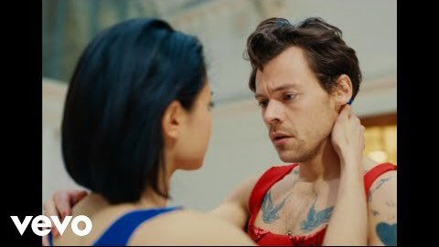
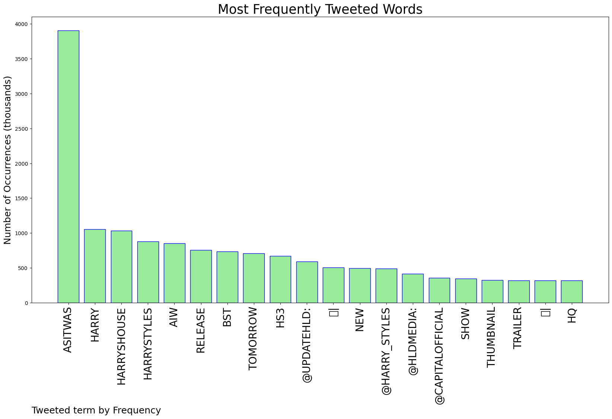
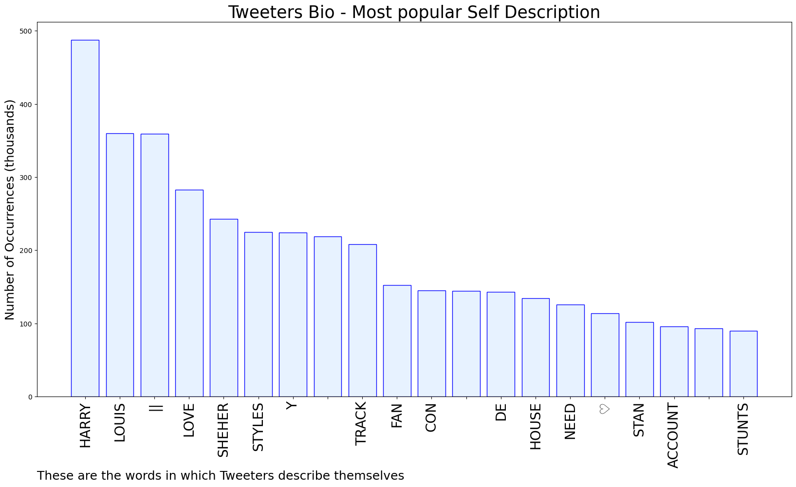

# MURCHIE85 TWITTER PROCESSING 
&#x1F34E; **TOPIC = "#AsItWas"**

## AUTOMATED RESEARCH SUMMARY

*note: Image pulled from web automatically, not connected to author.
  
<b> This report is AUTOMATED and not hand crafted, it is designed for pulling metrics on a given keyword or hashtag and performs a series of reporting and analysis.</b>

|                **Sample-Tweets**        |
| :-------------: |
| RT @TheHSUpdate: Harry interviews tomorrow #AsItWas: • Capital Breakfest: 6AM BST | 1AM EST | 22PM PT Listen here: https://t.co/VHhjLuWh… |
| right #AsItWas #AIW https://t.co/ORpPDSWP1I |
| RT @SHR00MRRY: two moods for #AsItWas  which one is it gonna be @Harry_Styles https://t.co/uEiruPBU3Y |

The most popular user is: **tommolahey**

 RT @UpdateHLD: 🚨| Harry will be in @BBCRadio2 at 8:10am BST tomorrow morning talking about #AsItWas!

## RELATED METRICS 
| Metric | Value |
| ------------- | ------------- |
| #1 Most tweeted to  | **Harry_Styles** |
| #2 Most tweeted to  | **UpdateHLD** |
| #3 Most tweeted to  | **HLDMedia** |
| NewProfiles (less than 10 days) | 0.88%  |
| Tweeters with < 10 followers  | 5.76%|
| Tweeters with > 1000000 followers  | 0.0%  |

## MOST POPULAR TWEET TERMS 

| Popularity Rank  | Term |
| ------------- | ------------- |
| first  | **ASITWAS**  |
| second  | **HARRY**  |
| third  | **HARRYSHOUSE** |
| fourth  | **HARRYSTYLES**  |
| fifth  | **AIW**  |

## Twitter Bio Analysis
### SENTIMENT ANALYSIS

VIEWS WERE : **SUBJECTIVE**  (13.33%) & **NEGATIVELY-SUBJECTIVE** (0.0%) **OBJECTIVE** (86.67%)

### TWEET SAMPLE 
| Random value picked from array |
| ------------- |
|RT @UpdateHLD: 🚨| Harry will also be on @hitsradiouk from 11:30am BST tomorrow morning to talk about #AsItWas ! |

### MOST RETWEETED 

| The most retweeted user is: **tommolahey**  |
| ------------- |
| RT @UpdateHLD: 🚨| Harry will be in @BBCRadio2 at 8:10am BST tomorrow morning talking about #AsItWas! |

### CONCLUSION & EXTERNAL ANALYSIS

*This is my [Adam McMurchie`s] opinion on the data from the tweets, it serves as no objective truth.Since the tweets themselves are a mixture of fact & opinion. 
Authors analytical summary on request.
**RECOMMENDATIONS** WILL BE UPDATED IN NEXT  24 HOURS  