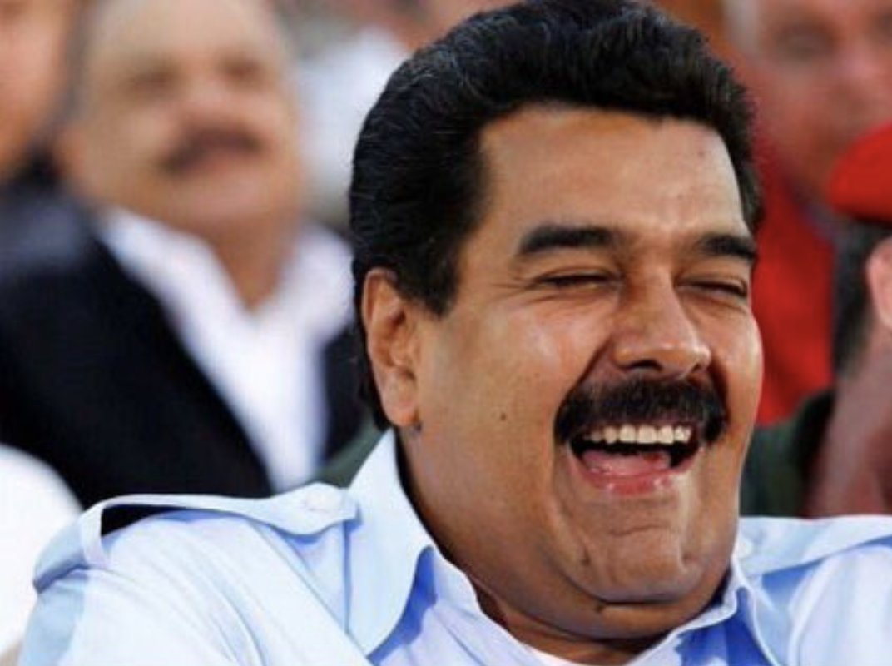
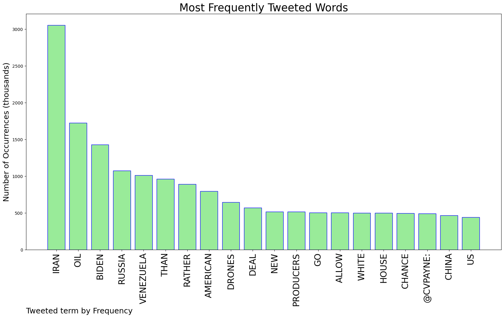
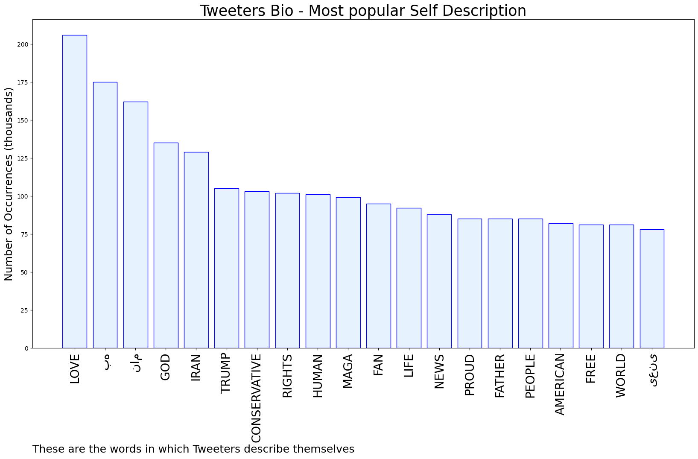

# MURCHIE85 TWITTER PROCESSING 
&#x1F34E; **TOPIC = "Iran"**

## AUTOMATED RESEARCH SUMMARY

*note: Image pulled from web automatically, not connected to author.
  
<b> This report is AUTOMATED and not hand crafted, it is designed for pulling metrics on a given keyword or hashtag and performs a series of reporting and analysis.</b>

|                **Sample-Tweets**        |
| :-------------: |
| RT @SaraCarterDC: All because Biden doesn’t want take the most logical step: open federal land for drilling and reinstate the #Keystone XL… |
| RT @BonginoReport: Biden Admin Courts Venezuela, Iran, and Saudi Arabia for Oil While Ignoring U.S. Producershttps://t.co/OoWsLebJeq |
| RT @pandagulu: If you're following Iran's domestic politics the unexpected daylight between Russia and Iran in nuclear negotiations is even… |

The most popular user is: **Corbo12Ian**

 RT @AmnestyUK: Human rights lawyer Nasrin Sotoudeh has been sentenced to 38 years and 148 lashes for peacefully standing up for women's rig…

## RELATED METRICS 
| Metric | Value |
| ------------- | ------------- |
| #1 Most tweeted to  | **cvpayne** |
| #2 Most tweeted to  | **Kasparov63** |
| #3 Most tweeted to  | **laurenboebert** |
| NewProfiles (less than 10 days) | 0.94%  |
| Tweeters with < 10 followers  | 5.82%|
| Tweeters with > 1000000 followers  | 0.06%  |

## MOST POPULAR TWEET TERMS 

| Popularity Rank  | Term |
| ------------- | ------------- |
| first  | **IRAN**  |
| second  | **OIL**  |
| third  | **BIDEN** |
| fourth  | **RUSSIA**  |
| fifth  | **VENEZUELA**  |

## Twitter Bio Analysis
### SENTIMENT ANALYSIS

VIEWS WERE : **SUBJECTIVE**  (26.67%) & **NEGATIVELY-SUBJECTIVE** (26.67%) **OBJECTIVE** (46.67%)

### TWEET SAMPLE 
| Random value picked from array |
| ------------- |
|RT @RepLeeZeldin: This is as bad a time as any for the Biden Admin to turn to Iran, Venezuela or any other adversary for our nation’s energ… |

### MOST RETWEETED 

| The most retweeted user is: **Corbo12Ian**  |
| ------------- |
| RT @AmnestyUK: Human rights lawyer Nasrin Sotoudeh has been sentenced to 38 years and 148 lashes for peacefully standing up for women's rig… |

### CONCLUSION & EXTERNAL ANALYSIS

*This is my [Adam McMurchie`s] opinion on the data from the tweets, it serves as no objective truth.Since the tweets themselves are a mixture of fact & opinion. 
Authors analytical summary on request.
**RECOMMENDATIONS** WILL BE UPDATED IN NEXT  24 HOURS  