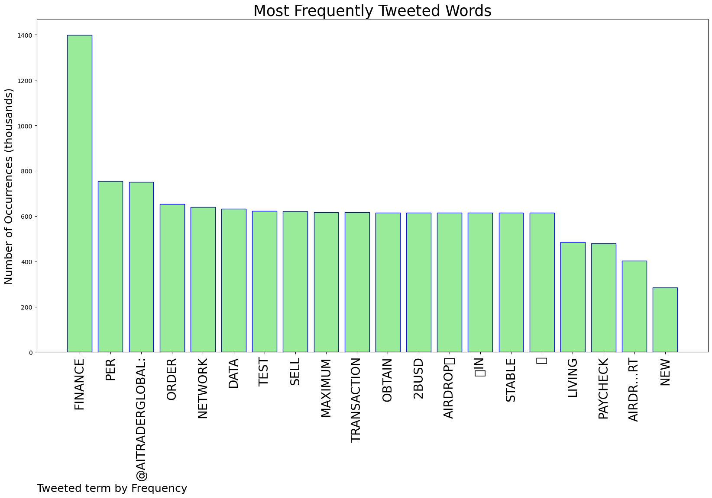
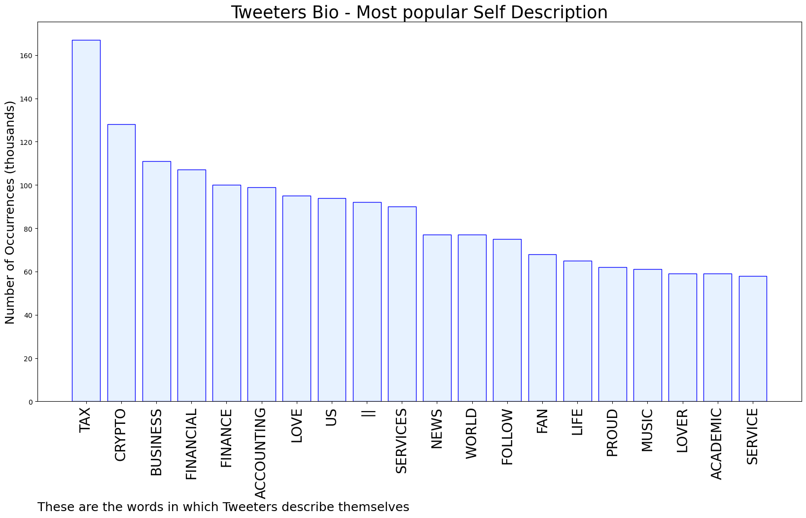

# MURCHIE85 TWITTER PROCESSING 
&#x1F34E; **TOPIC = "Finance"**

## AUTOMATED RESEARCH SUMMARY

*note: Image pulled from web automatically, not connected to author.
  
<b> This report is AUTOMATED and not hand crafted, it is designed for pulling metrics on a given keyword or hashtag and performs a series of reporting and analysis.</b>

|                **Sample-Tweets**        |
| :-------------: |
| RT @MOBA1911: Mwirians well represented at the King’s  College Budo,Founders Day.MwirianOweki Robert Waggwa Nsibirwa 2nd Deputy Katik… |
| RT @ArchbishopStua1: @BjCruickshank @ruth_wishart @MaureenPickeri5 @theSNP Disappointed Kate Forbes felt unable to take up a post, in parti… |
| Personal Finance: As the cost of living remains high, 62% Americans now say they are living paycheck to paycheck, a… https://t.co/ffBsAqgwaZ |

The most popular user is: **kolababajide**

 RT @Secured_Fi: Want to prove you're an early supporter of Secured Finance?

Get your hands on the Genesis OAT - it might even bring you go…

## RELATED METRICS 
| Metric | Value |
| ------------- | ------------- |
| #1 Most tweeted to  | **AITraderGlobal** |
| #2 Most tweeted to  | **ruth_wishart** |
| #3 Most tweeted to  | **HonMoses_Kuria** |
| NewProfiles (less than 10 days) | 3.18%  |
| Tweeters with < 10 followers  | 19.08%|
| Tweeters with > 1000000 followers  | 0.16%  |

## MOST POPULAR TWEET TERMS 

| Popularity Rank  | Term |
| ------------- | ------------- |
| first  | **FINANCE**  |
| second  | **PER**  |
| third  | **@AITRADERGLOBAL:** |
| fourth  | **ORDER**  |
| fifth  | **NETWORK**  |

## Twitter Bio Analysis
### SENTIMENT ANALYSIS

VIEWS WERE : **SUBJECTIVE**  (46.67%) & **NEGATIVELY-SUBJECTIVE** (26.67%) **OBJECTIVE** (26.67%)

### TWEET SAMPLE 
| Random value picked from array |
| ------------- |
|RT @DonaldPretsell: @ruth_wishart @BurtyBird Finance was honestly impossible. She basically slagged off key policy areas (that a finance mi… |

### MOST RETWEETED 

| The most retweeted user is: **kolababajide**  |
| ------------- |
| RT @Secured_Fi: Want to prove you're an early supporter of Secured Finance?Get your hands on the Genesis OAT - it might even bring you go… |

### CONCLUSION & EXTERNAL ANALYSIS

*This is my [Adam McMurchie`s] opinion on the data from the tweets, it serves as no objective truth.Since the tweets themselves are a mixture of fact & opinion. 
Authors analytical summary on request.
**RECOMMENDATIONS** WILL BE UPDATED IN NEXT  24 HOURS  