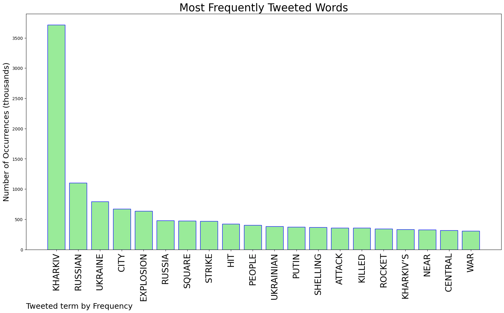
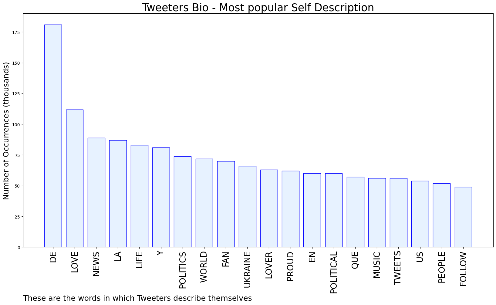
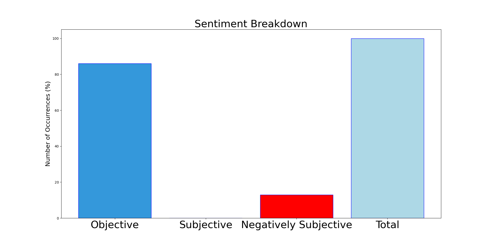

# MURCHIE85 TWITTER PROCESSING 
&#x1F34E; **TOPIC = "Kharkiv"**

## AUTOMATED RESEARCH SUMMARY

*note: Image pulled from web automatically, not connected to author.
  
<b> This report is AUTOMATED and not hand crafted, it is designed for pulling metrics on a given keyword or hashtag and performs a series of reporting and analysis.</b>

|                **Sample-Tweets**        |
| :-------------: |
| RT @Newsweek: The European Parliament accepted Ukraine's application to join the European Union (EU) Tuesday, as Russia continues a sixth d… |
| Force et courage au peuple #Ukrainiens, le monde est avec vous !/Strength and courage to the #Ukrainian people, t… https://t.co/hxZztLs3EB |
| ‘And so it is,just like you said it would be,life goes easy on me.Most of the time’(Thermobaric missil, Kharkiv) https://t.co/ylhELVmIp7 |

The most popular user is: **SecureAmerica**

 RT @danriversitv: Kharkiv Subway tonight. Like something from the Blitz in London during WW2. Shocking. Where on earth will this all end? h…

## RELATED METRICS 
| Metric | Value |
| ------------- | ------------- |
| #1 Most tweeted to  | **KyivIndependent** |
| #2 Most tweeted to  | **olex_scherba** |
| #3 Most tweeted to  | **Conflicts** |
| NewProfiles (less than 10 days) | 3.18%  |
| Tweeters with < 10 followers  | 9.94%|
| Tweeters with > 1000000 followers  | 0.12%  |

## MOST POPULAR TWEET TERMS 

| Popularity Rank  | Term |
| ------------- | ------------- |
| first  | **KHARKIV**  |
| second  | **RUSSIAN**  |
| third  | **UKRAINE** |
| fourth  | **CITY**  |
| fifth  | **EXPLOSION**  |

## Twitter Bio Analysis
### SENTIMENT ANALYSIS

VIEWS WERE : **SUBJECTIVE**  (0.0%) & **NEGATIVELY-SUBJECTIVE** (13.33%) **OBJECTIVE** (86.67%)

### TWEET SAMPLE 
| Random value picked from array |
| ------------- |
|Unfortunately, economic &amp; diplomatic sanctions will not stop the Russian bombarment of Ukrainian cities like… https://t.co/X9Vo0SJVCW |

### MOST RETWEETED 

| The most retweeted user is: **SecureAmerica**  |
| ------------- |
| RT @danriversitv: Kharkiv Subway tonight. Like something from the Blitz in London during WW2. Shocking. Where on earth will this all end? h… |

### CONCLUSION & EXTERNAL ANALYSIS

*This is my [Adam McMurchie`s] opinion on the data from the tweets, it serves as no objective truth.Since the tweets themselves are a mixture of fact & opinion. 
Authors analytical summary on request.
**RECOMMENDATIONS** WILL BE UPDATED IN NEXT  24 HOURS  