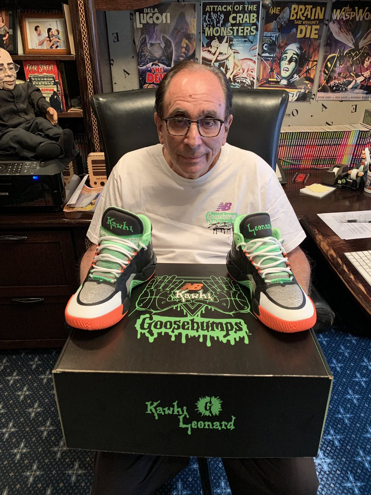
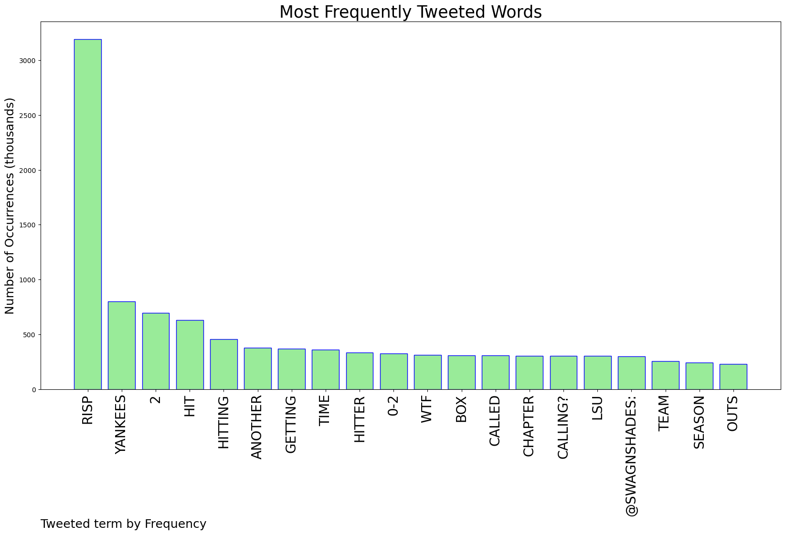
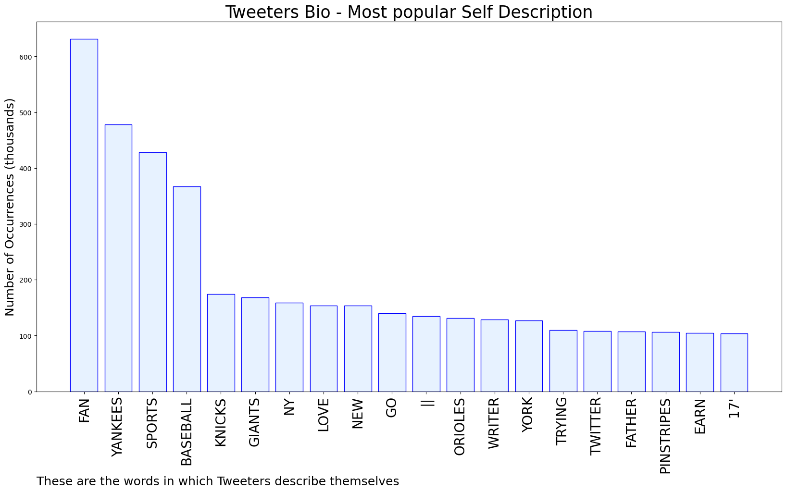
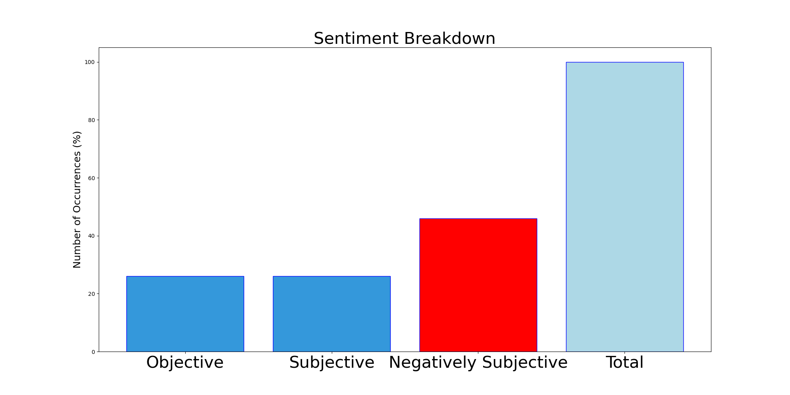

# MURCHIE85 TWITTER PROCESSING 
&#x1F34E; **TOPIC = "RISP"**

## AUTOMATED RESEARCH SUMMARY

*note: Image pulled from web automatically, not connected to author.
  
<b> This report is AUTOMATED and not hand crafted, it is designed for pulling metrics on a given keyword or hashtag and performs a series of reporting and analysis.</b>

|                **Sample-Tweets**        |
| :-------------: |
| ITS ABOUT TIME WE HIT WELL WITH RISP 🔥 |
| RT @SwagnShades: Another chapter of WTF are we calling? LSU hitter is called out for not getting in the box in time with 2 RISP, 0-2 count… |
| Atta boy Sparky. Hits with RISP are: https://t.co/rwHc4TWrTP |

The most popular user is: **c_h_risp**

 RT @RL_Stine: My Kawhi Leonard Goosebumps shoes have arrived! https://t.co/2oZ5q4qdaB

## RELATED METRICS 
| Metric | Value |
| ------------- | ------------- |
| #1 Most tweeted to  | **SwagnShades** |
| #2 Most tweeted to  | **Yankees** |
| #3 Most tweeted to  | **MaxTGoodman** |
| NewProfiles (less than 10 days) | 0.58%  |
| Tweeters with < 10 followers  | 4.76%|
| Tweeters with > 1000000 followers  | 0.02%  |

## MOST POPULAR TWEET TERMS 

| Popularity Rank  | Term |
| ------------- | ------------- |
| first  | **RISP**  |
| second  | **YANKEES**  |
| third  | **2** |
| fourth  | **HIT**  |
| fifth  | **HITTING**  |

## Twitter Bio Analysis
### SENTIMENT ANALYSIS

VIEWS WERE : **SUBJECTIVE**  (26.67%) & **NEGATIVELY-SUBJECTIVE** (46.67%) **OBJECTIVE** (26.67%)

### TWEET SAMPLE 
| Random value picked from array |
| ------------- |
|@BryanHoch @SOMPatriots Yea but can he hit under .200 with RISP? |

### MOST RETWEETED 

| The most retweeted user is: **c_h_risp**  |
| ------------- |
| RT @RL_Stine: My Kawhi Leonard Goosebumps shoes have arrived! https://t.co/2oZ5q4qdaB |

### CONCLUSION & EXTERNAL ANALYSIS

*This is my [Adam McMurchie`s] opinion on the data from the tweets, it serves as no objective truth.Since the tweets themselves are a mixture of fact & opinion. 
Authors analytical summary on request.
**RECOMMENDATIONS** WILL BE UPDATED IN NEXT  24 HOURS  