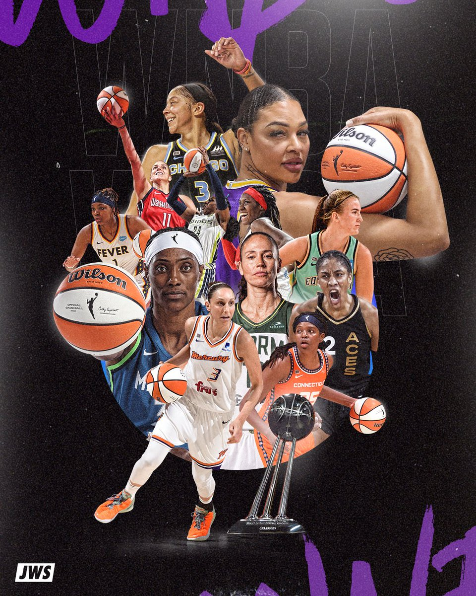
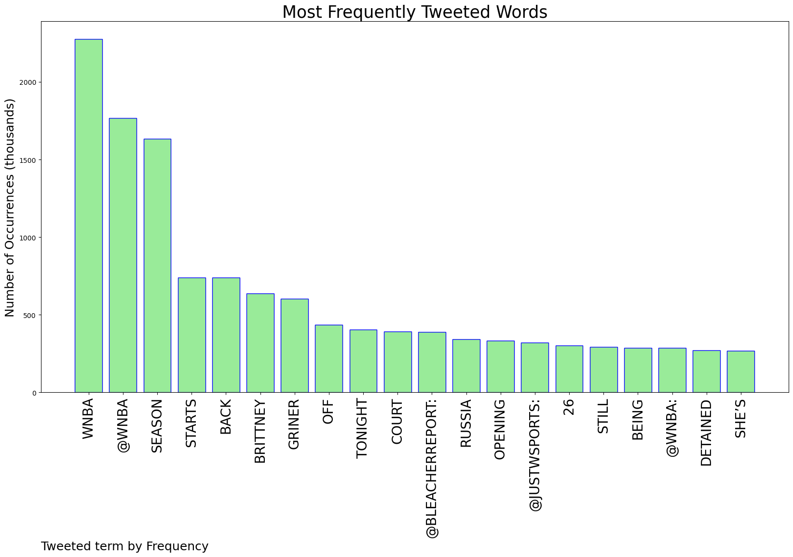

# MURCHIE85 TWITTER PROCESSING 
&#x1F34E; **TOPIC = "WNBA"**

## AUTOMATED RESEARCH SUMMARY

*note: Image pulled from web automatically, not connected to author.
  
<b> This report is AUTOMATED and not hand crafted, it is designed for pulling metrics on a given keyword or hashtag and performs a series of reporting and analysis.</b>

|                **Sample-Tweets**        |
| :-------------: |
| Brittney Griner sets a bad example for young women. Shame on the WNBA for supporting this criminal! |
| RT @ChantelJennings: Happy WNBA opening day! We've had tons of stories on our site this week to prepare you for the 26th WNBA season.Let'… |
| RT @WhistleSports: FREE BRITTNEY GRINER @WNBA | #WNBATwitter https://t.co/5J03Iifj3a |

The most popular user is: **TheBizzyBroker**

 RT @TJQuinnESPN: BREAKING: Brittney Griner is now classified as “wrongfully detained” by Russia, U.S. State Department says. Major shift in…

## RELATED METRICS 
| Metric | Value |
| ------------- | ------------- |
| #1 Most tweeted to  | **WNBA** |
| #2 Most tweeted to  | **BleacherReport** |
| #3 Most tweeted to  | **justwsports** |
| NewProfiles (less than 10 days) | 0.7%  |
| Tweeters with < 10 followers  | 3.2%|
| Tweeters with > 1000000 followers  | 0.36%  |

## MOST POPULAR TWEET TERMS 

| Popularity Rank  | Term |
| ------------- | ------------- |
| first  | **WNBA**  |
| second  | **@WNBA**  |
| third  | **SEASON** |
| fourth  | **STARTS**  |
| fifth  | **BACK**  |

## Twitter Bio Analysis
### SENTIMENT ANALYSIS

VIEWS WERE : **SUBJECTIVE**  (26.67%) & **NEGATIVELY-SUBJECTIVE** (6.67%) **OBJECTIVE** (66.67%)

### TWEET SAMPLE 
| Random value picked from array |
| ------------- |
|RT @Rk101785: MLB DFS Top Pitcher Breakdown Strategy | Draftkings Fanduel Friday May 6th, 2022 https://t.co/iun0XLRLD3 Join the #DFSArmy To… |

### MOST RETWEETED 

| The most retweeted user is: **TheBizzyBroker**  |
| ------------- |
| RT @TJQuinnESPN: BREAKING: Brittney Griner is now classified as “wrongfully detained” by Russia, U.S. State Department says. Major shift in… |

### CONCLUSION & EXTERNAL ANALYSIS

*This is my [Adam McMurchie`s] opinion on the data from the tweets, it serves as no objective truth.Since the tweets themselves are a mixture of fact & opinion. 
Authors analytical summary on request.
**RECOMMENDATIONS** WILL BE UPDATED IN NEXT  24 HOURS  