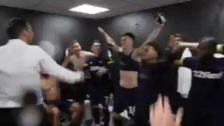
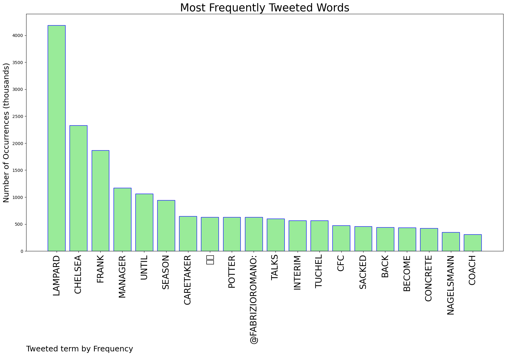
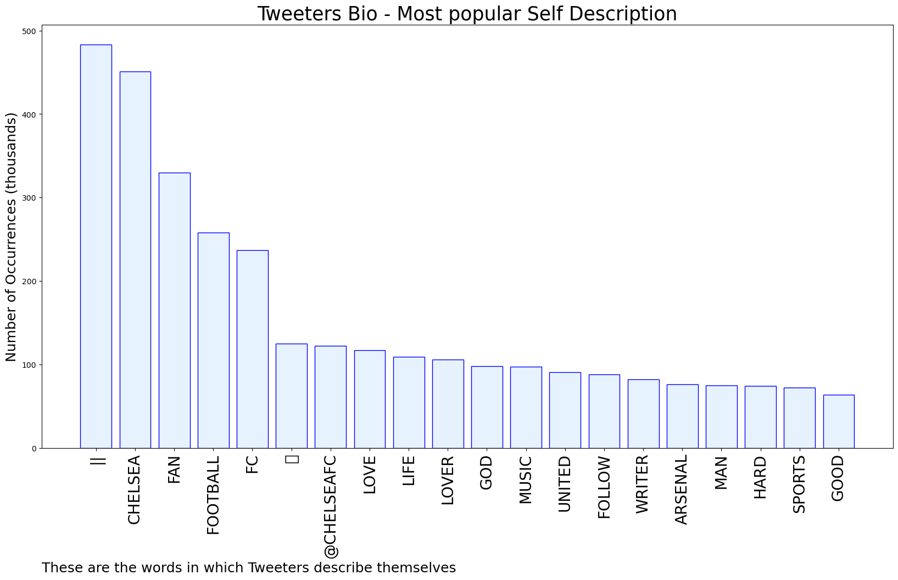

# MURCHIE85 TWITTER PROCESSING 
&#x1F34E; **TOPIC = "Lampard"**

## AUTOMATED RESEARCH SUMMARY

*note: Image pulled from web automatically, not connected to author.
  
<b> This report is AUTOMATED and not hand crafted, it is designed for pulling metrics on a given keyword or hashtag and performs a series of reporting and analysis.</b>

|                **Sample-Tweets**        |
| :-------------: |
| RT @CFCPys: 🚨 Chelsea spoke to Nagelsmann and Enrique this afternoon - Nagelsmann is still the favourite but Chelsea want to take their tim… |
| LAMPARD 😂😂😂😂 https://t.co/MGEofoqrnK |
| RT @CarefreeLewisG: If Chelsea are gonna be 11th and ass. I'd rather be ass with Super Frankie Lampard in charge |

The most popular user is: **TheChelsTalks**

 RT @ChelseaFC: Chelsea Football Club has today parted company with Head Coach Frank Lampard.

## RELATED METRICS 
| Metric | Value |
| ------------- | ------------- |
| #1 Most tweeted to  | **FabrizioRomano** |
| #2 Most tweeted to  | **CFCPys** |
| #3 Most tweeted to  | **CFCDUBois** |
| NewProfiles (less than 10 days) | 0.08%  |
| Tweeters with < 10 followers  | 3.48%|
| Tweeters with > 1000000 followers  | 0.08%  |

## MOST POPULAR TWEET TERMS 

| Popularity Rank  | Term |
| ------------- | ------------- |
| first  | **LAMPARD**  |
| second  | **CHELSEA**  |
| third  | **FRANK** |
| fourth  | **MANAGER**  |
| fifth  | **UNTIL**  |

## Twitter Bio Analysis
### SENTIMENT ANALYSIS

VIEWS WERE : **SUBJECTIVE**  (26.67%) & **NEGATIVELY-SUBJECTIVE** (6.67%) **OBJECTIVE** (66.67%)

### TWEET SAMPLE 
| Random value picked from array |
| ------------- |
|RT @FabrizioRomano: Chelsea are in concrete talks with Frank Lampard to become caretaker manager until the end of the season 🚨🔵 #CFCDiscu… |

### MOST RETWEETED 

| The most retweeted user is: **TheChelsTalks**  |
| ------------- |
| RT @ChelseaFC: Chelsea Football Club has today parted company with Head Coach Frank Lampard. |

### CONCLUSION & EXTERNAL ANALYSIS

*This is my [Adam McMurchie`s] opinion on the data from the tweets, it serves as no objective truth.Since the tweets themselves are a mixture of fact & opinion. 
Authors analytical summary on request.
**RECOMMENDATIONS** WILL BE UPDATED IN NEXT  24 HOURS  