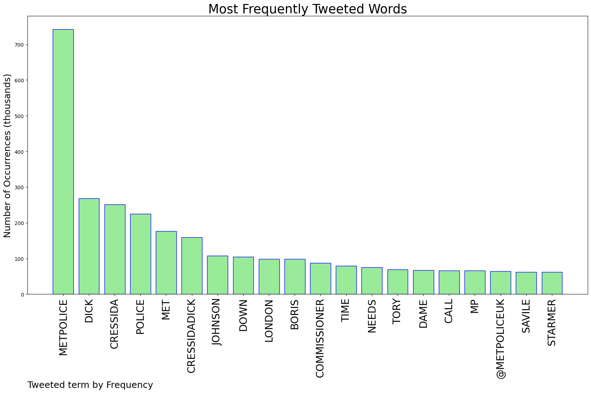
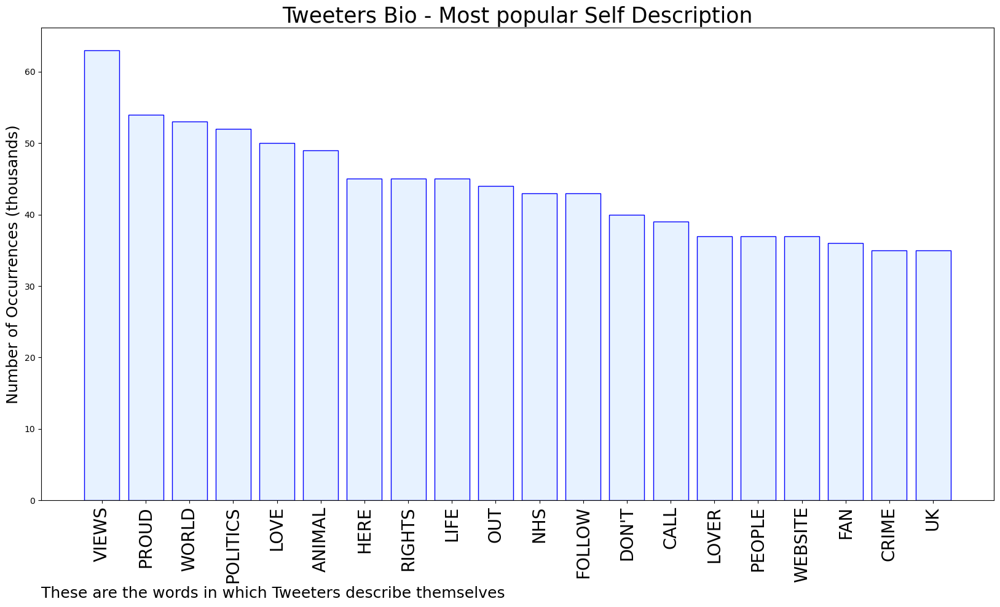

# MURCHIE85 TWITTER PROCESSING 
&#x1F34E; **TOPIC = "#MetPolice"**

## AUTOMATED RESEARCH SUMMARY

*note: Image pulled from web automatically, not connected to author.
  
<b> This report is AUTOMATED and not hand crafted, it is designed for pulling metrics on a given keyword or hashtag and performs a series of reporting and analysis.</b>

|                **Sample-Tweets**        |
| :-------------: |
| RT @charlotteukcity: Cressida Dick is leaving her job. I hope whoever takes her place will work tirelessly to build back trust, by setting… |
| @kath_odonnell @SimonAttwood @PeterStefanovi2 @teachertwit2 Exactly! Seen anyone talking about #Partygate recently?… https://t.co/CyHJteLTyj |
| RT @_Kano_P: So bored of seeing retired Supt and C.Supt criticising the Met about things that happened when they were serving and had influ… |

The most popular user is: **angie_florence3**

 RT @bmay: The Metropolitan Police weren’t quite this slow, cautious or bashful about the Sarah Everard vigil were they? 
#metpolice #PartyG…

## RELATED METRICS 
| Metric | Value |
| ------------- | ------------- |
| #1 Most tweeted to  | **metpoliceuk** |
| #2 Most tweeted to  | **jamesak47** |
| #3 Most tweeted to  | **theprecarian** |
| NewProfiles (less than 10 days) | 1.62%  |
| Tweeters with < 10 followers  | 3.87%|
| Tweeters with > 1000000 followers  | 0.0%  |

## MOST POPULAR TWEET TERMS 

| Popularity Rank  | Term |
| ------------- | ------------- |
| first  | **METPOLICE**  |
| second  | **DICK**  |
| third  | **CRESSIDA** |
| fourth  | **POLICE**  |
| fifth  | **MET**  |

## Twitter Bio Analysis
### SENTIMENT ANALYSIS

VIEWS WERE : **SUBJECTIVE**  (46.67%) & **NEGATIVELY-SUBJECTIVE** (20.0%) **OBJECTIVE** (33.33%)

### TWEET SAMPLE 
| Random value picked from array |
| ------------- |
|Will He be #Prosecuted ? #MetPolice have Said they are not going to #Investigate !!  @RSPCA_official should… https://t.co/T4qKQKYayN |

### MOST RETWEETED 

| The most retweeted user is: **angie_florence3**  |
| ------------- |
| RT @bmay: The Metropolitan Police weren’t quite this slow, cautious or bashful about the Sarah Everard vigil were they? #metpolice #PartyG… |

### CONCLUSION & EXTERNAL ANALYSIS

*This is my [Adam McMurchie`s] opinion on the data from the tweets, it serves as no objective truth.Since the tweets themselves are a mixture of fact & opinion. 
Authors analytical summary on request.
**RECOMMENDATIONS** WILL BE UPDATED IN NEXT  24 HOURS  