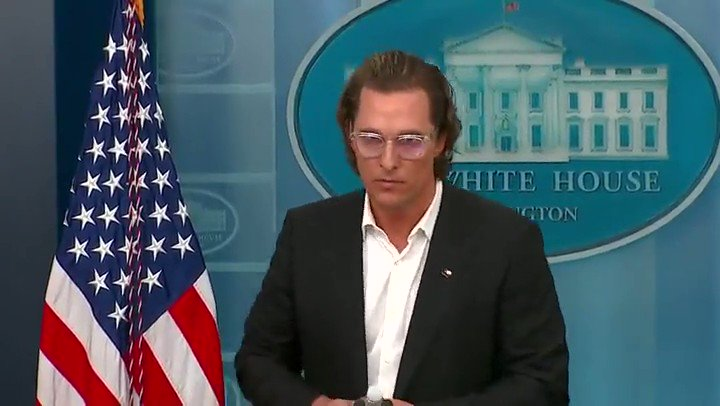
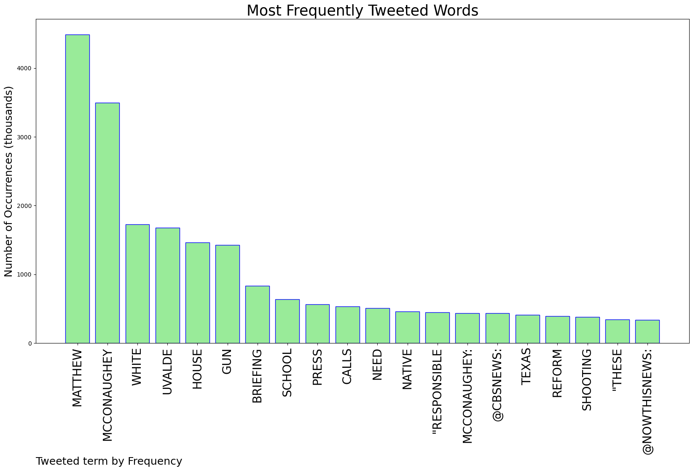
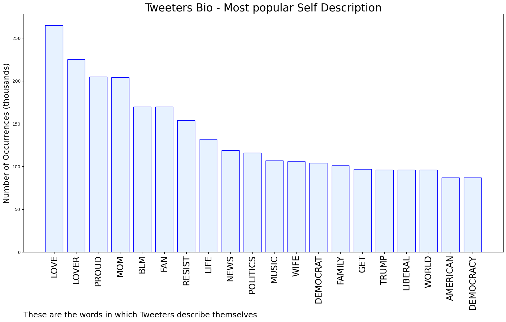
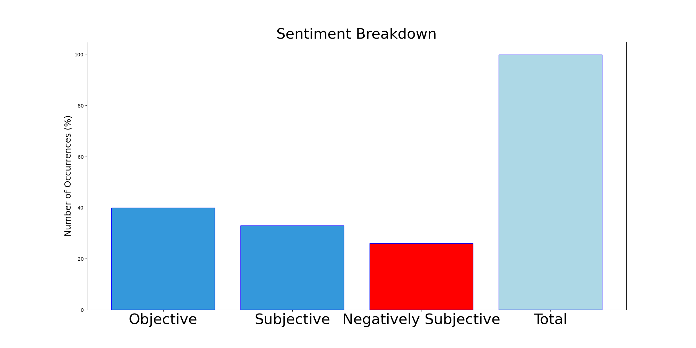

# MURCHIE85 TWITTER PROCESSING 
&#x1F34E; **TOPIC = "Matthew McConaughey"**

## AUTOMATED RESEARCH SUMMARY

*note: Image pulled from web automatically, not connected to author.
  
<b> This report is AUTOMATED and not hand crafted, it is designed for pulling metrics on a given keyword or hashtag and performs a series of reporting and analysis.</b>

|                **Sample-Tweets**        |
| :-------------: |
| RT @OccupyDemocrats: BREAKING: Actor Matthew McConaughey gives a moving White House press briefing calling for gun reform and displays the… |
| RT @Leslieoo7: This Matthew McConaughey speech is gutting me. It's supposed to, but will it move those who can do something more than tweet… |
| RT @ComicDaveSmith: Progressives are at their most comfortable when they can worship celebrities as gods. This is the response that you’re… |

The most popular user is: **psr_6589**

 RT @CalltoActivism: BREAKING: Actor Matthew McConaughey, who grew up in Uvalde, Texas, DEMANDS “gun responsibility” including  background c…

## RELATED METRICS 
| Metric | Value |
| ------------- | ------------- |
| #1 Most tweeted to  | **CBSNews** |
| #2 Most tweeted to  | **nowthisnews** |
| #3 Most tweeted to  | **therecount** |
| NewProfiles (less than 10 days) | 0.34%  |
| Tweeters with < 10 followers  | 1.9%|
| Tweeters with > 1000000 followers  | 0.24%  |

## MOST POPULAR TWEET TERMS 

| Popularity Rank  | Term |
| ------------- | ------------- |
| first  | **MATTHEW**  |
| second  | **MCCONAUGHEY**  |
| third  | **WHITE** |
| fourth  | **UVALDE**  |
| fifth  | **HOUSE**  |

## Twitter Bio Analysis
### SENTIMENT ANALYSIS

VIEWS WERE : **SUBJECTIVE**  (33.33%) & **NEGATIVELY-SUBJECTIVE** (26.67%) **OBJECTIVE** (40.0%)

### TWEET SAMPLE 
| Random value picked from array |
| ------------- |
|RT @TitusNation: Matthew McConaughey at the White House, born in Uvalde. Putting himself out there. Nice. |

### MOST RETWEETED 

| The most retweeted user is: **psr_6589**  |
| ------------- |
| RT @CalltoActivism: BREAKING: Actor Matthew McConaughey, who grew up in Uvalde, Texas, DEMANDS “gun responsibility” including  background c… |

### CONCLUSION & EXTERNAL ANALYSIS

*This is my [Adam McMurchie`s] opinion on the data from the tweets, it serves as no objective truth.Since the tweets themselves are a mixture of fact & opinion. 
Authors analytical summary on request.
**RECOMMENDATIONS** WILL BE UPDATED IN NEXT  24 HOURS  