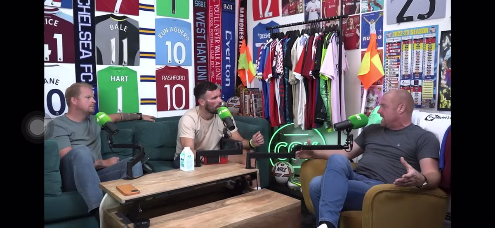
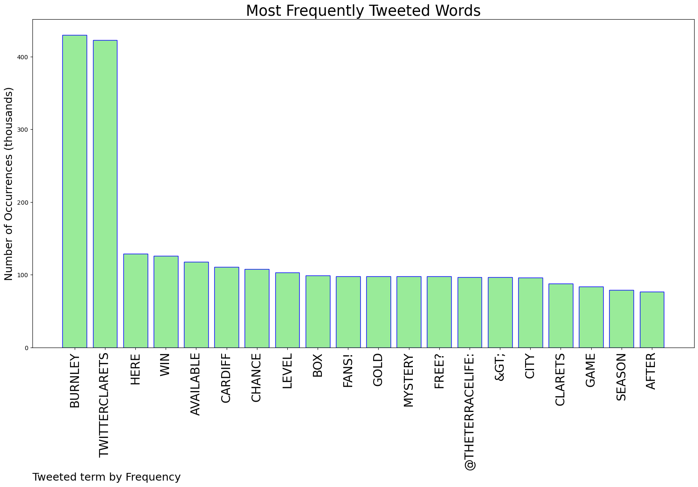
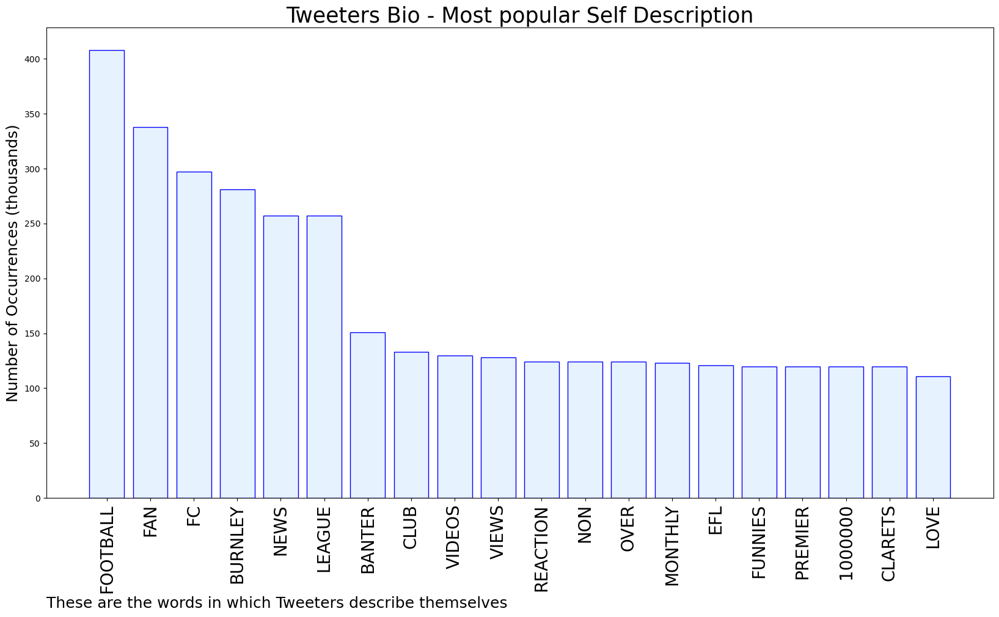
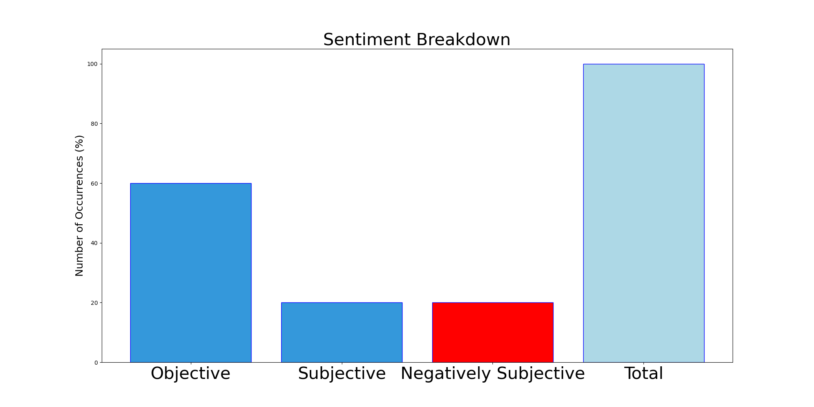

# MURCHIE85 TWITTER PROCESSING 
&#x1F34E; **TOPIC = "#twitterclarets"**

## AUTOMATED RESEARCH SUMMARY

*note: Image pulled from web automatically, not connected to author.
  
<b> This report is AUTOMATED and not hand crafted, it is designed for pulling metrics on a given keyword or hashtag and performs a series of reporting and analysis.</b>

|                **Sample-Tweets**        |
| :-------------: |
| RT @theterracelife: Burnley fans! Want a chance to win a gold level Burnley Mystery Box for free?Available here &gt; https://t.co/PKEses3PDs… |
| Police forced to get involved with Oldham and Wrexham fans scrapping pre-match -  https://t.co/1GLCG2as9W… https://t.co/0sUe3zV822 |
| For the xG fans out there. 📊 #twitterclarets #utc https://t.co/HSO2hV1Pmq |

The most popular user is: **wamalwaKe**

 RT @BurnleyFC_clips: Sean Dyche wanted Harry Kane at Burnley.. #twitterclarets https://t.co/Uv4ZYnoFyk

## RELATED METRICS 
| Metric | Value |
| ------------- | ------------- |
| #1 Most tweeted to  | **theterracelife** |
| #2 Most tweeted to  | **BurnleyOfficial** |
| #3 Most tweeted to  | **Burnley_FC_Live** |
| NewProfiles (less than 10 days) | 0.35%  |
| Tweeters with < 10 followers  | 1.17%|
| Tweeters with > 1000000 followers  | 0.0%  |

## MOST POPULAR TWEET TERMS 

| Popularity Rank  | Term |
| ------------- | ------------- |
| first  | **BURNLEY**  |
| second  | **TWITTERCLARETS**  |
| third  | **HERE** |
| fourth  | **WIN**  |
| fifth  | **AVAILABLE**  |

## Twitter Bio Analysis
### SENTIMENT ANALYSIS

VIEWS WERE : **SUBJECTIVE**  (20.0%) & **NEGATIVELY-SUBJECTIVE** (20.0%) **OBJECTIVE** (60.0%)

### TWEET SAMPLE 
| Random value picked from array |
| ------------- |
|Unpopular view but Brownhill is a number 10 and never will be. Needs to be Cork plus one of Brownhill or Cullen and… https://t.co/ZBgncAXa6U |

### MOST RETWEETED 

| The most retweeted user is: **wamalwaKe**  |
| ------------- |
| RT @BurnleyFC_clips: Sean Dyche wanted Harry Kane at Burnley.. #twitterclarets https://t.co/Uv4ZYnoFyk |

### CONCLUSION & EXTERNAL ANALYSIS

*This is my [Adam McMurchie`s] opinion on the data from the tweets, it serves as no objective truth.Since the tweets themselves are a mixture of fact & opinion. 
Authors analytical summary on request.
**RECOMMENDATIONS** WILL BE UPDATED IN NEXT  24 HOURS  