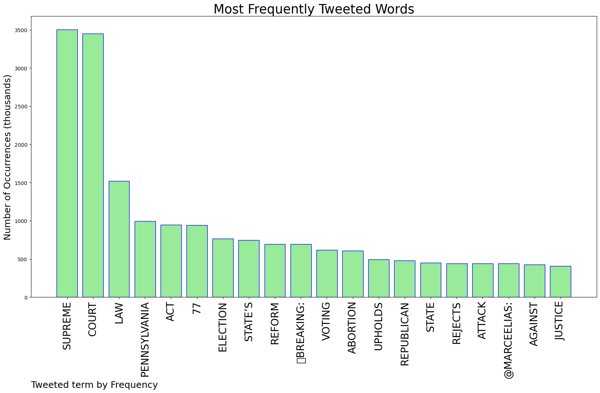
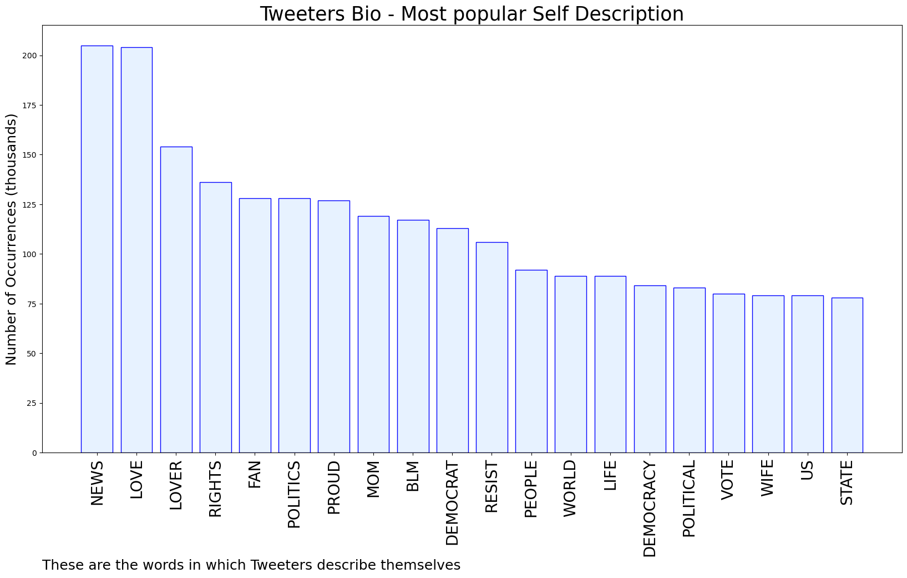

# MURCHIE85 TWITTER PROCESSING 
&#x1F34E; **TOPIC = "Supreme Court"**

## AUTOMATED RESEARCH SUMMARY

*note: Image pulled from web automatically, not connected to author.
  
<b> This report is AUTOMATED and not hand crafted, it is designed for pulling metrics on a given keyword or hashtag and performs a series of reporting and analysis.</b>

|                **Sample-Tweets**        |
| :-------------: |
| Washington PostJustice Dept. sues Idaho over upcoming near-total abortion ban in its first legal action since Supr… https://t.co/Oh0DPygyNb |
| RT @jilevin: The Handmaid’s Tale meets The United States Supreme Court. https://t.co/1nxRRxjHIY |
| RT @ewarren: This bill would help make sure that the extremist Supreme Court doesn’t get the last word in our democracy.https://t.co/GLQ0d… |

The most popular user is: **dimonic2003**

 RT @OccupyDemocrats: BREAKING NEWS: Democrats introduce a bill to create 18-year term limits for Supreme Court justices that would immediat…

## RELATED METRICS 
| Metric | Value |
| ------------- | ------------- |
| #1 Most tweeted to  | **marceelias** |
| #2 Most tweeted to  | **DemocracyDocket** |
| #3 Most tweeted to  | **cjwerleman** |
| NewProfiles (less than 10 days) | 0.6%  |
| Tweeters with < 10 followers  | 3.04%|
| Tweeters with > 1000000 followers  | 0.48%  |

## MOST POPULAR TWEET TERMS 

| Popularity Rank  | Term |
| ------------- | ------------- |
| first  | **SUPREME**  |
| second  | **COURT**  |
| third  | **LAW** |
| fourth  | **PENNSYLVANIA**  |
| fifth  | **ACT**  |

## Twitter Bio Analysis
### SENTIMENT ANALYSIS

VIEWS WERE : **SUBJECTIVE**  (26.67%) & **NEGATIVELY-SUBJECTIVE** (20.0%) **OBJECTIVE** (53.33%)

### TWEET SAMPLE 
| Random value picked from array |
| ------------- |
|RT @marceelias: 🚨BREAKING: Pennsylvania Supreme Court REJECTS Republican attack on Act 77, the state’s election reform law that established… |

### MOST RETWEETED 

| The most retweeted user is: **dimonic2003**  |
| ------------- |
| RT @OccupyDemocrats: BREAKING NEWS: Democrats introduce a bill to create 18-year term limits for Supreme Court justices that would immediat… |

### CONCLUSION & EXTERNAL ANALYSIS

*This is my [Adam McMurchie`s] opinion on the data from the tweets, it serves as no objective truth.Since the tweets themselves are a mixture of fact & opinion. 
Authors analytical summary on request.
**RECOMMENDATIONS** WILL BE UPDATED IN NEXT  24 HOURS  