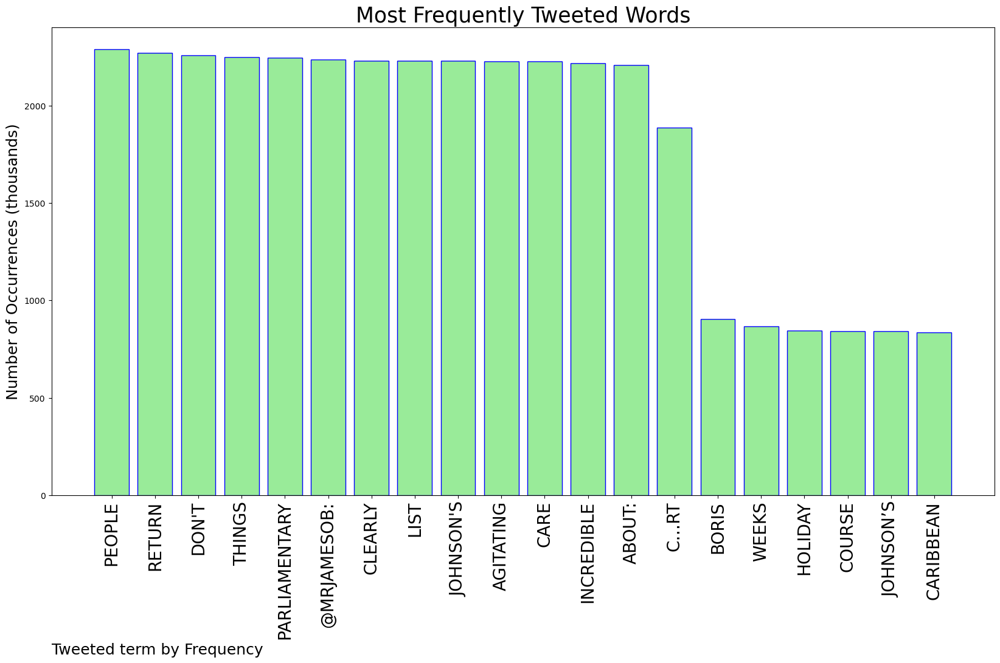
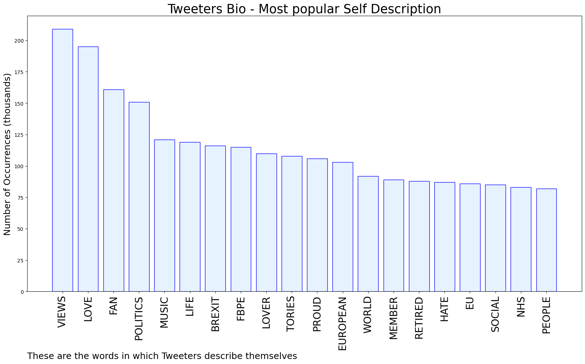
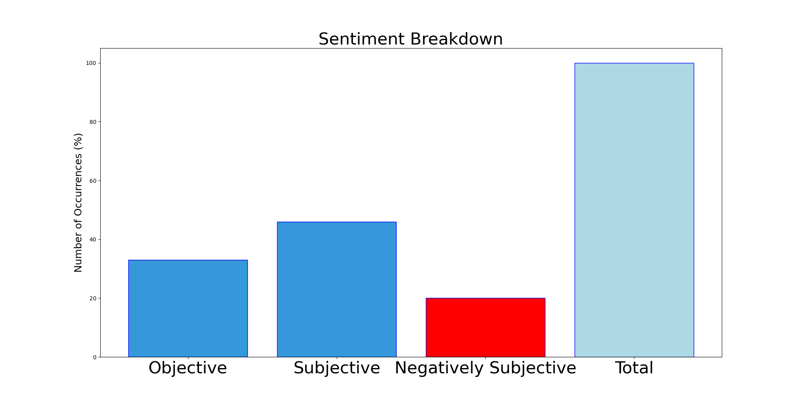

# MURCHIE85 TWITTER PROCESSING 
&#x1F34E; **TOPIC = "Parliamentary"**

## AUTOMATED RESEARCH SUMMARY

*note: Image pulled from web automatically, not connected to author.
  
<b> This report is AUTOMATED and not hand crafted, it is designed for pulling metrics on a given keyword or hashtag and performs a series of reporting and analysis.</b>

|                **Sample-Tweets**        |
| :-------------: |
| RT @tompeck: I mean, course Boris Johnson’s on holiday in the Caribbean. There are only about 22 weeks of parliamentary recess a year that… |
| RT @mrjamesob: The list of things that people agitating for Johnson's return clearly don't care about is incredible when you think about: c… |
| RT @mrjamesob: The list of things that people agitating for Johnson's return clearly don't care about is incredible when you think about: c… |

The most popular user is: **abi1005**

 RT @mrjamesob: The list of things that people agitating for Johnson's return clearly don't care about is incredible when you think about: c…

## RELATED METRICS 
| Metric | Value |
| ------------- | ------------- |
| #1 Most tweeted to  | **mrjamesob** |
| #2 Most tweeted to  | **tompeck** |
| #3 Most tweeted to  | **BorisJohnson** |
| NewProfiles (less than 10 days) | 0.46%  |
| Tweeters with < 10 followers  | 3.58%|
| Tweeters with > 1000000 followers  | 0.08%  |

## MOST POPULAR TWEET TERMS 

| Popularity Rank  | Term |
| ------------- | ------------- |
| first  | **PEOPLE**  |
| second  | **RETURN**  |
| third  | **"DONT"** |
| fourth  | **THINGS**  |
| fifth  | **PARLIAMENTARY**  |

## Twitter Bio Analysis
### SENTIMENT ANALYSIS

VIEWS WERE : **SUBJECTIVE**  (46.67%) & **NEGATIVELY-SUBJECTIVE** (20.0%) **OBJECTIVE** (33.33%)

### TWEET SAMPLE 
| Random value picked from array |
| ------------- |
|RT @KenRoth: With Liz Truss's resignation as British prime minister https://t.co/2J6PH4zYdW let's hope this also means an end to her Conser… |

### MOST RETWEETED 

| The most retweeted user is: **abi1005**  |
| ------------- |
| RT @mrjamesob: The list of things that people agitating for Johnson's return clearly don't care about is incredible when you think about: c… |

### CONCLUSION & EXTERNAL ANALYSIS

*This is my [Adam McMurchie`s] opinion on the data from the tweets, it serves as no objective truth.Since the tweets themselves are a mixture of fact & opinion. 
Authors analytical summary on request.
**RECOMMENDATIONS** WILL BE UPDATED IN NEXT  24 HOURS  