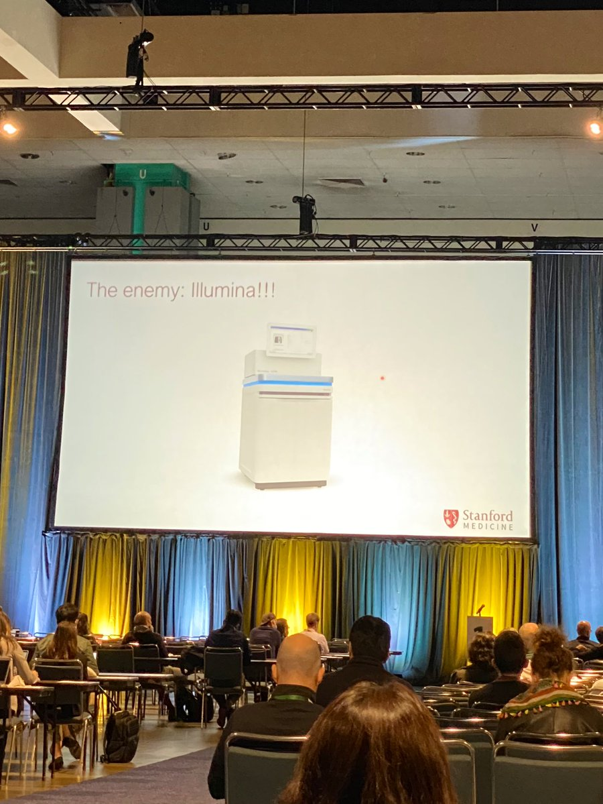
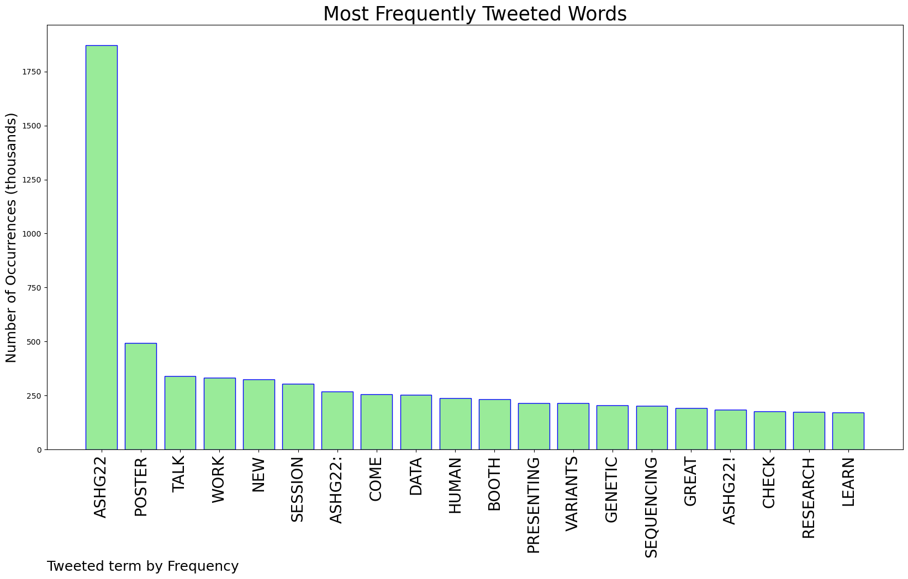
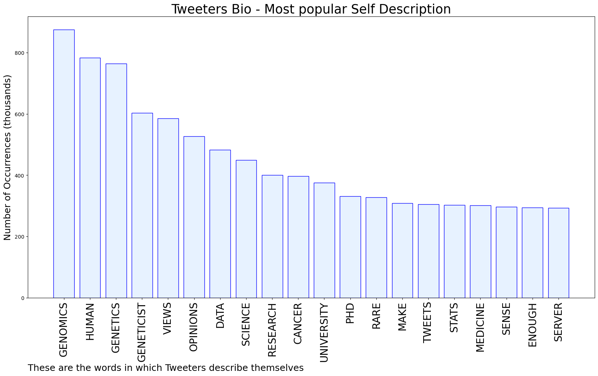
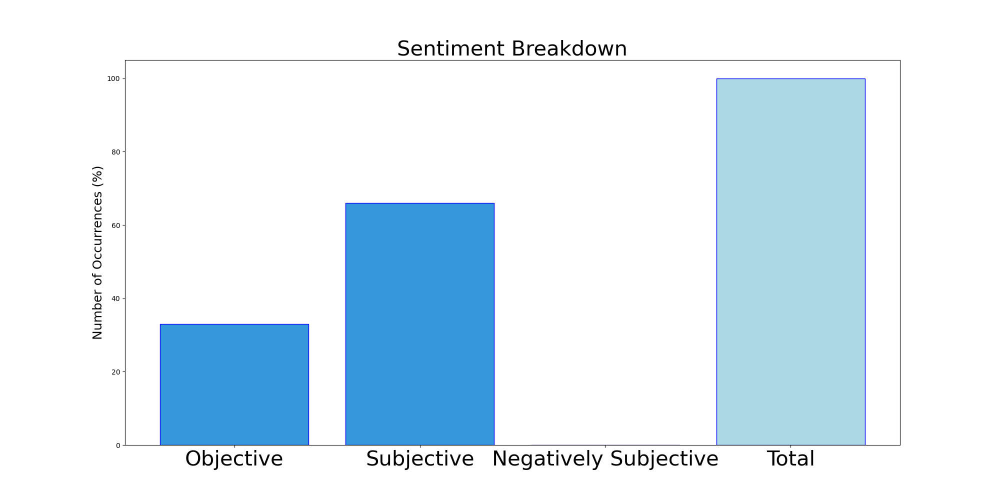

# MURCHIE85 TWITTER PROCESSING 
&#x1F34E; **TOPIC = "#ASHG22"**

## AUTOMATED RESEARCH SUMMARY

*note: Image pulled from web automatically, not connected to author.
  
<b> This report is AUTOMATED and not hand crafted, it is designed for pulling metrics on a given keyword or hashtag and performs a series of reporting and analysis.</b>

|                **Sample-Tweets**        |
| :-------------: |
| RT @MChiaraManzini: At the "Let's talk about sex" session at #ASHG22. Important reminder for writing about SABV. Don't be uncomfortable usi… |
| There are a number of poster a presentations featuring #nanopore sequencing at #ASHG22 you won't want to miss. Find… https://t.co/WJNFc2KoPc |
| RT @RMdeVoer: About last night! We kicked off #ASHG22 with a great @PacBio party with many lovely colleagues from @GeneticNijmegen (and oth… |

The most popular user is: **automaton123**

 RT @doctorveera: Danish Saleheen stunned the audience with his story of building the world's largest cohort of human knockouts in Pakistan,…

## RELATED METRICS 
| Metric | Value |
| ------------- | ------------- |
| #1 Most tweeted to  | **PacBio** |
| #2 Most tweeted to  | **GeneticsSociety** |
| #3 Most tweeted to  | **ksamocha** |
| NewProfiles (less than 10 days) | 0.38%  |
| Tweeters with < 10 followers  | 1.44%|
| Tweeters with > 1000000 followers  | 0.0%  |

## MOST POPULAR TWEET TERMS 

| Popularity Rank  | Term |
| ------------- | ------------- |
| first  | **ASHG22**  |
| second  | **POSTER**  |
| third  | **TALK** |
| fourth  | **WORK**  |
| fifth  | **NEW**  |

## Twitter Bio Analysis
### SENTIMENT ANALYSIS

VIEWS WERE : **SUBJECTIVE**  (66.67%) & **NEGATIVELY-SUBJECTIVE** (0.0%) **OBJECTIVE** (33.33%)

### TWEET SAMPLE 
| Random value picked from array |
| ------------- |
|RT @doctorveera: Danish Saleheen stunned the audience with his story of building the world's largest cohort of human knockouts in Pakistan,… |

### MOST RETWEETED 

| The most retweeted user is: **automaton123**  |
| ------------- |
| RT @doctorveera: Danish Saleheen stunned the audience with his story of building the world's largest cohort of human knockouts in Pakistan,… |

### CONCLUSION & EXTERNAL ANALYSIS

*This is my [Adam McMurchie`s] opinion on the data from the tweets, it serves as no objective truth.Since the tweets themselves are a mixture of fact & opinion. 
Authors analytical summary on request.
**RECOMMENDATIONS** WILL BE UPDATED IN NEXT  24 HOURS  