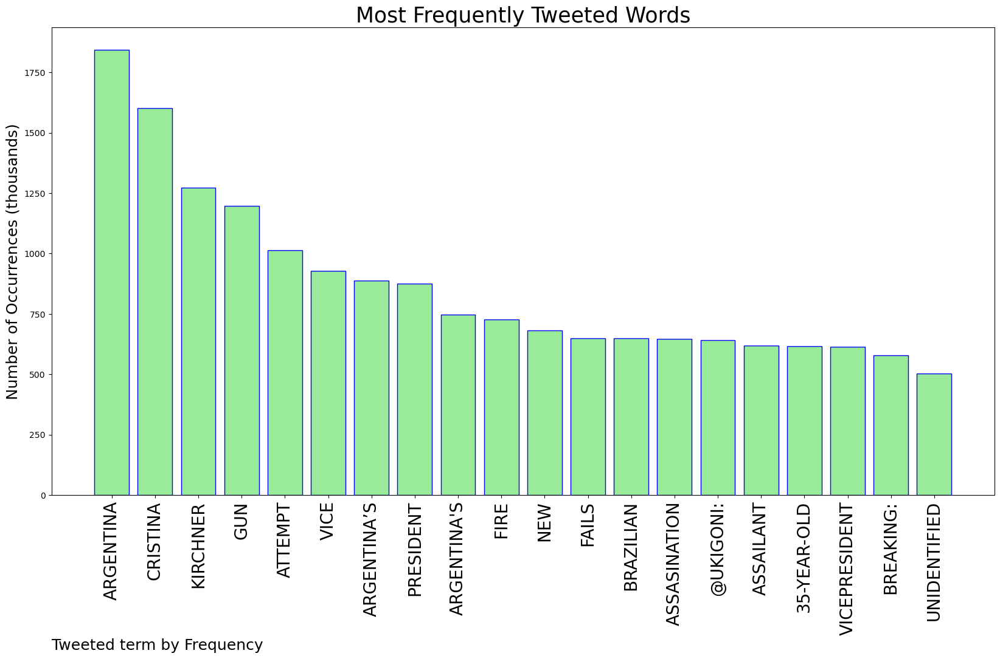
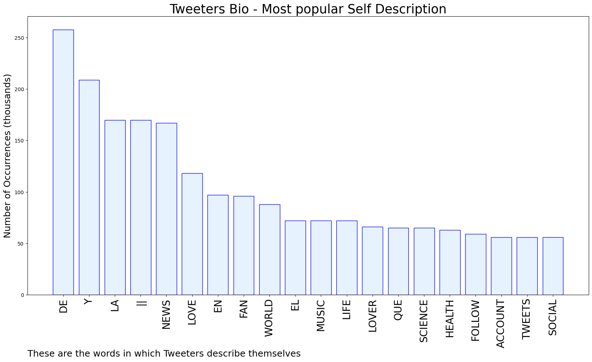

# MURCHIE85 TWITTER PROCESSING 
&#x1F34E; **TOPIC = "Argentina"**

## AUTOMATED RESEARCH SUMMARY

*note: Image pulled from web automatically, not connected to author.
  
<b> This report is AUTOMATED and not hand crafted, it is designed for pulling metrics on a given keyword or hashtag and performs a series of reporting and analysis.</b>

|                **Sample-Tweets**        |
| :-------------: |
| RT @InfectiousDz: San Miguel de Tucumán, Tucumán, Argentina- 8 healthcare workers and 1 patient ill- Symptoms: fever, myalgia, abdominal… |
| RT @NorthBelle4: What is the mystery pneumonia that killed three in Argentina? https://t.co/tytjIew8ik |
| RT @VanguardBat: Top 5 countries that exported the highest $ value worth of Agbado in 20211. USA: US$19.1 billion (37.2% of total corn ex… |

The most popular user is: **AngelinoSancho1**

 RT @ukigoni: Assasination attempt on Argentina’s vicepresident Cristina Kirchner, gun fails to fire. Assailant, 35-year-old Brazilian, has…

## RELATED METRICS 
| Metric | Value |
| ------------- | ------------- |
| #1 Most tweeted to  | **ukigoni** |
| #2 Most tweeted to  | **BNOFeed** |
| #3 Most tweeted to  | **AmichaiStein1** |
| NewProfiles (less than 10 days) | 0.66%  |
| Tweeters with < 10 followers  | 3.5%|
| Tweeters with > 1000000 followers  | 0.32%  |

## MOST POPULAR TWEET TERMS 

| Popularity Rank  | Term |
| ------------- | ------------- |
| first  | **ARGENTINA**  |
| second  | **CRISTINA**  |
| third  | **KIRCHNER** |
| fourth  | **GUN**  |
| fifth  | **ATTEMPT**  |

## Twitter Bio Analysis
### SENTIMENT ANALYSIS

VIEWS WERE : **SUBJECTIVE**  (6.67%) & **NEGATIVELY-SUBJECTIVE** (0.0%) **OBJECTIVE** (93.33%)

### TWEET SAMPLE 
| Random value picked from array |
| ------------- |
|RT @Deoliver47: My Washington Post subscription allows me to share this. Check out this gift article, at no cost to you.Read here: https:… |

### MOST RETWEETED 

| The most retweeted user is: **AngelinoSancho1**  |
| ------------- |
| RT @ukigoni: Assasination attempt on Argentina’s vicepresident Cristina Kirchner, gun fails to fire. Assailant, 35-year-old Brazilian, has… |

### CONCLUSION & EXTERNAL ANALYSIS

*This is my [Adam McMurchie`s] opinion on the data from the tweets, it serves as no objective truth.Since the tweets themselves are a mixture of fact & opinion. 
Authors analytical summary on request.
**RECOMMENDATIONS** WILL BE UPDATED IN NEXT  24 HOURS  