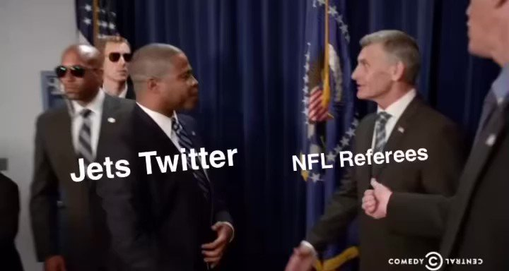
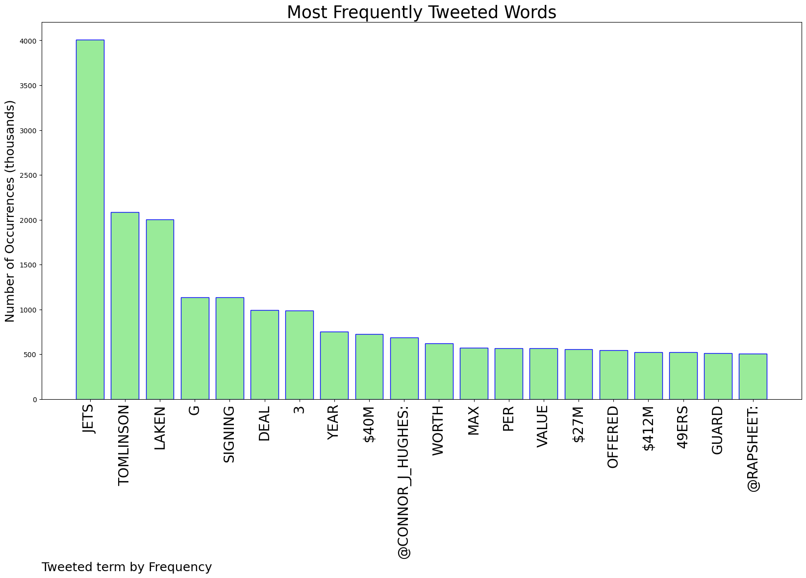
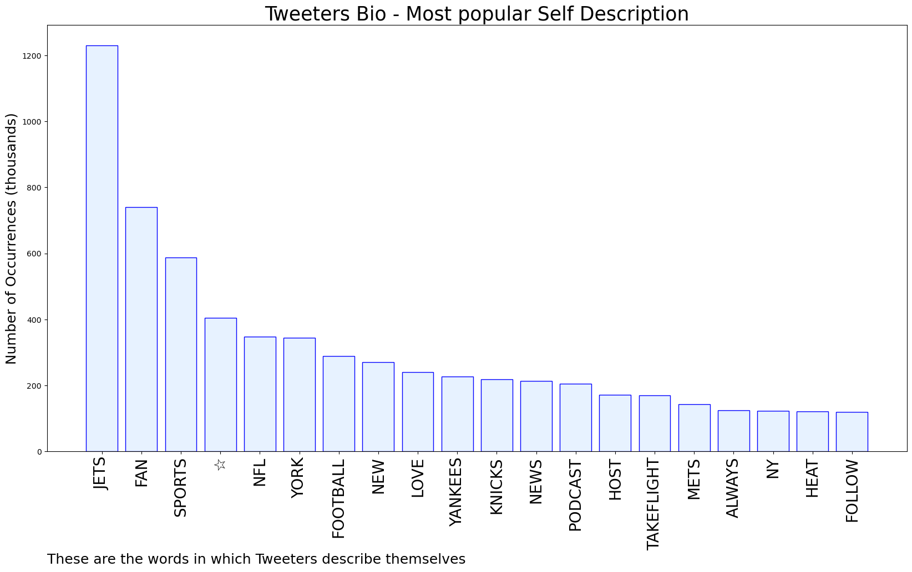

# MURCHIE85 TWITTER PROCESSING 
&#x1F34E; **TOPIC = "#Jets"**

## AUTOMATED RESEARCH SUMMARY

*note: Image pulled from web automatically, not connected to author.
  
<b> This report is AUTOMATED and not hand crafted, it is designed for pulling metrics on a given keyword or hashtag and performs a series of reporting and analysis.</b>

|                **Sample-Tweets**        |
| :-------------: |
| RT @RichCimini: Thinking about how Tomlinson might impact #Jets draft plan at 4: Obviously, they're not going to take an OT (Ekwonu or Neal… |
| RT @RapSheet: The #Jets are signing G Laken Tomlinson to a 3 year deal worth $40M, Max Value of $41.2M, $27M Guaranteed. |
| I really want Christian Kirk #Jets |

The most popular user is: **CTatchell18**

 RT @NYJ_Matt: The 2021 New York Jets | Season Recap

#Jets #TakeFlight #NFL

 https://t.co/x7rrHCqh80

## RELATED METRICS 
| Metric | Value |
| ------------- | ------------- |
| #1 Most tweeted to  | **Connor_J_Hughes** |
| #2 Most tweeted to  | **RapSheet** |
| #3 Most tweeted to  | **MySportsUpdate** |
| NewProfiles (less than 10 days) | 1.12%  |
| Tweeters with < 10 followers  | 2.72%|
| Tweeters with > 1000000 followers  | 0.06%  |

## MOST POPULAR TWEET TERMS 

| Popularity Rank  | Term |
| ------------- | ------------- |
| first  | **JETS**  |
| second  | **TOMLINSON**  |
| third  | **LAKEN** |
| fourth  | **G**  |
| fifth  | **SIGNING**  |

## Twitter Bio Analysis
### SENTIMENT ANALYSIS

VIEWS WERE : **SUBJECTIVE**  (66.67%) & **NEGATIVELY-SUBJECTIVE** (0.0%) **OBJECTIVE** (33.33%)

### TWEET SAMPLE 
| Random value picked from array |
| ------------- |
|Breaking: The #Jets are signing OG Laken Tomlinson to a 3-year, $40M deal, per @RapSheet. The former 9er gets $27M guaranteed. |

### MOST RETWEETED 

| The most retweeted user is: **CTatchell18**  |
| ------------- |
| RT @NYJ_Matt: The 2021 New York Jets | Season Recap#Jets #TakeFlight #NFL https://t.co/x7rrHCqh80 |

### CONCLUSION & EXTERNAL ANALYSIS

*This is my [Adam McMurchie`s] opinion on the data from the tweets, it serves as no objective truth.Since the tweets themselves are a mixture of fact & opinion. 
Authors analytical summary on request.
**RECOMMENDATIONS** WILL BE UPDATED IN NEXT  24 HOURS  