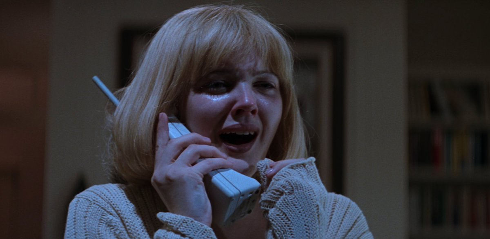
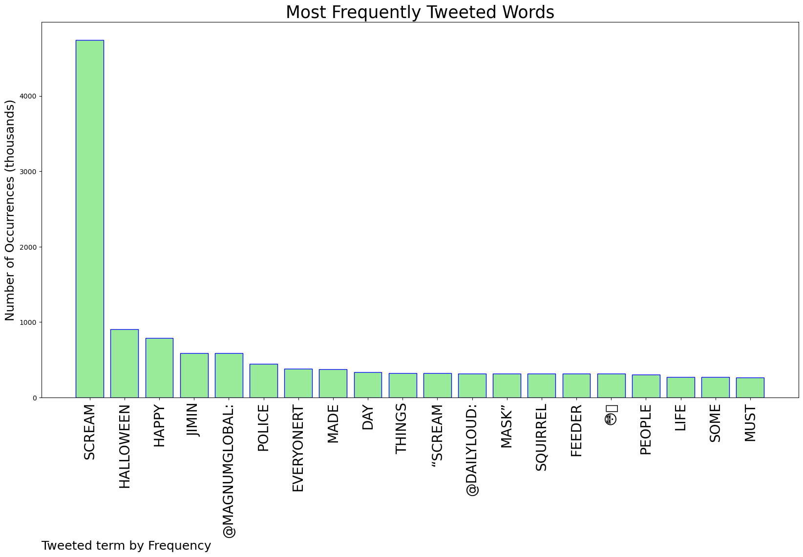
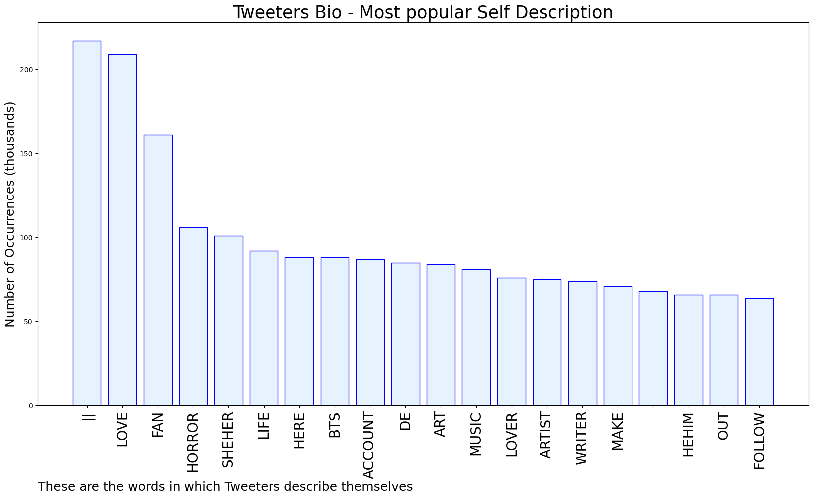
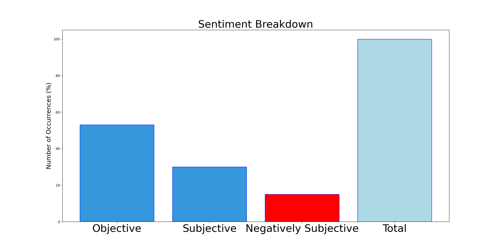

# MURCHIE85 TWITTER PROCESSING 
&#x1F34E; **TOPIC = "Scream"**

## AUTOMATED RESEARCH SUMMARY

*note: Image pulled from web automatically, not connected to author.
  
<b> This report is AUTOMATED and not hand crafted, it is designed for pulling metrics on a given keyword or hashtag and performs a series of reporting and analysis.</b>

|                **Sample-Tweets**        |
| :-------------: |
| RT @PaperFury: how to care for yourself during NaNoWriMo- write what you love- get rid of your family won't be needing them anymore- sto… |
| RT @MagnumGlobal: i screamyou screamwe all screamfor ...Jimin. Happy Halloween everyone. |
| @DevonESawa Barbarian has been my favorite, it solidified Justin Long as a Scream King. |

The most popular user is: **Erinxde**

 RT @Harry_Styles: I scream, you scream. We all scream..

## RELATED METRICS 
| Metric | Value |
| ------------- | ------------- |
| #1 Most tweeted to  | **MagnumGlobal** |
| #2 Most tweeted to  | **DailyLoud** |
| #3 Most tweeted to  | **PleaseBeGneiss** |
| NewProfiles (less than 10 days) | 1.14%  |
| Tweeters with < 10 followers  | 6.24%|
| Tweeters with > 1000000 followers  | 0.04%  |

## MOST POPULAR TWEET TERMS 

| Popularity Rank  | Term |
| ------------- | ------------- |
| first  | **SCREAM**  |
| second  | **HALLOWEEN**  |
| third  | **HAPPY** |
| fourth  | **JIMIN**  |
| fifth  | **@MAGNUMGLOBAL:**  |

## Twitter Bio Analysis
### SENTIMENT ANALYSIS

VIEWS WERE : **SUBJECTIVE**  (30.77%) & **NEGATIVELY-SUBJECTIVE** (15.38%) **OBJECTIVE** (53.85%)

### TWEET SAMPLE 
| Random value picked from array |
| ------------- |
|RT @DarickR: "Thank goodness homophobes, conspiracy theorists, and advocates for political violence can scream into the Twitter town square… |

### MOST RETWEETED 

| The most retweeted user is: **Erinxde**  |
| ------------- |
| RT @Harry_Styles: I scream, you scream. We all scream.. |

### CONCLUSION & EXTERNAL ANALYSIS

*This is my [Adam McMurchie`s] opinion on the data from the tweets, it serves as no objective truth.Since the tweets themselves are a mixture of fact & opinion. 
Authors analytical summary on request.
**RECOMMENDATIONS** WILL BE UPDATED IN NEXT  24 HOURS  