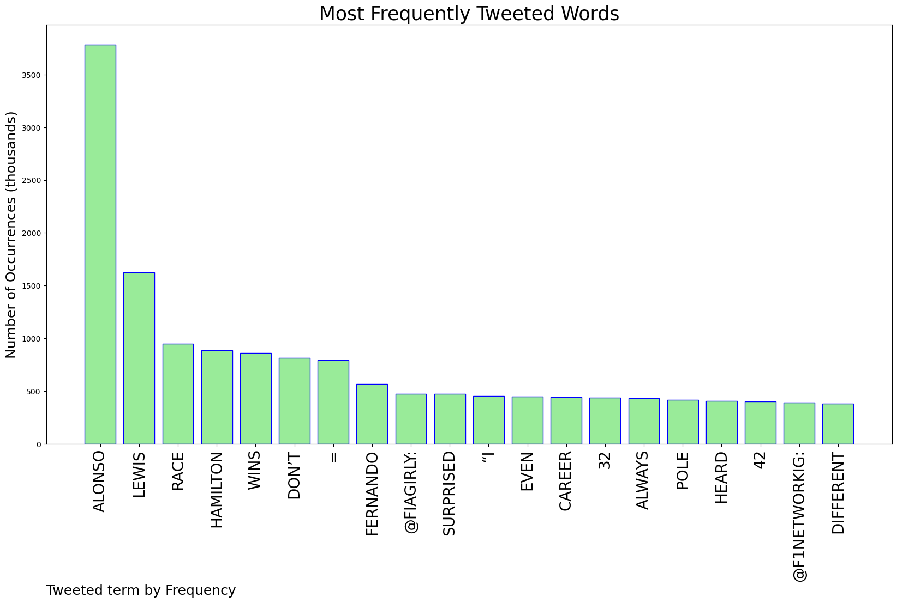
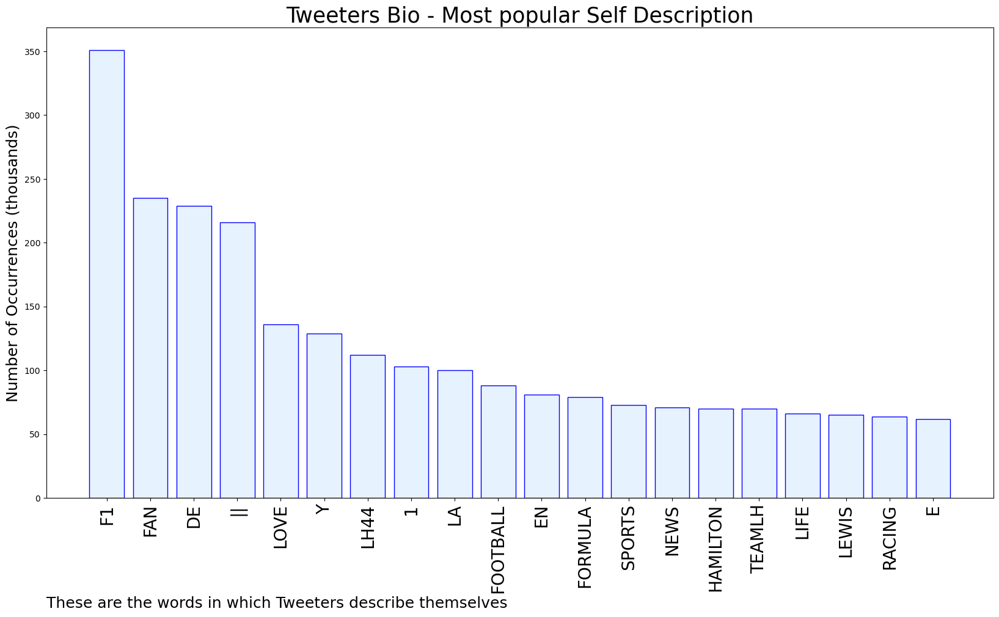

# MURCHIE85 TWITTER PROCESSING 
&#x1F34E; **TOPIC = "Alonso"**

## AUTOMATED RESEARCH SUMMARY

*note: Image pulled from web automatically, not connected to author.
  
<b> This report is AUTOMATED and not hand crafted, it is designed for pulling metrics on a given keyword or hashtag and performs a series of reporting and analysis.</b>

|                **Sample-Tweets**        |
| :-------------: |
| RT @fiagirly: “[Alonso’s] reaction was a bit rough I don’t know if you heard him”“I don’t care.” *walks away* 🥵🥵 https://t.co/INProXFmex |
| RT @f1trolls_: Alonso waving to Hamilton after the crash https://t.co/mBJv2JhhmQ |
| Alonso needs to shut tf up! https://t.co/GUWOgqbg6M |

The most popular user is: **Alonso_Mints**

 RT @Missypromotes: $100 GIVEAWAY 

- RT &amp; Follow @crypto_jhil 

ends in 24 hours 💛

## RELATED METRICS 
| Metric | Value |
| ------------- | ------------- |
| #1 Most tweeted to  | **fiagirly** |
| #2 Most tweeted to  | **F1networkig** |
| #3 Most tweeted to  | **ESPNF1** |
| NewProfiles (less than 10 days) | 0.92%  |
| Tweeters with < 10 followers  | 8.42%|
| Tweeters with > 1000000 followers  | 0.1%  |

## MOST POPULAR TWEET TERMS 

| Popularity Rank  | Term |
| ------------- | ------------- |
| first  | **ALONSO**  |
| second  | **LEWIS**  |
| third  | **RACE** |
| fourth  | **HAMILTON**  |
| fifth  | **WINS**  |

## Twitter Bio Analysis
### SENTIMENT ANALYSIS

VIEWS WERE : **SUBJECTIVE**  (13.33%) & **NEGATIVELY-SUBJECTIVE** (6.67%) **OBJECTIVE** (80.0%)

### TWEET SAMPLE 
| Random value picked from array |
| ------------- |
|@snolasco7 @Hm3felipe @ESPNF1 Did Lewis cry today? Pretty sure it was Alonso |

### MOST RETWEETED 

| The most retweeted user is: **Alonso_Mints**  |
| ------------- |
| RT @Missypromotes: $100 GIVEAWAY - RT &amp; Follow @crypto_jhil ends in 24 hours 💛 |

### CONCLUSION & EXTERNAL ANALYSIS

*This is my [Adam McMurchie`s] opinion on the data from the tweets, it serves as no objective truth.Since the tweets themselves are a mixture of fact & opinion. 
Authors analytical summary on request.
**RECOMMENDATIONS** WILL BE UPDATED IN NEXT  24 HOURS  