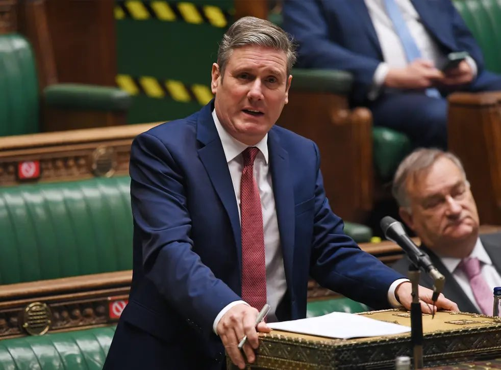
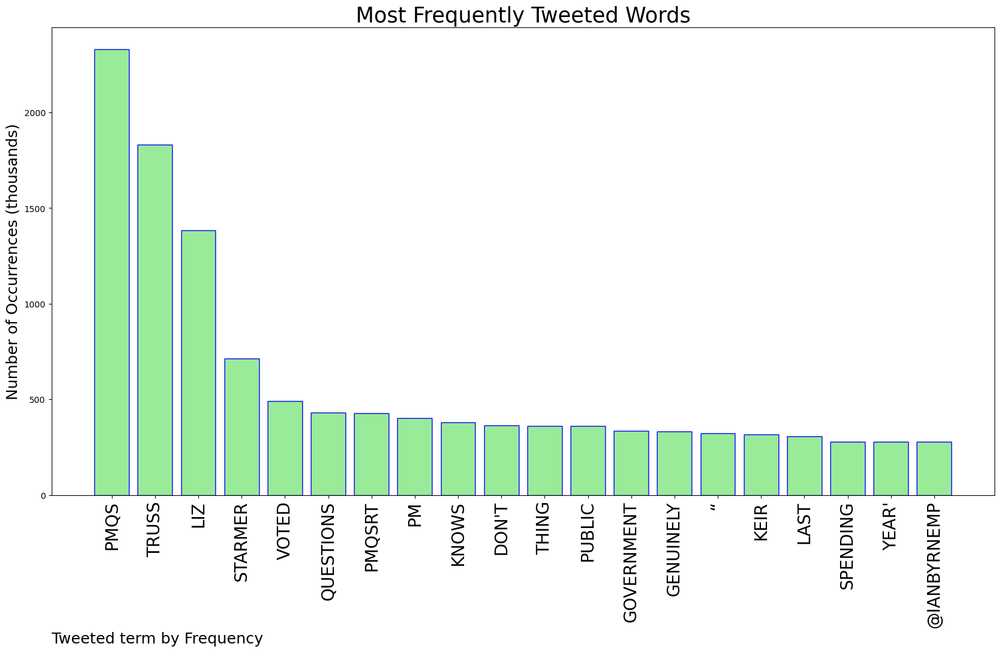
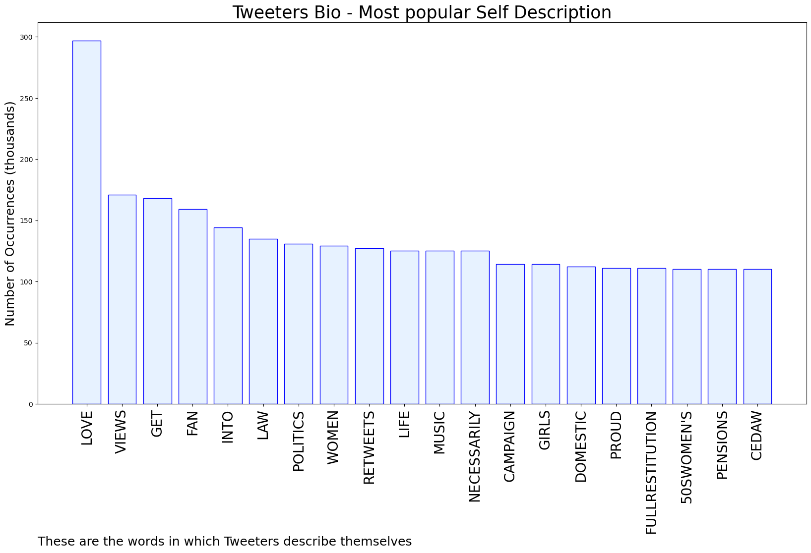
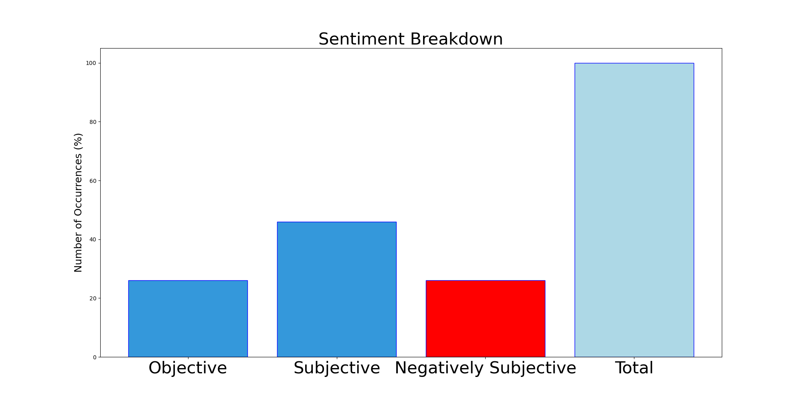

# MURCHIE85 TWITTER PROCESSING 
&#x1F34E; **TOPIC = "#PMQs"**

## AUTOMATED RESEARCH SUMMARY

*note: Image pulled from web automatically, not connected to author.
  
<b> This report is AUTOMATED and not hand crafted, it is designed for pulling metrics on a given keyword or hashtag and performs a series of reporting and analysis.</b>

|                **Sample-Tweets**        |
| :-------------: |
| RT @Muxima5: Penny Mordaunt’s slapped arse face says it all. Fully exposed on the front bench to the public and sitting next to Truss she h… |
| RT @KarlTurnerMP: Have to say I’ve known @PennyMordaunt a fairly long time now. We were elected same GE. Penny definitely did not look at a… |
| RT @PeteWishart: The answer to the mortgage crisis is to build more nuclear power stations, apparently. #PMQs |

The most popular user is: **Anniehowd**

 RT @MrPMHarrison: I don't think Starmer quite knows what to with Truss at #PMQs.
It's like trying to explain trigonometry to a labrador. Sh…

## RELATED METRICS 
| Metric | Value |
| ------------- | ------------- |
| #1 Most tweeted to  | **IanByrneMP** |
| #2 Most tweeted to  | **terryelaineh1** |
| #3 Most tweeted to  | **trussliz** |
| NewProfiles (less than 10 days) | 0.4%  |
| Tweeters with < 10 followers  | 2.04%|
| Tweeters with > 1000000 followers  | 0.0%  |

## MOST POPULAR TWEET TERMS 

| Popularity Rank  | Term |
| ------------- | ------------- |
| first  | **PMQS**  |
| second  | **TRUSS**  |
| third  | **LIZ** |
| fourth  | **STARMER**  |
| fifth  | **VOTED**  |

## Twitter Bio Analysis
### SENTIMENT ANALYSIS

VIEWS WERE : **SUBJECTIVE**  (46.67%) & **NEGATIVELY-SUBJECTIVE** (26.67%) **OBJECTIVE** (26.67%)

### TWEET SAMPLE 
| Random value picked from array |
| ------------- |
|RT @MimiJ9: ANOTHER MAJOR U TURN.Liz Truss’s team has said there will be cuts made in the public sector.Truss said at #PMQS that no cut… |

### MOST RETWEETED 

| The most retweeted user is: **Anniehowd**  |
| ------------- |
| RT @MrPMHarrison: I don't think Starmer quite knows what to with Truss at #PMQs.It's like trying to explain trigonometry to a labrador. Sh… |

### CONCLUSION & EXTERNAL ANALYSIS

*This is my [Adam McMurchie`s] opinion on the data from the tweets, it serves as no objective truth.Since the tweets themselves are a mixture of fact & opinion. 
Authors analytical summary on request.
**RECOMMENDATIONS** WILL BE UPDATED IN NEXT  24 HOURS  