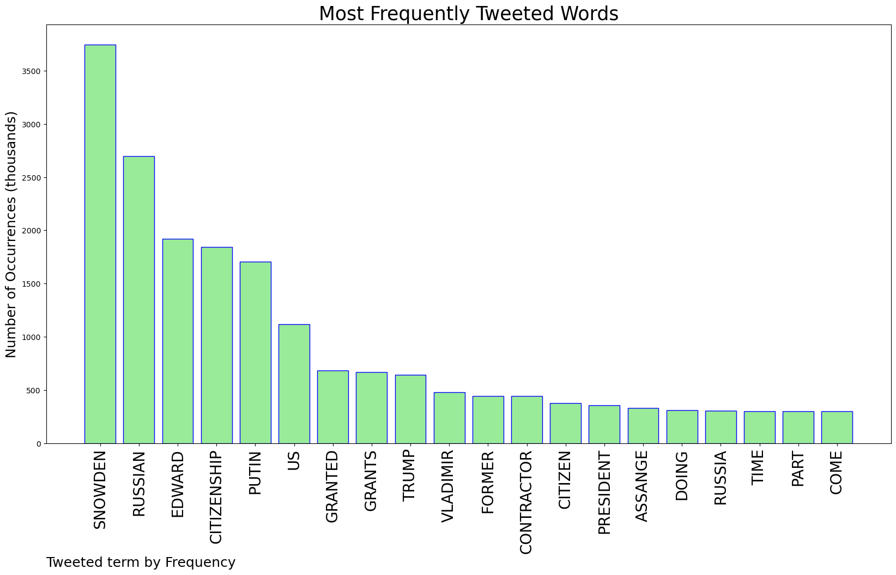
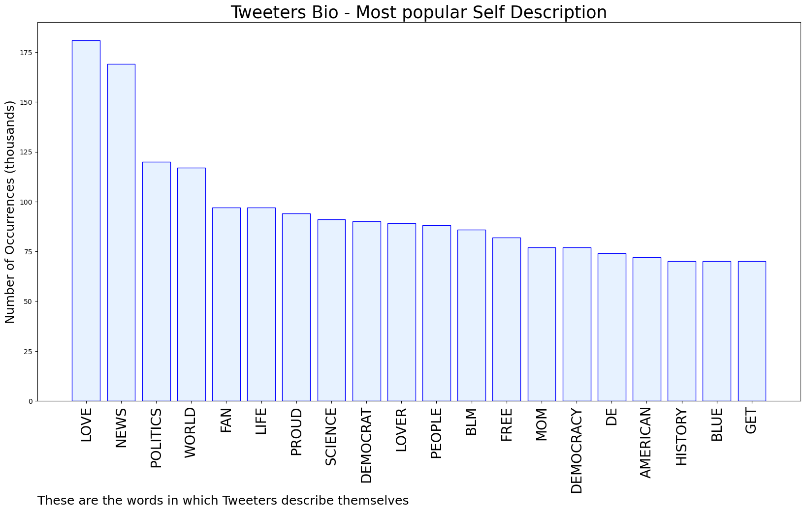
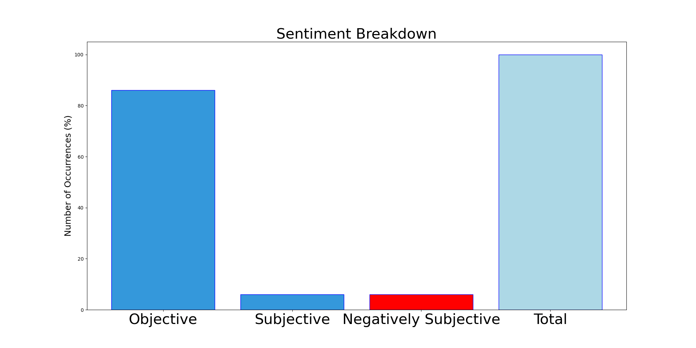

# MURCHIE85 TWITTER PROCESSING 
&#x1F34E; **TOPIC = "Snowden"**

## AUTOMATED RESEARCH SUMMARY

*note: Image pulled from web automatically, not connected to author.
  
<b> This report is AUTOMATED and not hand crafted, it is designed for pulling metrics on a given keyword or hashtag and performs a series of reporting and analysis.</b>

|                **Sample-Tweets**        |
| :-------------: |
| RT @Archer83Able: didn't have Edward Snowden fighting alongside Wagner Group and draftees from Sakhalin somewhere near Bakhmut on my 2022 B… |
| @ghcDrew @mwest410 @AP What visa are you talking about?! Snowden came to Russia without visa. Russia provided him w… https://t.co/HuWHOxSe2A |
| RT @WheatPM: In 2012 you could not escape Snowden and Assange headlines and praise, and I'm just so glad their actual loyalties are now und… |

The most popular user is: **NoRussianBottt**

 RT @Snowden: Did you know that whistleblowers are sentenced to more time in prison than corrupt officials who trade secrets for sex⁠—more t…

## RELATED METRICS 
| Metric | Value |
| ------------- | ------------- |
| #1 Most tweeted to  | **Snowden** |
| #2 Most tweeted to  | **ggreenwald** |
| #3 Most tweeted to  | **davetroy** |
| NewProfiles (less than 10 days) | 0.7%  |
| Tweeters with < 10 followers  | 4.0%|
| Tweeters with > 1000000 followers  | 0.28%  |

## MOST POPULAR TWEET TERMS 

| Popularity Rank  | Term |
| ------------- | ------------- |
| first  | **SNOWDEN**  |
| second  | **RUSSIAN**  |
| third  | **EDWARD** |
| fourth  | **CITIZENSHIP**  |
| fifth  | **PUTIN**  |

## Twitter Bio Analysis
### SENTIMENT ANALYSIS

VIEWS WERE : **SUBJECTIVE**  (6.67%) & **NEGATIVELY-SUBJECTIVE** (6.67%) **OBJECTIVE** (86.67%)

### TWEET SAMPLE 
| Random value picked from array |
| ------------- |
|@jack @Snowden 6 days laterhttps://t.co/ay5QgDvAmV |

### MOST RETWEETED 

| The most retweeted user is: **NoRussianBottt**  |
| ------------- |
| RT @Snowden: Did you know that whistleblowers are sentenced to more time in prison than corrupt officials who trade secrets for sex⁠—more t… |

### CONCLUSION & EXTERNAL ANALYSIS

*This is my [Adam McMurchie`s] opinion on the data from the tweets, it serves as no objective truth.Since the tweets themselves are a mixture of fact & opinion. 
Authors analytical summary on request.
**RECOMMENDATIONS** WILL BE UPDATED IN NEXT  24 HOURS  