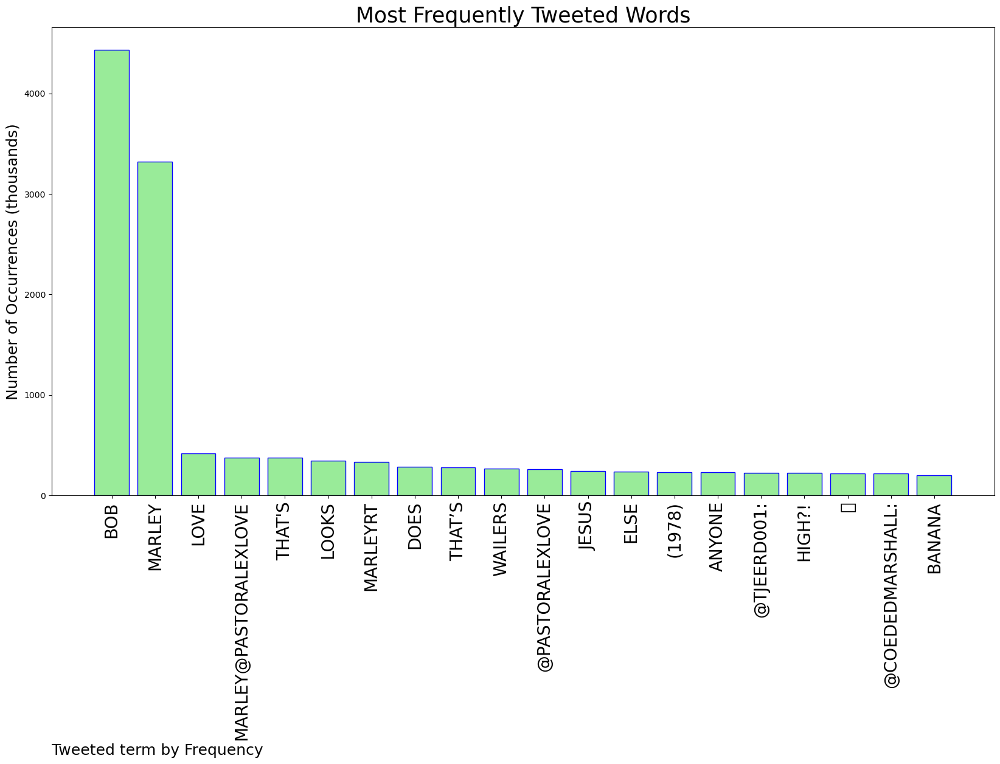
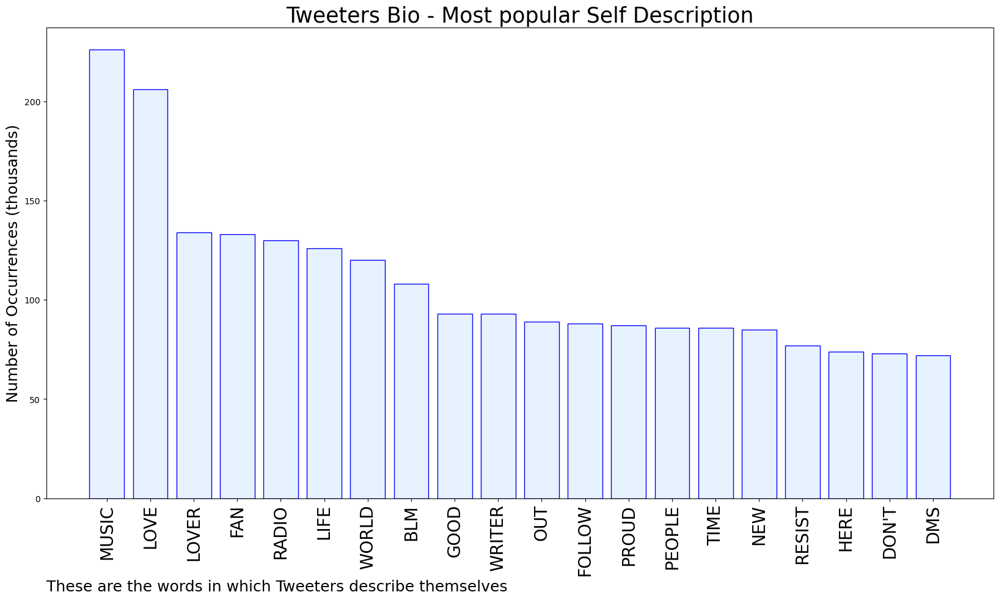

# MURCHIE85 TWITTER PROCESSING 
&#x1F34E; **TOPIC = "Bob Marley"**

## AUTOMATED RESEARCH SUMMARY

*note: Image pulled from web automatically, not connected to author.
  
<b> This report is AUTOMATED and not hand crafted, it is designed for pulling metrics on a given keyword or hashtag and performs a series of reporting and analysis.</b>

|                **Sample-Tweets**        |
| :-------------: |
| RT @JamesL1927: BOB MARLEY playing football in London in the 1970s. https://t.co/V5l9zUEnwI |
| RT @Super70sSports: George Harrison and Bob Marley sharing a bro shake is the fucking mojo I needed tonight. https://t.co/DagWDnUNW9 |
| @PastorAlexLove Bob Marley is a god. |

The most popular user is: **lxghnella**

 RT @zrlbsn: To be Lauryn Hill’s daughter and Bob Marley’s granddaughter and to be reasoning like this is INSANE

## RELATED METRICS 
| Metric | Value |
| ------------- | ------------- |
| #1 Most tweeted to  | **PastorAlexLove** |
| #2 Most tweeted to  | **Tjeerd001** |
| #3 Most tweeted to  | **CoededMarshall** |
| NewProfiles (less than 10 days) | 0.84%  |
| Tweeters with < 10 followers  | 4.3%|
| Tweeters with > 1000000 followers  | 0.0%  |

## MOST POPULAR TWEET TERMS 

| Popularity Rank  | Term |
| ------------- | ------------- |
| first  | **BOB**  |
| second  | **MARLEY**  |
| third  | **LOVE** |
| fourth  | **MARLEY@PASTORALEXLOVE**  |
| fifth  | **"THATS"**  |

## Twitter Bio Analysis
### SENTIMENT ANALYSIS

VIEWS WERE : **SUBJECTIVE**  (40.0%) & **NEGATIVELY-SUBJECTIVE** (0.0%) **OBJECTIVE** (60.0%)

### TWEET SAMPLE 
| Random value picked from array |
| ------------- |
|Sorry, I see Bob Marley. https://t.co/1Jvafthh9U |

### MOST RETWEETED 

| The most retweeted user is: **lxghnella**  |
| ------------- |
| RT @zrlbsn: To be Lauryn Hill’s daughter and Bob Marley’s granddaughter and to be reasoning like this is INSANE |

### CONCLUSION & EXTERNAL ANALYSIS

*This is my [Adam McMurchie`s] opinion on the data from the tweets, it serves as no objective truth.Since the tweets themselves are a mixture of fact & opinion. 
Authors analytical summary on request.
**RECOMMENDATIONS** WILL BE UPDATED IN NEXT  24 HOURS  