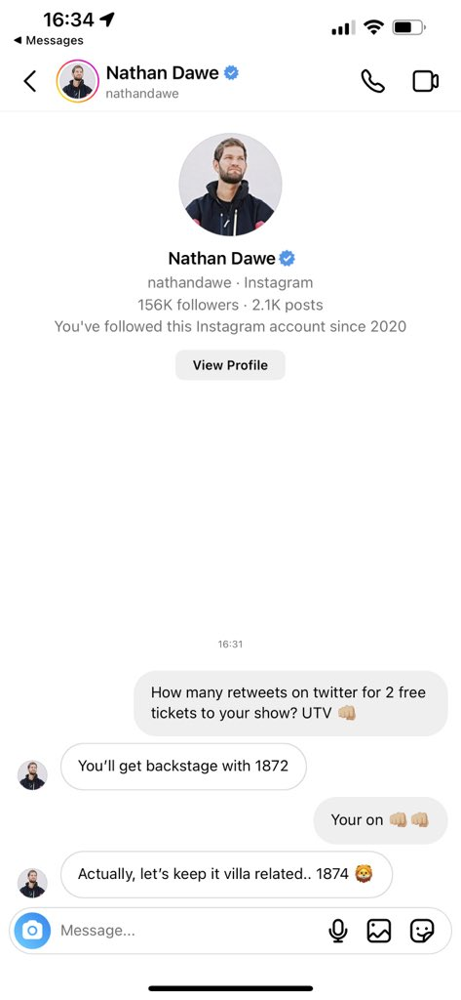
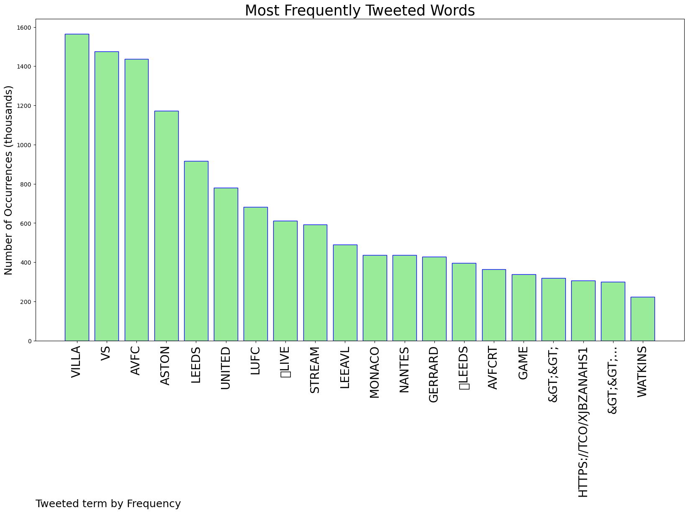
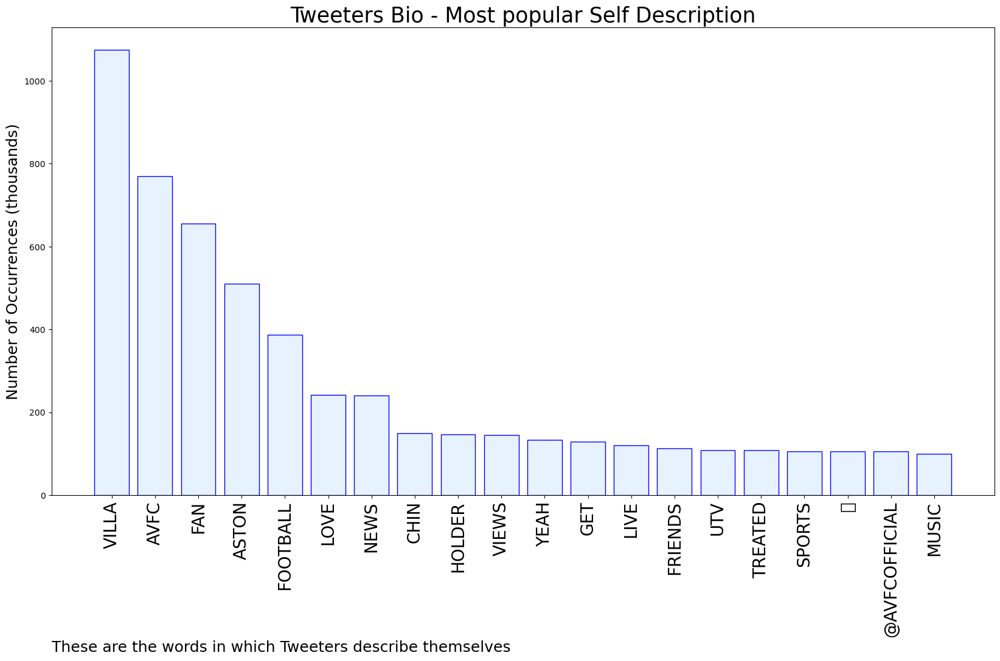

# MURCHIE85 TWITTER PROCESSING 
&#x1F34E; **TOPIC = "#avfc"**

## AUTOMATED RESEARCH SUMMARY

*note: Image pulled from web automatically, not connected to author.
  
<b> This report is AUTOMATED and not hand crafted, it is designed for pulling metrics on a given keyword or hashtag and performs a series of reporting and analysis.</b>

|                **Sample-Tweets**        |
| :-------------: |
| RT @AVFCFaithful_: Dean Smith was sacked for 10 points in 11 games, we currently have 8 points from 8 games. #avfc |
| Refs a bottle job, sent one off not gid two clear yellows. #avfc |
| 📺Live Stream#LEEAVL #LUFC #AVFC🔴Leeds vs Aston Villa🔗Link1:https://t.co/0a9tHJO8oL🔗Link2:https://t.co/0a9tHJO8oLtk |

The most popular user is: **AimlessRL**

 RT @JakeAvery4: Help me out lads 😂 #nathandawe #avfc @villareport https://t.co/6RbKVdH85t

## RELATED METRICS 
| Metric | Value |
| ------------- | ------------- |
| #1 Most tweeted to  | **AVFCFaithful_** |
| #2 Most tweeted to  | **AVFCStatto** |
| #3 Most tweeted to  | **AVFCOfficial** |
| NewProfiles (less than 10 days) | 0.44%  |
| Tweeters with < 10 followers  | 19.04%|
| Tweeters with > 1000000 followers  | 0.02%  |

## MOST POPULAR TWEET TERMS 

| Popularity Rank  | Term |
| ------------- | ------------- |
| first  | **VILLA**  |
| second  | **VS**  |
| third  | **AVFC** |
| fourth  | **ASTON**  |
| fifth  | **LEEDS**  |

## Twitter Bio Analysis
### SENTIMENT ANALYSIS

VIEWS WERE : **SUBJECTIVE**  (40.0%) & **NEGATIVELY-SUBJECTIVE** (13.33%) **OBJECTIVE** (46.67%)

### TWEET SAMPLE 
| Random value picked from array |
| ------------- |
|Bailey off at half time right?  #AVFC |

### MOST RETWEETED 

| The most retweeted user is: **AimlessRL**  |
| ------------- |
| RT @JakeAvery4: Help me out lads 😂 #nathandawe #avfc @villareport https://t.co/6RbKVdH85t |

### CONCLUSION & EXTERNAL ANALYSIS

*This is my [Adam McMurchie`s] opinion on the data from the tweets, it serves as no objective truth.Since the tweets themselves are a mixture of fact & opinion. 
Authors analytical summary on request.
**RECOMMENDATIONS** WILL BE UPDATED IN NEXT  24 HOURS  