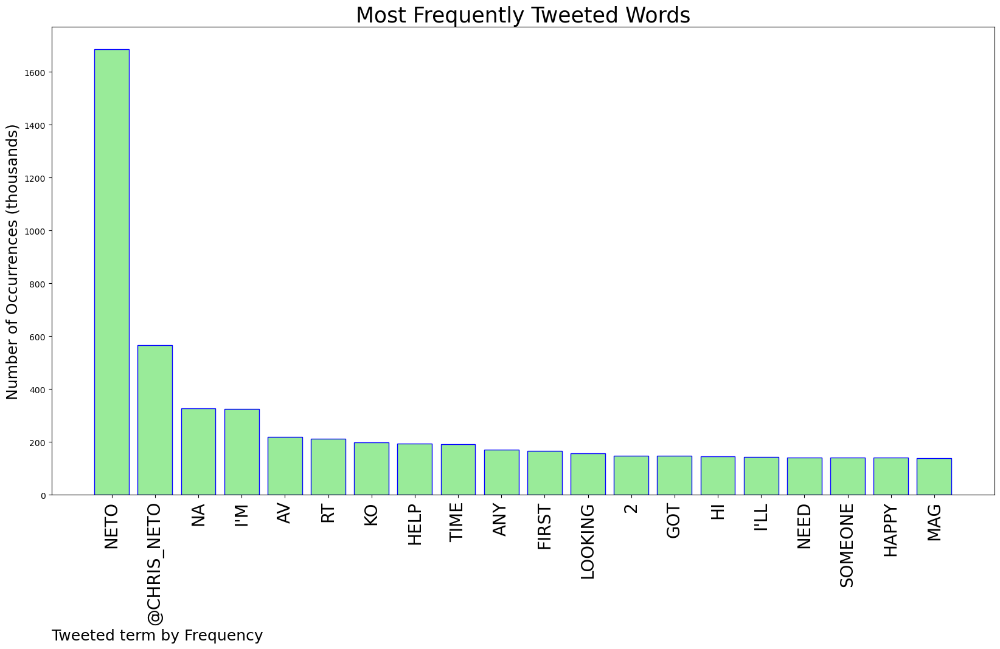
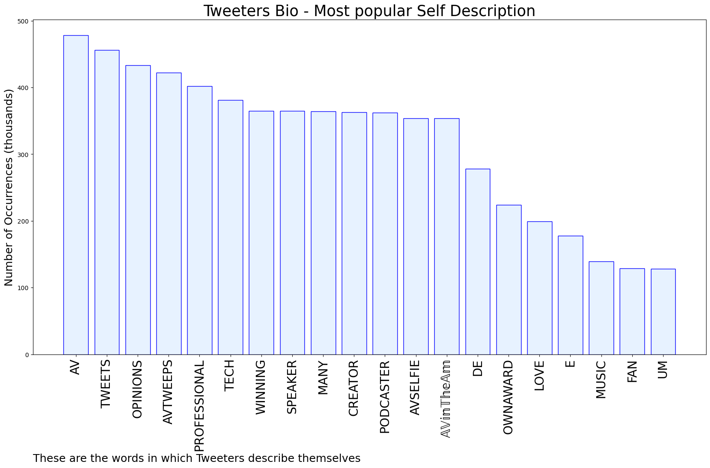

# MURCHIE85 TWITTER PROCESSING 
&#x1F34E; **TOPIC = "Neto"**

## AUTOMATED RESEARCH SUMMARY

*note: Image pulled from web automatically, not connected to author.
  
<b> This report is AUTOMATED and not hand crafted, it is designed for pulling metrics on a given keyword or hashtag and performs a series of reporting and analysis.</b>

|                **Sample-Tweets**        |
| :-------------: |
| @htomufc Olise, Neto or Dembele and use amad as backup |
| RT @KyahLex: Grabe ganda neto panoorin, another one of the books!! https://t.co/8ykffTVeU6 |
| RT @NJDavidD: @BobRomano19 @chris_neto Yes, but there is a small but growing trend to shed the complex AV integration business and become m… |

The most popular user is: **_Neto_tosa_**

 RT @jhsflwer: THIS!!!!!!!!!!!! https://t.co/7t2wGigctT

## RELATED METRICS 
| Metric | Value |
| ------------- | ------------- |
| #1 Most tweeted to  | **chris_neto** |
| #2 Most tweeted to  | **jacobyaudio** |
| #3 Most tweeted to  | **tomarbuthnot** |
| NewProfiles (less than 10 days) | 1.68%  |
| Tweeters with < 10 followers  | 4.86%|
| Tweeters with > 1000000 followers  | 0.0%  |

## MOST POPULAR TWEET TERMS 

| Popularity Rank  | Term |
| ------------- | ------------- |
| first  | **NETO**  |
| second  | **@CHRIS_NETO**  |
| third  | **NA** |
| fourth  | **"IM"**  |
| fifth  | **AV**  |

## Twitter Bio Analysis
### SENTIMENT ANALYSIS

VIEWS WERE : **SUBJECTIVE**  (20.0%) & **NEGATIVELY-SUBJECTIVE** (0.0%) **OBJECTIVE** (80.0%)

### TWEET SAMPLE 
| Random value picked from array |
| ------------- |
|@YouTube Felipe Neto, Rosanna Pansino, Daniel Middleton. Etc Just love this dudes like I have know them forever.… https://t.co/xRNnOiB69h |

### MOST RETWEETED 

| The most retweeted user is: **_Neto_tosa_**  |
| ------------- |
| RT @jhsflwer: THIS!!!!!!!!!!!! https://t.co/7t2wGigctT |

### CONCLUSION & EXTERNAL ANALYSIS

*This is my [Adam McMurchie`s] opinion on the data from the tweets, it serves as no objective truth.Since the tweets themselves are a mixture of fact & opinion. 
Authors analytical summary on request.
**RECOMMENDATIONS** WILL BE UPDATED IN NEXT  24 HOURS  