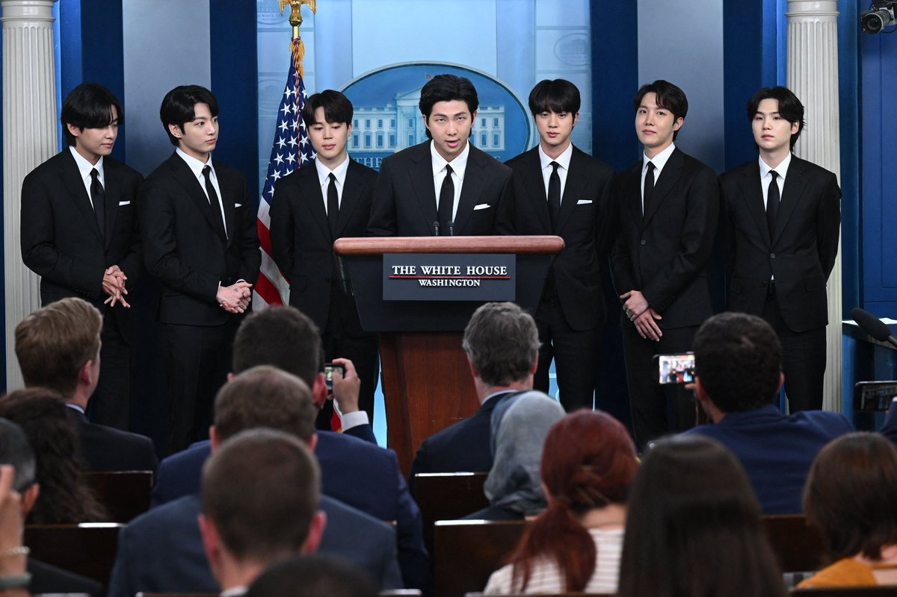
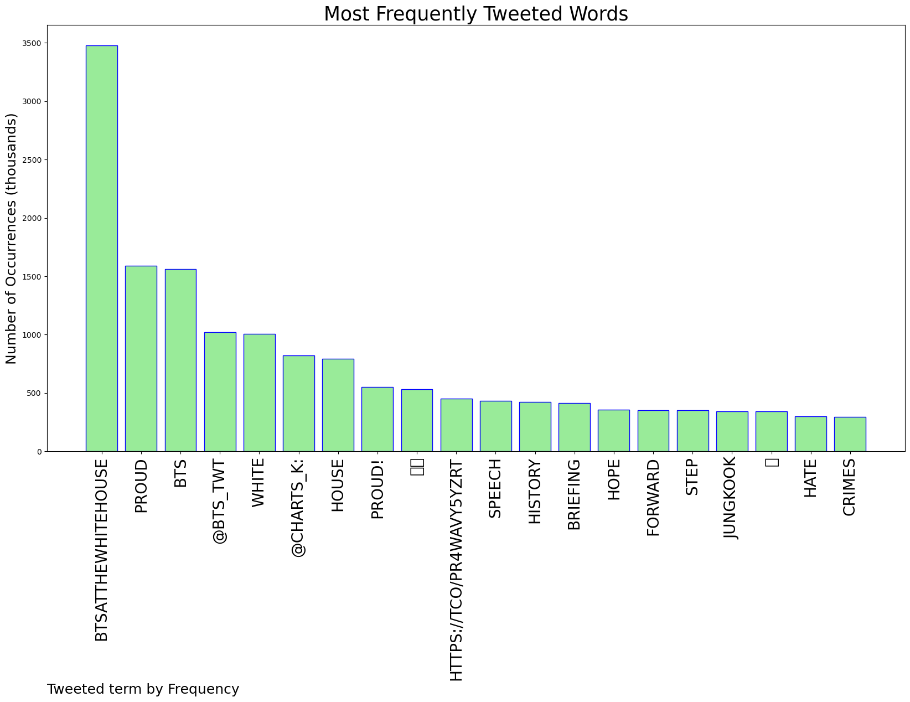
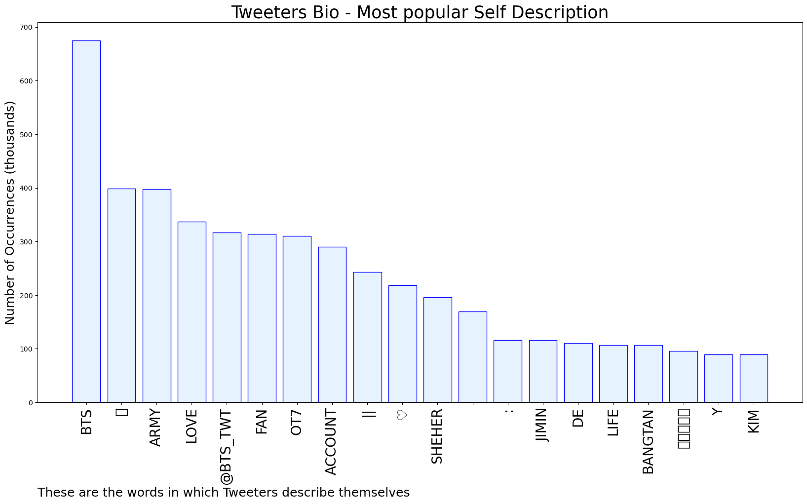

# MURCHIE85 TWITTER PROCESSING 
&#x1F34E; **TOPIC = "#BTSatTheWhiteHouse"**

## AUTOMATED RESEARCH SUMMARY

*note: Image pulled from web automatically, not connected to author.
  
<b> This report is AUTOMATED and not hand crafted, it is designed for pulling metrics on a given keyword or hashtag and performs a series of reporting and analysis.</b>

|                **Sample-Tweets**        |
| :-------------: |
| RT @oldiesbtss: YOU MADE HISTORY @BTS_twt #BTSatTheWhiteHouse https://t.co/O8HsOvYPoB |
| RT @thetaeprint: [VIDEO] Taehyung’s speech at White House 🐯: Everyone has their own history. We hope today is one step forward to respect… |
| BTS HWAITING !!BTS FIGHTING !!@BTS_twt #BTSatTheWhiteHouse |

The most popular user is: **7everBTS**

 RT @charts_k: .@BTS_twt speaking at the White House Briefing Room. 🇺🇸

#BTSatTheWhiteHouse https://t.co/0DfCSumx3C

## RELATED METRICS 
| Metric | Value |
| ------------- | ------------- |
| #1 Most tweeted to  | **BTS_twt** |
| #2 Most tweeted to  | **charts_k** |
| #3 Most tweeted to  | **btsbaragi_jk** |
| NewProfiles (less than 10 days) | 0.28%  |
| Tweeters with < 10 followers  | 7.94%|
| Tweeters with > 1000000 followers  | 0.02%  |

## MOST POPULAR TWEET TERMS 

| Popularity Rank  | Term |
| ------------- | ------------- |
| first  | **BTSATTHEWHITEHOUSE**  |
| second  | **PROUD**  |
| third  | **BTS** |
| fourth  | **@BTS_TWT**  |
| fifth  | **WHITE**  |

## Twitter Bio Analysis
### SENTIMENT ANALYSIS

VIEWS WERE : **SUBJECTIVE**  (13.33%) & **NEGATIVELY-SUBJECTIVE** (6.67%) **OBJECTIVE** (80.0%)

### TWEET SAMPLE 
| Random value picked from array |
| ------------- |
|RT @levijjk: TENEMOS QUE SER TENDENCIA,COMENTEN LOS MESES Y EL FANCHAT ‼WE ARE PROUD OF YOU BTS#BTSatTheWhiteHouse@BTS_twt |

### MOST RETWEETED 

| The most retweeted user is: **7everBTS**  |
| ------------- |
| RT @charts_k: .@BTS_twt speaking at the White House Briefing Room. 🇺🇸#BTSatTheWhiteHouse https://t.co/0DfCSumx3C |

### CONCLUSION & EXTERNAL ANALYSIS

*This is my [Adam McMurchie`s] opinion on the data from the tweets, it serves as no objective truth.Since the tweets themselves are a mixture of fact & opinion. 
Authors analytical summary on request.
**RECOMMENDATIONS** WILL BE UPDATED IN NEXT  24 HOURS  