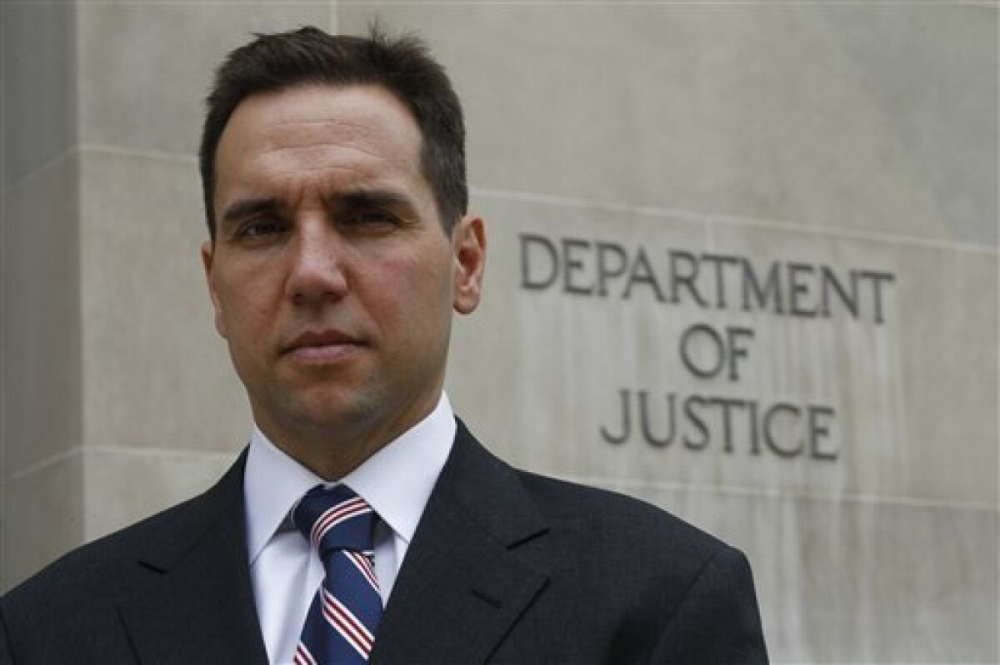
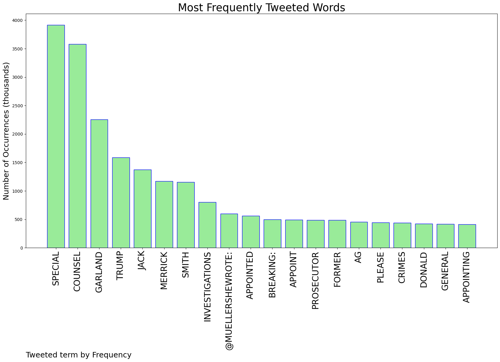
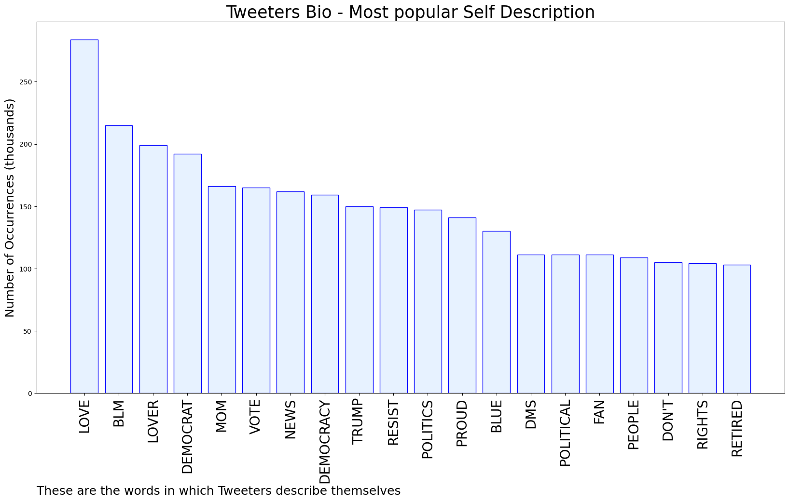
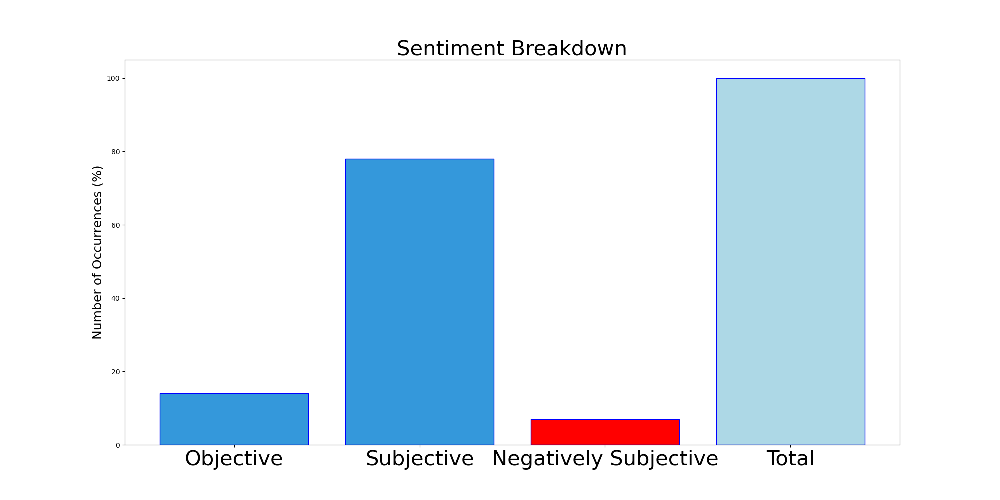

# MURCHIE85 TWITTER PROCESSING 
&#x1F34E; **TOPIC = "Special Counsel"**

## AUTOMATED RESEARCH SUMMARY

*note: Image pulled from web automatically, not connected to author.
  
<b> This report is AUTOMATED and not hand crafted, it is designed for pulling metrics on a given keyword or hashtag and performs a series of reporting and analysis.</b>

|                **Sample-Tweets**        |
| :-------------: |
| Trying to gauge the lib anon reaction to the Special Counsel appointment is proving challenging. They’re all over the place right now. |
| RT @StevenBeschloss: No indictment today, but Garland's chosen special counsel--Jack Smith, a war crimes prosecutor--is a path to indictmen… |
| RT @ElieNYC: His line about the fact that Trump is now running for President is utter, complete BULLCRAP.If Garland was worried about tha… |

The most popular user is: **Kafka1057**

 RT @tribelaw: Yes. Time's up, DOJ. I know that Merrick Garland, who has devoted his life to the rule of law, will do the right thing. But t…

## RELATED METRICS 
| Metric | Value |
| ------------- | ------------- |
| #1 Most tweeted to  | **MuellerSheWrote** |
| #2 Most tweeted to  | **kyledcheney** |
| #3 Most tweeted to  | **robreiner** |
| NewProfiles (less than 10 days) | 0.66%  |
| Tweeters with < 10 followers  | 2.26%|
| Tweeters with > 1000000 followers  | 0.26%  |

## MOST POPULAR TWEET TERMS 

| Popularity Rank  | Term |
| ------------- | ------------- |
| first  | **SPECIAL**  |
| second  | **COUNSEL**  |
| third  | **GARLAND** |
| fourth  | **TRUMP**  |
| fifth  | **JACK**  |

## Twitter Bio Analysis
### SENTIMENT ANALYSIS

VIEWS WERE : **SUBJECTIVE**  (78.57%) & **NEGATIVELY-SUBJECTIVE** (7.14%) **OBJECTIVE** (14.29%)

### TWEET SAMPLE 
| Random value picked from array |
| ------------- |
|RT @ECMcLaughlin: Fucking infuriating. Also, ⁦@sarahkendzior⁩ was right. https://t.co/0hOgW3ZpZm |

### MOST RETWEETED 

| The most retweeted user is: **Kafka1057**  |
| ------------- |
| RT @tribelaw: Yes. Time's up, DOJ. I know that Merrick Garland, who has devoted his life to the rule of law, will do the right thing. But t… |

### CONCLUSION & EXTERNAL ANALYSIS

*This is my [Adam McMurchie`s] opinion on the data from the tweets, it serves as no objective truth.Since the tweets themselves are a mixture of fact & opinion. 
Authors analytical summary on request.
**RECOMMENDATIONS** WILL BE UPDATED IN NEXT  24 HOURS  