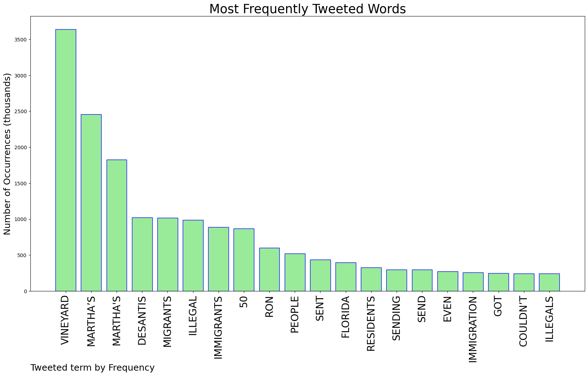
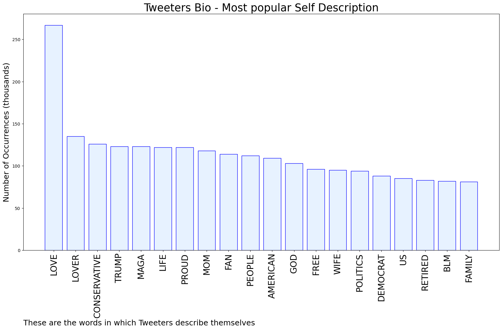

# MURCHIE85 TWITTER PROCESSING 
&#x1F34E; **TOPIC = "Martha's Vineyard"**

## AUTOMATED RESEARCH SUMMARY

*note: Image pulled from web automatically, not connected to author.
  
<b> This report is AUTOMATED and not hand crafted, it is designed for pulling metrics on a given keyword or hashtag and performs a series of reporting and analysis.</b>

|                **Sample-Tweets**        |
| :-------------: |
| RT @EndWokeness: Whenever you pass one of these, remember that time when Martha’s Vineyard called the National Guard to remove 50 illegals… |
| RT @tlplair: The price of a one-way 1st-class ticket from Tallahassee to Martha's Vineyard is $2,119. 50 tickets would cost $105,950. Ye… |
| RT @BuckSexton: Sending dozens of illegal migrants on a plane in broad daylight to lovely Martha’s Vineyard is “kidnapping” Sending milli… |

The most popular user is: **patrickmacd7**

 RT @jaxcarys: Martha's Vineyard resident with some words https://t.co/eMaZFjCbG0

## RELATED METRICS 
| Metric | Value |
| ------------- | ------------- |
| #1 Most tweeted to  | **ksorbs** |
| #2 Most tweeted to  | **Sky_Lee_1** |
| #3 Most tweeted to  | **ClayTravis** |
| NewProfiles (less than 10 days) | 1.14%  |
| Tweeters with < 10 followers  | 4.68%|
| Tweeters with > 1000000 followers  | 0.12%  |

## MOST POPULAR TWEET TERMS 

| Popularity Rank  | Term |
| ------------- | ------------- |
| first  | **VINEYARD**  |
| second  | **MARTHA’S**  |
| third  | **"MARTHAS"** |
| fourth  | **DESANTIS**  |
| fifth  | **MIGRANTS**  |

## Twitter Bio Analysis
### SENTIMENT ANALYSIS

VIEWS WERE : **SUBJECTIVE**  (20.0%) & **NEGATIVELY-SUBJECTIVE** (26.67%) **OBJECTIVE** (53.33%)

### TWEET SAMPLE 
| Random value picked from array |
| ------------- |
|RT @TimRunsHisMouth: The residents of Martha's Vineyard got rid of those illegal immigrants faster than they could read their yard signs sa… |

### MOST RETWEETED 

| The most retweeted user is: **patrickmacd7**  |
| ------------- |
| RT @jaxcarys: Martha's Vineyard resident with some words https://t.co/eMaZFjCbG0 |

### CONCLUSION & EXTERNAL ANALYSIS

*This is my [Adam McMurchie`s] opinion on the data from the tweets, it serves as no objective truth.Since the tweets themselves are a mixture of fact & opinion. 
Authors analytical summary on request.
**RECOMMENDATIONS** WILL BE UPDATED IN NEXT  24 HOURS  