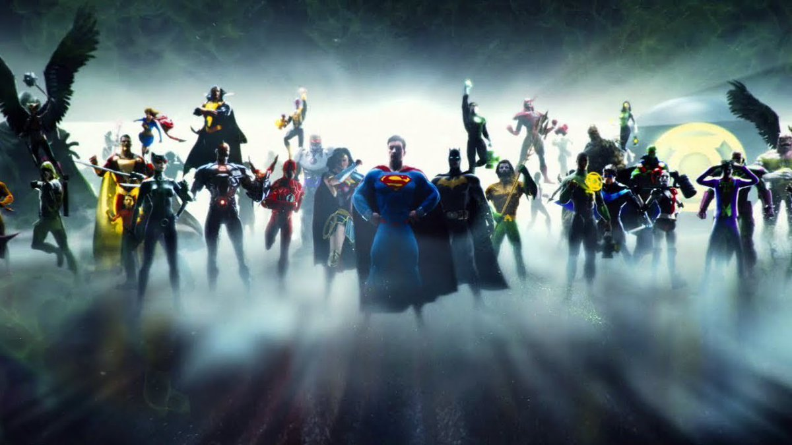
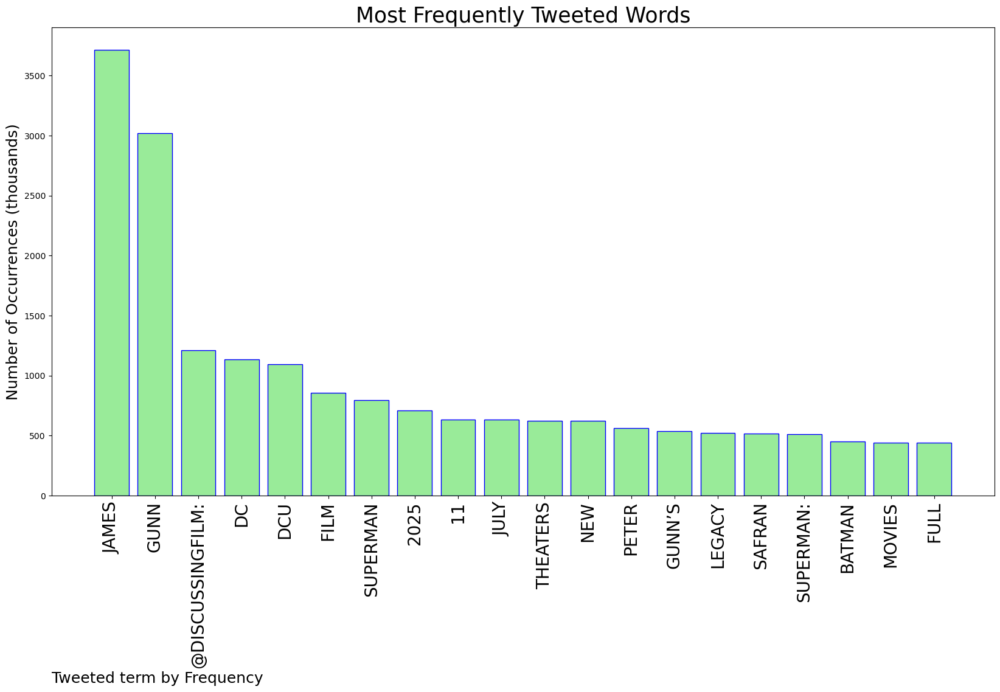
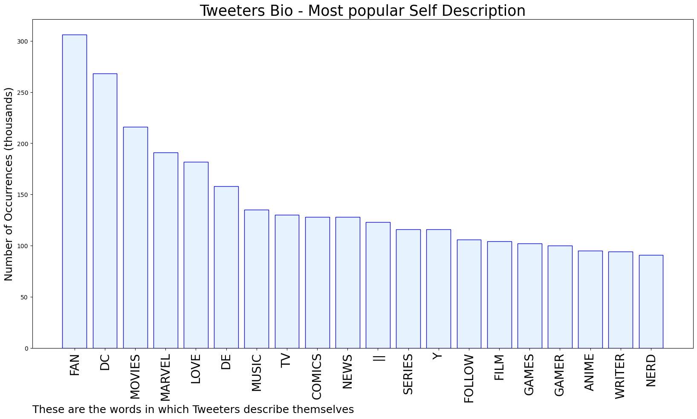
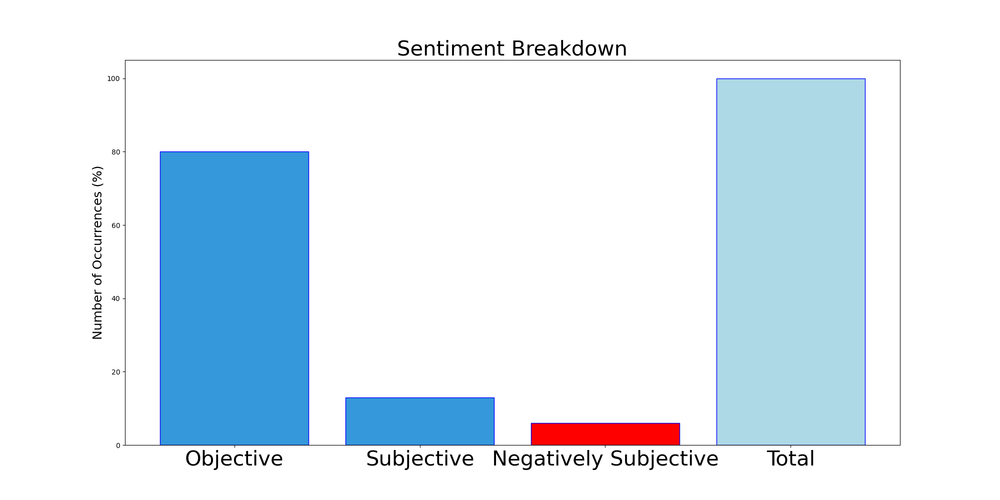

# MURCHIE85 TWITTER PROCESSING 
&#x1F34E; **TOPIC = "James Gunn"**

## AUTOMATED RESEARCH SUMMARY

*note: Image pulled from web automatically, not connected to author.
  
<b> This report is AUTOMATED and not hand crafted, it is designed for pulling metrics on a given keyword or hashtag and performs a series of reporting and analysis.</b>

|                **Sample-Tweets**        |
| :-------------: |
| "I think he's a nice guy. I think he's been misled by a lot of people, including the old regime at this company. Bu… https://t.co/ZaD1kxhF7s |
| RT @screenrant: James Gunn adressed Shazam star Zachary Levi's Twitter controversy that began over the weekend."I can’t be changing my pl… |
| RT @IGN: James Gunn revealed that Shazam! 2 leads into The Flash, which "resets everything." It then goes into a mostly unrelated Blue Beet… |

The most popular user is: **5E00N**

 RT @DiscussingFilm: James Gunn’s ‘Superman’ film will be titled ‘SUPERMAN: LEGACY’.

The film releases on July 11, 2025 in theaters. https:…

## RELATED METRICS 
| Metric | Value |
| ------------- | ------------- |
| #1 Most tweeted to  | **DiscussingFilm** |
| #2 Most tweeted to  | **DCComics** |
| #3 Most tweeted to  | **IGN** |
| NewProfiles (less than 10 days) | 0.1%  |
| Tweeters with < 10 followers  | 4.92%|
| Tweeters with > 1000000 followers  | 0.3%  |

## MOST POPULAR TWEET TERMS 

| Popularity Rank  | Term |
| ------------- | ------------- |
| first  | **JAMES**  |
| second  | **GUNN**  |
| third  | **@DISCUSSINGFILM:** |
| fourth  | **DC**  |
| fifth  | **DCU**  |

## Twitter Bio Analysis
### SENTIMENT ANALYSIS

VIEWS WERE : **SUBJECTIVE**  (13.33%) & **NEGATIVELY-SUBJECTIVE** (6.67%) **OBJECTIVE** (80.0%)

### TWEET SAMPLE 
| Random value picked from array |
| ------------- |
|RT @DiscussingFilm: ‘THE BRAVE AND THE BOLD’ will introduce the Bat-Family to James Gunn’s DCU, beginning with a new actor as Batman and Da… |

### MOST RETWEETED 

| The most retweeted user is: **5E00N**  |
| ------------- |
| RT @DiscussingFilm: James Gunn’s ‘Superman’ film will be titled ‘SUPERMAN: LEGACY’.The film releases on July 11, 2025 in theaters. https:… |

### CONCLUSION & EXTERNAL ANALYSIS

*This is my [Adam McMurchie`s] opinion on the data from the tweets, it serves as no objective truth.Since the tweets themselves are a mixture of fact & opinion. 
Authors analytical summary on request.
**RECOMMENDATIONS** WILL BE UPDATED IN NEXT  24 HOURS  