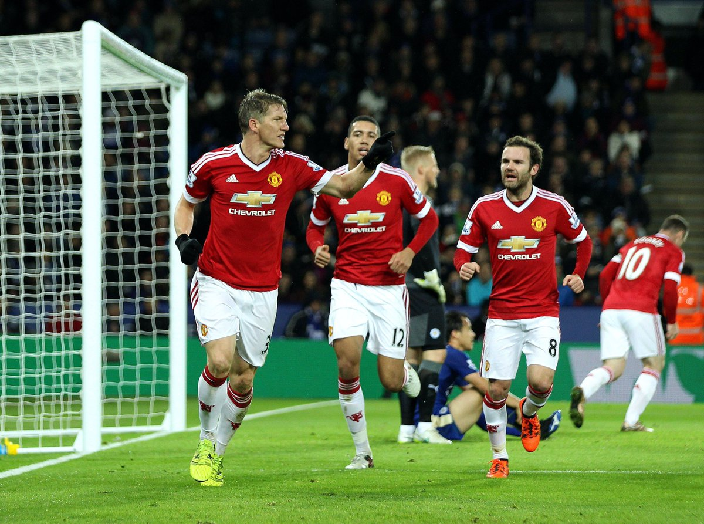
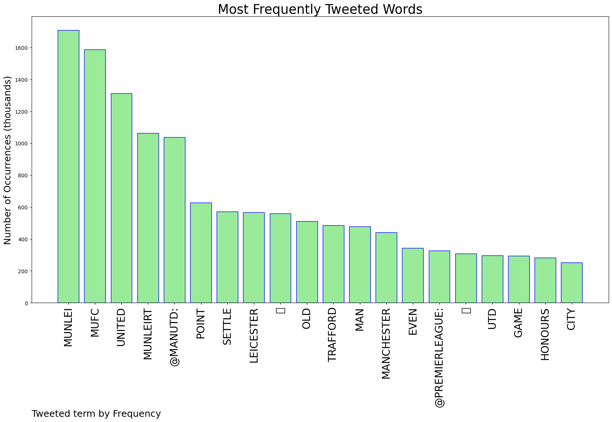
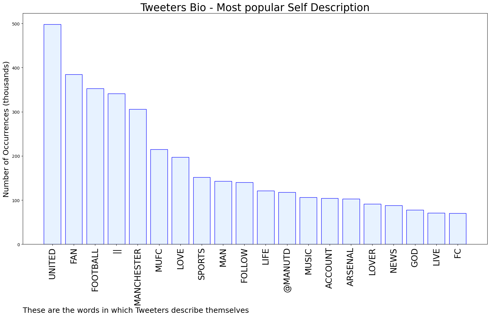

# MURCHIE85 TWITTER PROCESSING 
&#x1F34E; **TOPIC = "#MUNLEI"**

## AUTOMATED RESEARCH SUMMARY

*note: Image pulled from web automatically, not connected to author.
  
<b> This report is AUTOMATED and not hand crafted, it is designed for pulling metrics on a given keyword or hashtag and performs a series of reporting and analysis.</b>

|                **Sample-Tweets**        |
| :-------------: |
| RT @OfficialFPL: ONE Man Utd fan triple-captained Kelechi Iheanacho 😳The forward scored and is on for two bonus points 💰#MUNLEI #FPL ht… |
| RT @ManUtd: Off we go for the second 4⃣5⃣ – come on United! 🗣#MUFC | #MUNLEI |
| Lucky to draw, utterly devoid of ideas, unable to keep the ball. On a positive note, it confirms Rashford has no place in this team #MUNLEI |

The most popular user is: **_oXrayz**

 RT @ManUtd: 🥊 In the red corner...

#MUFC | #MUNLEI

## RELATED METRICS 
| Metric | Value |
| ------------- | ------------- |
| #1 Most tweeted to  | **ManUtd** |
| #2 Most tweeted to  | **premierleague** |
| #3 Most tweeted to  | **OfficialFPL** |
| NewProfiles (less than 10 days) | 1.0%  |
| Tweeters with < 10 followers  | 5.84%|
| Tweeters with > 1000000 followers  | 0.44%  |

## MOST POPULAR TWEET TERMS 

| Popularity Rank  | Term |
| ------------- | ------------- |
| first  | **MUNLEI**  |
| second  | **MUFC**  |
| third  | **UNITED** |
| fourth  | **MUNLEIRT**  |
| fifth  | **@MANUTD:**  |

## Twitter Bio Analysis
### SENTIMENT ANALYSIS

VIEWS WERE : **SUBJECTIVE**  (46.67%) & **NEGATIVELY-SUBJECTIVE** (6.67%) **OBJECTIVE** (46.67%)

### TWEET SAMPLE 
| Random value picked from array |
| ------------- |
|#PremierLeague, gli highlights di #MUNLEI 1-1https://t.co/bSPaSRcxTG |

### MOST RETWEETED 

| The most retweeted user is: **_oXrayz**  |
| ------------- |
| RT @ManUtd: 🥊 In the red corner...#MUFC | #MUNLEI |

### CONCLUSION & EXTERNAL ANALYSIS

*This is my [Adam McMurchie`s] opinion on the data from the tweets, it serves as no objective truth.Since the tweets themselves are a mixture of fact & opinion. 
Authors analytical summary on request.
**RECOMMENDATIONS** WILL BE UPDATED IN NEXT  24 HOURS  