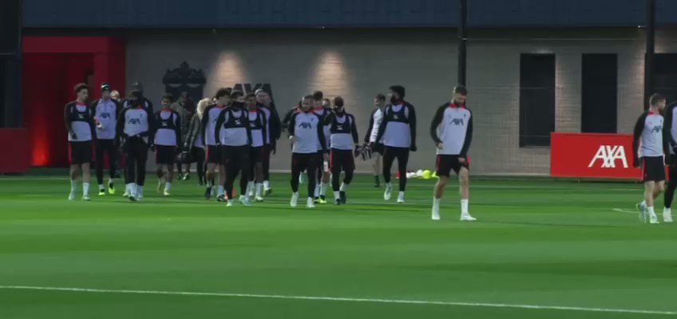
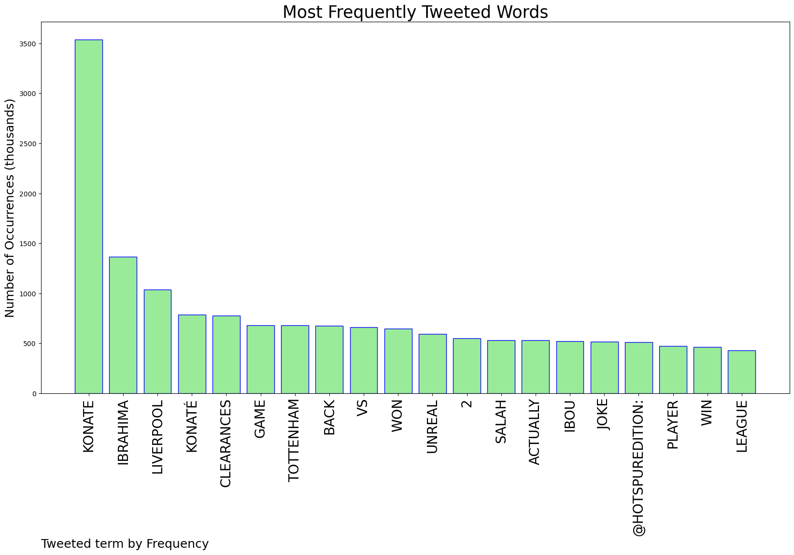
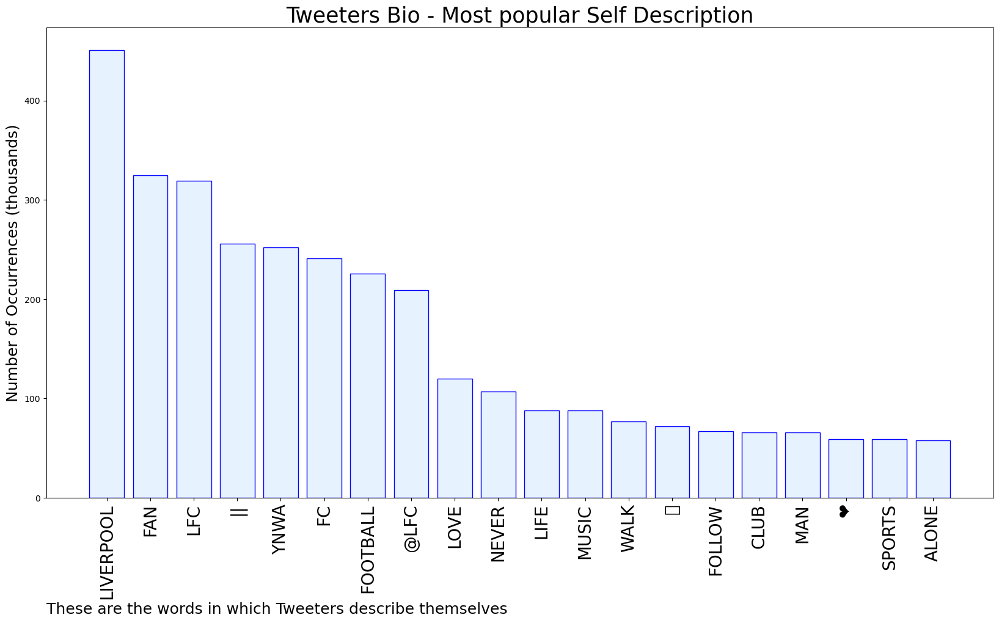
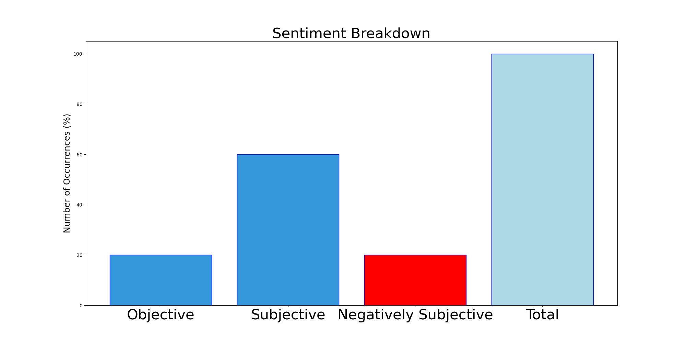

# MURCHIE85 TWITTER PROCESSING 
&#x1F34E; **TOPIC = "Konate"**

## AUTOMATED RESEARCH SUMMARY

*note: Image pulled from web automatically, not connected to author.
  
<b> This report is AUTOMATED and not hand crafted, it is designed for pulling metrics on a given keyword or hashtag and performs a series of reporting and analysis.</b>

|                **Sample-Tweets**        |
| :-------------: |
| RT @AnfieldWatch: Ibrahima Konate has to start every single week. |
| RT @SamueILFC: Ibou Konate was the player we missed the most, massive difference when he starts. Exceptional. |
| RT @Watch_LFC: Big Ibou Konaté. What a performance. Absolutely unreal. Monsieur Deschamps, you are spoilt for riches at CB but Konaté wou… |

The most popular user is: **SergioR15592920**

 RT @totamo11: Salah when he saw Konate walking alone 🥹

 https://t.co/M2eIyWNh33

## RELATED METRICS 
| Metric | Value |
| ------------- | ------------- |
| #1 Most tweeted to  | **AnfieldWatch** |
| #2 Most tweeted to  | **HotspurEdition** |
| #3 Most tweeted to  | **TheAnfieldBuzz** |
| NewProfiles (less than 10 days) | 0.36%  |
| Tweeters with < 10 followers  | 2.9%|
| Tweeters with > 1000000 followers  | 0.12%  |

## MOST POPULAR TWEET TERMS 

| Popularity Rank  | Term |
| ------------- | ------------- |
| first  | **KONATE**  |
| second  | **IBRAHIMA**  |
| third  | **LIVERPOOL** |
| fourth  | **KONATÉ**  |
| fifth  | **CLEARANCES**  |

## Twitter Bio Analysis
### SENTIMENT ANALYSIS

VIEWS WERE : **SUBJECTIVE**  (60.0%) & **NEGATIVELY-SUBJECTIVE** (20.0%) **OBJECTIVE** (20.0%)

### TWEET SAMPLE 
| Random value picked from array |
| ------------- |
|RT @TheAnfieldBuzz: Ibrahima Konaté vs Tottenham Hostpur:87 touches8 clearances2 interceptions3/3 tackles won (100%)11 recoveries4/5… |

### MOST RETWEETED 

| The most retweeted user is: **SergioR15592920**  |
| ------------- |
| RT @totamo11: Salah when he saw Konate walking alone 🥹 https://t.co/M2eIyWNh33 |

### CONCLUSION & EXTERNAL ANALYSIS

*This is my [Adam McMurchie`s] opinion on the data from the tweets, it serves as no objective truth.Since the tweets themselves are a mixture of fact & opinion. 
Authors analytical summary on request.
**RECOMMENDATIONS** WILL BE UPDATED IN NEXT  24 HOURS  