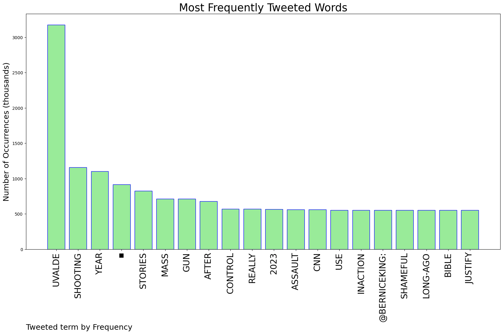
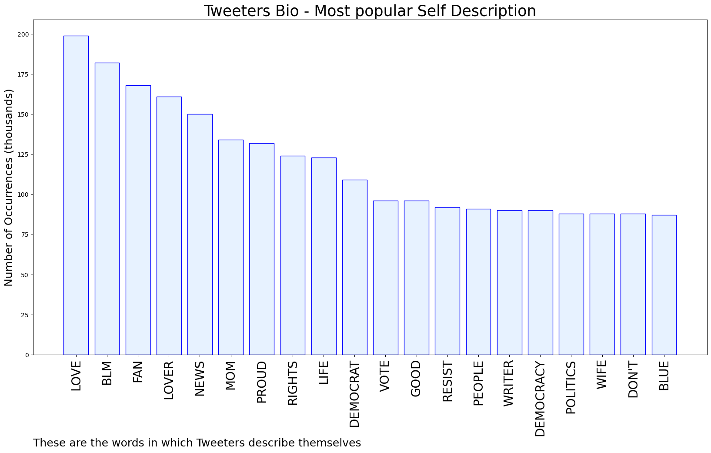
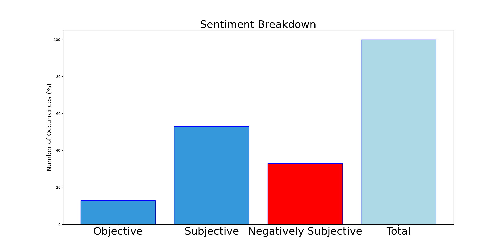

# MURCHIE85 TWITTER PROCESSING 
&#x1F34E; **TOPIC = "Uvalde"**

## AUTOMATED RESEARCH SUMMARY

*note: Image pulled from web automatically, not connected to author.
  
<b> This report is AUTOMATED and not hand crafted, it is designed for pulling metrics on a given keyword or hashtag and performs a series of reporting and analysis.</b>

|                **Sample-Tweets**        |
| :-------------: |
| RT @ChangeTheSyst14: A #Uvalde survivor’s mom wanted to see what her daughter suffered that tragic day. CNN showed her https://t.co/rj44fzY… |
| RT @TristanSnell: Uvalde: AR-15Buffalo: AR-15Boulder: AR-15Orlando: AR-15Parkland: AR-15Las Vegas: AR-15Aurora, CO: AR-15Sandy Hook:… |
| RT @ShimonPro: This is one of the major untold stories in #Uvalde . The medics/emts. Their bosses won’t allow them to speak publicly. So we… |

The most popular user is: **alexusparenteau**

 RT @TristanSnell: Uvalde: AR-15
Buffalo: AR-15
Boulder: AR-15
Orlando: AR-15
Parkland: AR-15
Las Vegas: AR-15
Aurora, CO: AR-15
Sandy Hook:…

## RELATED METRICS 
| Metric | Value |
| ------------- | ------------- |
| #1 Most tweeted to  | **BerniceKing** |
| #2 Most tweeted to  | **ChangeTheSyst14** |
| #3 Most tweeted to  | **ShimonPro** |
| NewProfiles (less than 10 days) | 0.06%  |
| Tweeters with < 10 followers  | 1.8%|
| Tweeters with > 1000000 followers  | 0.16%  |

## MOST POPULAR TWEET TERMS 

| Popularity Rank  | Term |
| ------------- | ------------- |
| first  | **UVALDE**  |
| second  | **SHOOTING**  |
| third  | **YEAR** |
| fourth  | **▪️**  |
| fifth  | **STORIES**  |

## Twitter Bio Analysis
### SENTIMENT ANALYSIS

VIEWS WERE : **SUBJECTIVE**  (53.33%) & **NEGATIVELY-SUBJECTIVE** (33.33%) **OBJECTIVE** (13.33%)

### TWEET SAMPLE 
| Random value picked from array |
| ------------- |
|RT @johnpavlovitz: A year after #Uvalde I am going to spend today mourning that it wasn't enough to move you; that Charleston wasn't, Color… |

### MOST RETWEETED 

| The most retweeted user is: **alexusparenteau**  |
| ------------- |
| RT @TristanSnell: Uvalde: AR-15Buffalo: AR-15Boulder: AR-15Orlando: AR-15Parkland: AR-15Las Vegas: AR-15Aurora, CO: AR-15Sandy Hook:… |

### CONCLUSION & EXTERNAL ANALYSIS

*This is my [Adam McMurchie`s] opinion on the data from the tweets, it serves as no objective truth.Since the tweets themselves are a mixture of fact & opinion. 
Authors analytical summary on request.
**RECOMMENDATIONS** WILL BE UPDATED IN NEXT  24 HOURS  