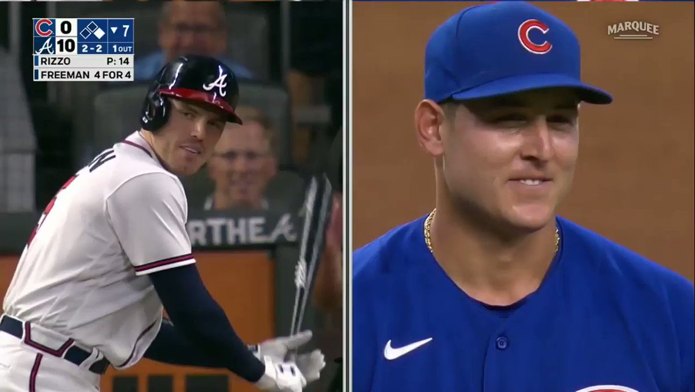
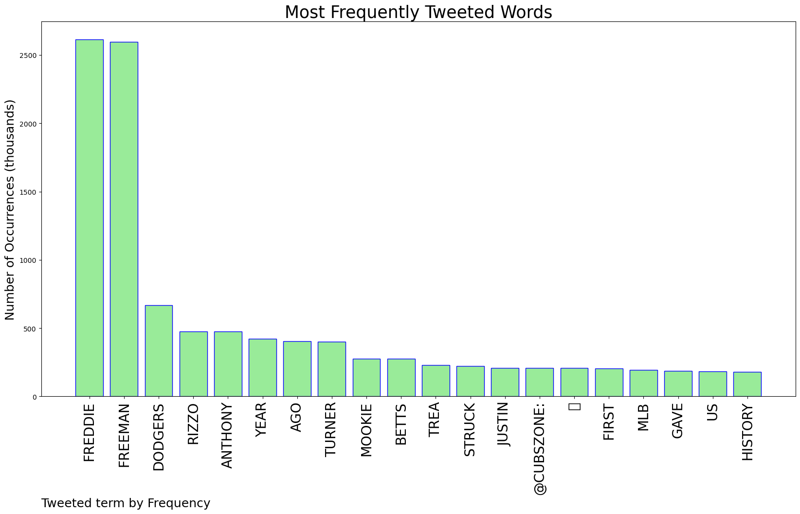
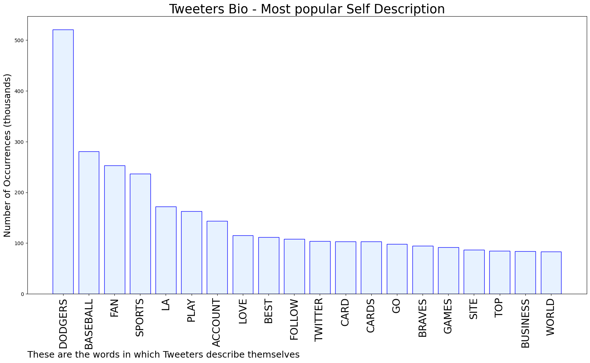
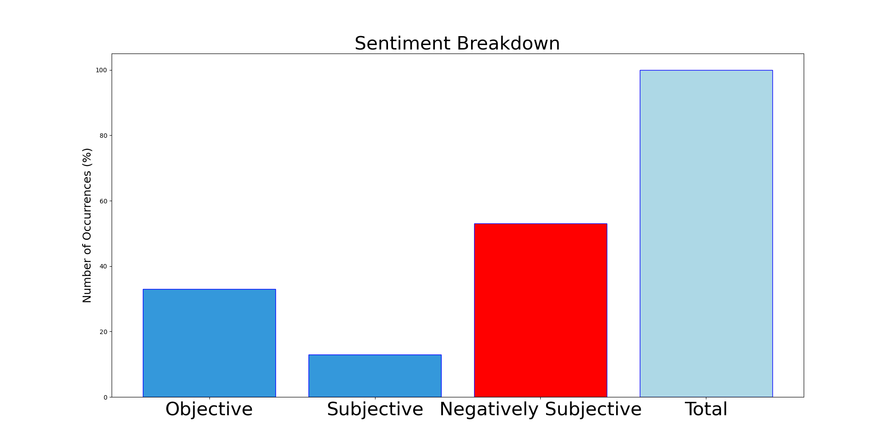

# MURCHIE85 TWITTER PROCESSING 
&#x1F34E; **TOPIC = "Freddie Freeman"**

## AUTOMATED RESEARCH SUMMARY

*note: Image pulled from web automatically, not connected to author.
  
<b> This report is AUTOMATED and not hand crafted, it is designed for pulling metrics on a given keyword or hashtag and performs a series of reporting and analysis.</b>

|                **Sample-Tweets**        |
| :-------------: |
| NOPEEEE! Dodgers with Mookie I just have to root for with Freddie freeman !! They the real deal right now and Bosto… https://t.co/MXx7IbuIu2 |
| RT @MMoreno1015: Freddie Freeman, Trea Turner, Justin Turner, Clayton Kershaw, Walker Buehler, Mookie Betts and Cody Bellinger are on hand… |
| RT @SportsNetLA: Freddie Freeman breaks down his undying love for snickerdoodle cookies in the #Dodgers clubhouse 😂🍪 @kirsten_watson https:… |

The most popular user is: **RandyUlysse**

 RT @espn: Breaking: Freddie Freeman and the Dodgers have agreed to terms on a six-year, $162 million deal, according to @kileymcd and @Jeff…

## RELATED METRICS 
| Metric | Value |
| ------------- | ------------- |
| #1 Most tweeted to  | **CubsZone** |
| #2 Most tweeted to  | **Cut4** |
| #3 Most tweeted to  | **DodgersNation** |
| NewProfiles (less than 10 days) | 0.41%  |
| Tweeters with < 10 followers  | 4.06%|
| Tweeters with > 1000000 followers  | 0.06%  |

## MOST POPULAR TWEET TERMS 

| Popularity Rank  | Term |
| ------------- | ------------- |
| first  | **FREDDIE**  |
| second  | **FREEMAN**  |
| third  | **DODGERS** |
| fourth  | **RIZZO**  |
| fifth  | **ANTHONY**  |

## Twitter Bio Analysis
### SENTIMENT ANALYSIS

VIEWS WERE : **SUBJECTIVE**  (13.33%) & **NEGATIVELY-SUBJECTIVE** (53.33%) **OBJECTIVE** (33.33%)

### TWEET SAMPLE 
| Random value picked from array |
| ------------- |
|Me every time Freddie Freeman’s new walk-up song comes on. It’s actually my new hype song 😂 https://t.co/gzLLMajn59 |

### MOST RETWEETED 

| The most retweeted user is: **RandyUlysse**  |
| ------------- |
| RT @espn: Breaking: Freddie Freeman and the Dodgers have agreed to terms on a six-year, $162 million deal, according to @kileymcd and @Jeff… |

### CONCLUSION & EXTERNAL ANALYSIS

*This is my [Adam McMurchie`s] opinion on the data from the tweets, it serves as no objective truth.Since the tweets themselves are a mixture of fact & opinion. 
Authors analytical summary on request.
**RECOMMENDATIONS** WILL BE UPDATED IN NEXT  24 HOURS  