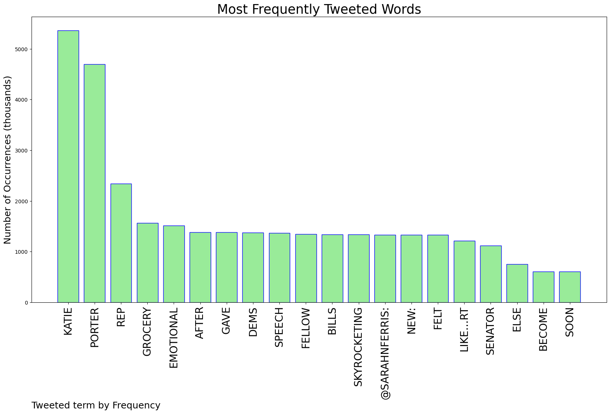
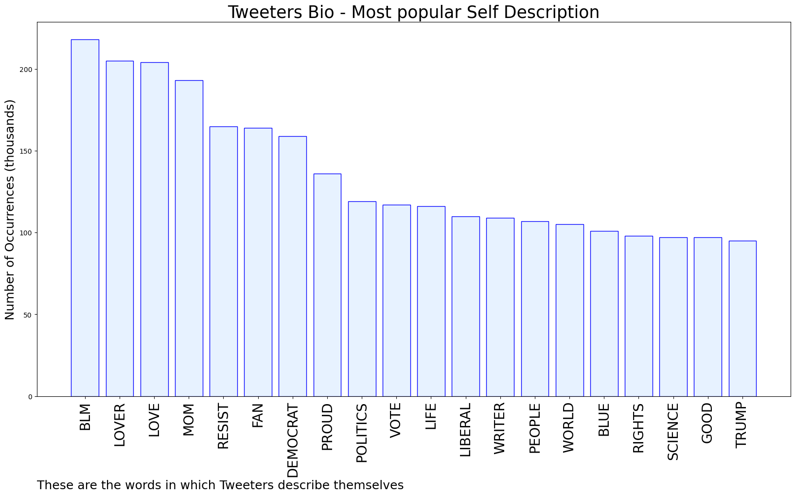
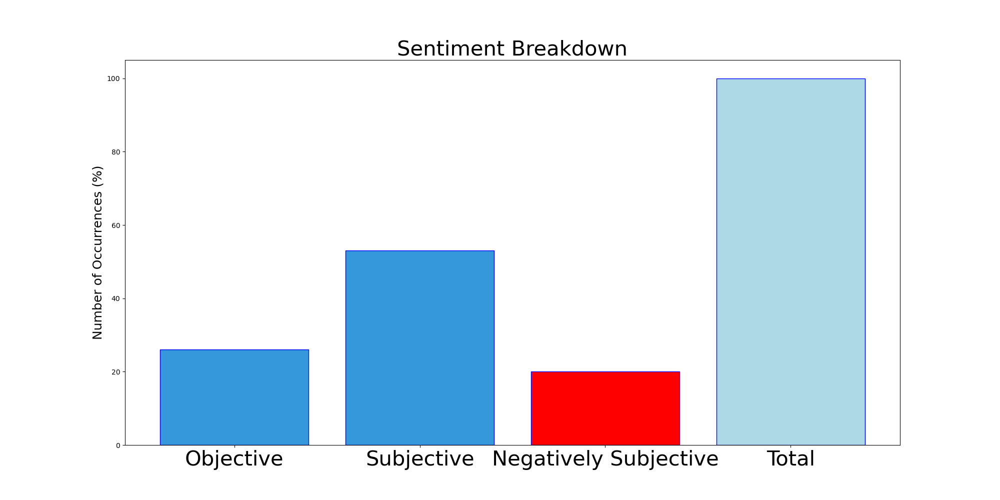

# MURCHIE85 TWITTER PROCESSING 
&#x1F34E; **TOPIC = "Katie Porter"**

## AUTOMATED RESEARCH SUMMARY

*note: Image pulled from web automatically, not connected to author.
  
<b> This report is AUTOMATED and not hand crafted, it is designed for pulling metrics on a given keyword or hashtag and performs a series of reporting and analysis.</b>

|                **Sample-Tweets**        |
| :-------------: |
| RT @stevemorris__: One data point on why it takes a member of Congress for members of Congress to get something like this: Katie Porter i… |
| RT @ReallyAmerican1: Who else would like to someday soon see Rep. Katie Porter become Senator Katie Porter? |
| RT @realTuckFrumper: Rep. Katie Porter Gets Emotional And Wakes Democrats Up On Grocery Prices https://t.co/VqVsslgzrp |

The most popular user is: **teandoranges**

 RT @sarahnferris: NEW: After Rep. Katie Porter gave emotional speech to fellow Dems about skyrocketing grocery bills, she said it felt like…

## RELATED METRICS 
| Metric | Value |
| ------------- | ------------- |
| #1 Most tweeted to  | **sarahnferris** |
| #2 Most tweeted to  | **ReallyAmerican1** |
| #3 Most tweeted to  | **JDCocchiarella** |
| NewProfiles (less than 10 days) | 0.4%  |
| Tweeters with < 10 followers  | 1.84%|
| Tweeters with > 1000000 followers  | 0.02%  |

## MOST POPULAR TWEET TERMS 

| Popularity Rank  | Term |
| ------------- | ------------- |
| first  | **KATIE**  |
| second  | **PORTER**  |
| third  | **REP** |
| fourth  | **GROCERY**  |
| fifth  | **EMOTIONAL**  |

## Twitter Bio Analysis
### SENTIMENT ANALYSIS

VIEWS WERE : **SUBJECTIVE**  (53.33%) & **NEGATIVELY-SUBJECTIVE** (20.0%) **OBJECTIVE** (26.67%)

### TWEET SAMPLE 
| Random value picked from array |
| ------------- |
|@SteveHofstetter Tammy Duckworth and Katie Porter. |

### MOST RETWEETED 

| The most retweeted user is: **teandoranges**  |
| ------------- |
| RT @sarahnferris: NEW: After Rep. Katie Porter gave emotional speech to fellow Dems about skyrocketing grocery bills, she said it felt like… |

### CONCLUSION & EXTERNAL ANALYSIS

*This is my [Adam McMurchie`s] opinion on the data from the tweets, it serves as no objective truth.Since the tweets themselves are a mixture of fact & opinion. 
Authors analytical summary on request.
**RECOMMENDATIONS** WILL BE UPDATED IN NEXT  24 HOURS  