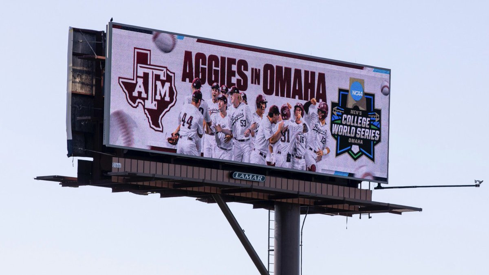
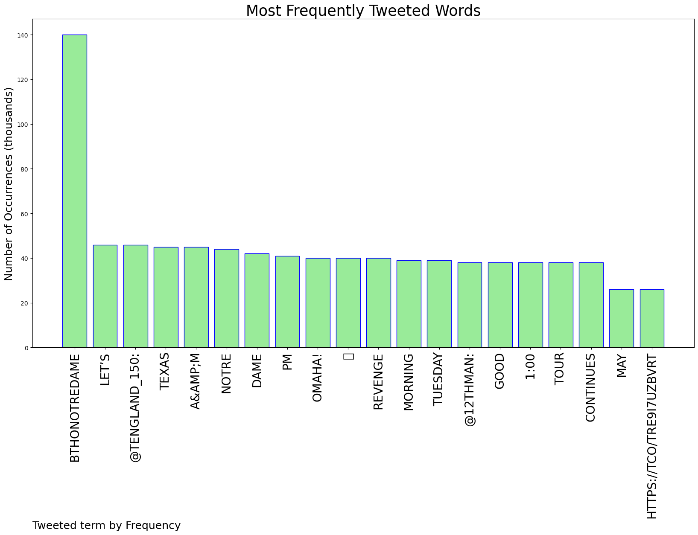
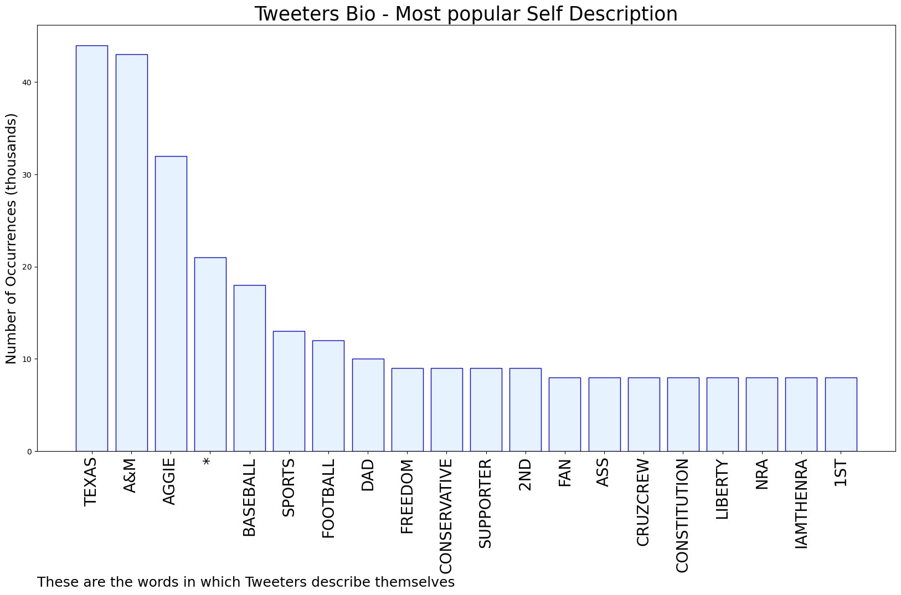

# MURCHIE85 TWITTER PROCESSING 
&#x1F34E; **TOPIC = "#BTHOnotredame"**

## AUTOMATED RESEARCH SUMMARY

*note: Image pulled from web automatically, not connected to author.
  
<b> This report is AUTOMATED and not hand crafted, it is designed for pulling metrics on a given keyword or hashtag and performs a series of reporting and analysis.</b>

|                **Sample-Tweets**        |
| :-------------: |
| RT @12thMan: Good morning from Omaha! Let’s #BTHOnotredame 👍 https://t.co/p34RDPblkX |
| RT @12thMan: Good morning from Omaha! Let’s #BTHOnotredame 👍 https://t.co/p34RDPblkX |
| RT @tengland_150: Texas A&amp;M - Notre DameTuesday1:00 PMRevenge tour continues#BTHOnotredame https://t.co/tre9i7uzbv |

The most popular user is: **originaljarhead**

 RT @tengland_150: Texas A&amp;M - Notre Dame
Tuesday
1:00 PM

Revenge tour continues

#BTHOnotredame https://t.co/tre9i7uzbv

## RELATED METRICS 
| Metric | Value |
| ------------- | ------------- |
| #1 Most tweeted to  | **tengland_150** |
| #2 Most tweeted to  | **12thMan** |
| #3 Most tweeted to  | **AggieBaseball** |
| NewProfiles (less than 10 days) | 1.83%  |
| Tweeters with < 10 followers  | 1.83%|
| Tweeters with > 1000000 followers  | 0.0%  |

## MOST POPULAR TWEET TERMS 

| Popularity Rank  | Term |
| ------------- | ------------- |
| first  | **BTHONOTREDAME**  |
| second  | **LET’S**  |
| third  | **@TENGLAND_150:** |
| fourth  | **TEXAS**  |
| fifth  | **A&AMP;M**  |

## Twitter Bio Analysis
### SENTIMENT ANALYSIS

VIEWS WERE : **SUBJECTIVE**  (33.33%) & **NEGATIVELY-SUBJECTIVE** (20.0%) **OBJECTIVE** (46.67%)

### TWEET SAMPLE 
| Random value picked from array |
| ------------- |
|RT @OlsenSection203: May the road tomorrow lead you home, May the wind be blowing in on your at bats, May the sun shine directly into your… |

### MOST RETWEETED 

| The most retweeted user is: **originaljarhead**  |
| ------------- |
| RT @tengland_150: Texas A&amp;M - Notre DameTuesday1:00 PMRevenge tour continues#BTHOnotredame https://t.co/tre9i7uzbv |

### CONCLUSION & EXTERNAL ANALYSIS

*This is my [Adam McMurchie`s] opinion on the data from the tweets, it serves as no objective truth.Since the tweets themselves are a mixture of fact & opinion. 
Authors analytical summary on request.
**RECOMMENDATIONS** WILL BE UPDATED IN NEXT  24 HOURS  