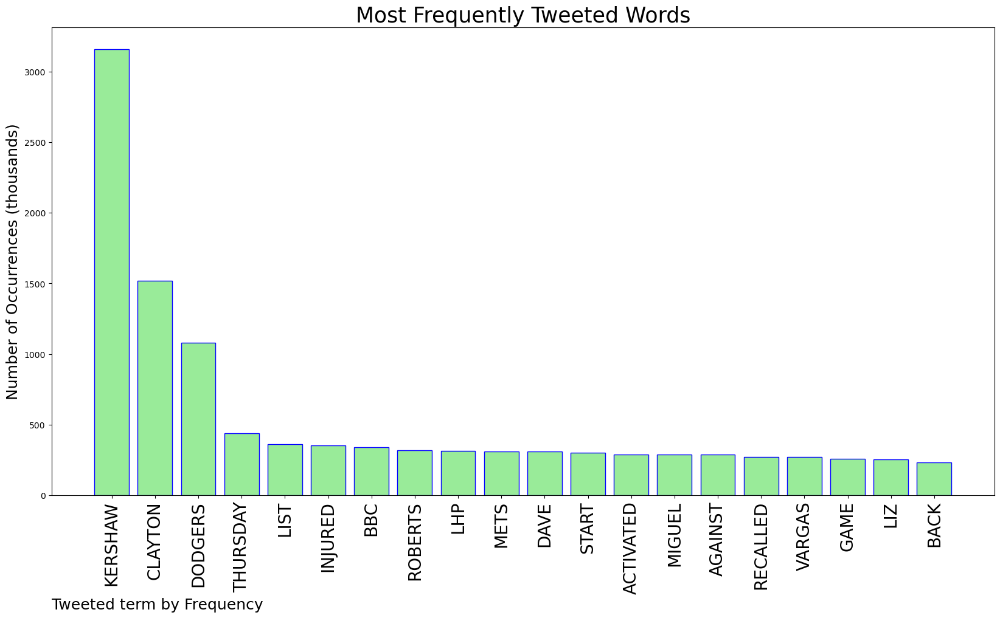
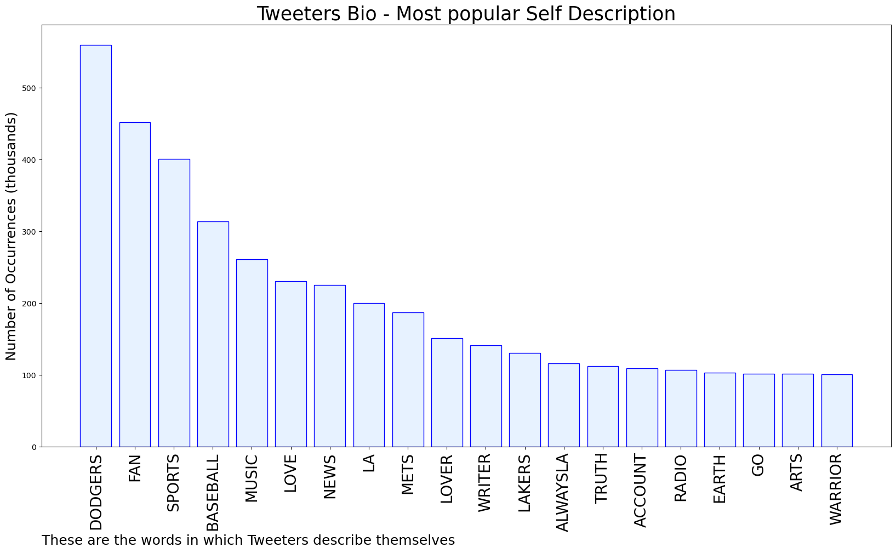

# MURCHIE85 TWITTER PROCESSING 
&#x1F34E; **TOPIC = "Kershaw"**

## AUTOMATED RESEARCH SUMMARY

*note: Image pulled from web automatically, not connected to author.
  
<b> This report is AUTOMATED and not hand crafted, it is designed for pulling metrics on a given keyword or hashtag and performs a series of reporting and analysis.</b>

|                **Sample-Tweets**        |
| :-------------: |
| Happy Publication Day! We've got three brilliant titles heading for your shelves📚 'Dünkirchen 1940' by Robert Ker… https://t.co/4IfbnfDqNE |
| Bassist Elie Afif joins Martin Kershaw (saxophone), @gstephenguitar and @tominterrupto on drums on Thu 8 Sep at the… https://t.co/crgY2RmeQo |
| @Howard_Cole Yea with out Walker butain Kershaw man go Dodger's |

The most popular user is: **kershaw_oland**

 RT @MelDubs: I have been laughing for 5 minutes and I have tears streaming down my face https://t.co/J4RtLq9l65

## RELATED METRICS 
| Metric | Value |
| ------------- | ------------- |
| #1 Most tweeted to  | **Dodgers** |
| #2 Most tweeted to  | **GBNEWS** |
| #3 Most tweeted to  | **juanctoribio** |
| NewProfiles (less than 10 days) | 0.88%  |
| Tweeters with < 10 followers  | 4.8%|
| Tweeters with > 1000000 followers  | 0.14%  |

## MOST POPULAR TWEET TERMS 

| Popularity Rank  | Term |
| ------------- | ------------- |
| first  | **KERSHAW**  |
| second  | **CLAYTON**  |
| third  | **DODGERS** |
| fourth  | **THURSDAY**  |
| fifth  | **LIST**  |

## Twitter Bio Analysis
### SENTIMENT ANALYSIS

VIEWS WERE : **SUBJECTIVE**  (33.33%) & **NEGATIVELY-SUBJECTIVE** (26.67%) **OBJECTIVE** (40.0%)

### TWEET SAMPLE 
| Random value picked from array |
| ------------- |
|RT @DannyVietti: The Dodgers have an entire starting pitching rotation either on the injured list or suspended:Clayton Kershaw (IL)Walke… |

### MOST RETWEETED 

| The most retweeted user is: **kershaw_oland**  |
| ------------- |
| RT @MelDubs: I have been laughing for 5 minutes and I have tears streaming down my face https://t.co/J4RtLq9l65 |

### CONCLUSION & EXTERNAL ANALYSIS

*This is my [Adam McMurchie`s] opinion on the data from the tweets, it serves as no objective truth.Since the tweets themselves are a mixture of fact & opinion. 
Authors analytical summary on request.
**RECOMMENDATIONS** WILL BE UPDATED IN NEXT  24 HOURS  