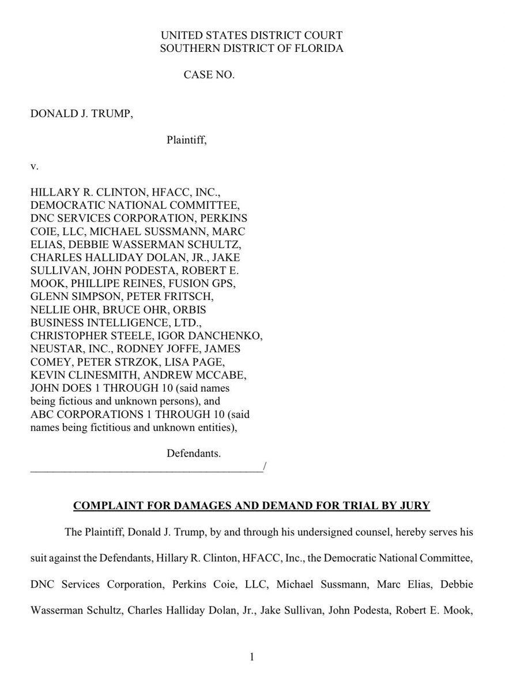
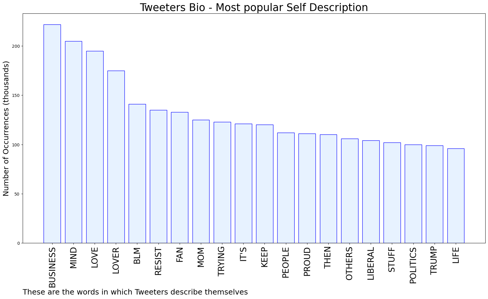

# MURCHIE85 TWITTER PROCESSING 
&#x1F34E; **TOPIC = "Discovery"**

## AUTOMATED RESEARCH SUMMARY

*note: Image pulled from web automatically, not connected to author.
  
<b> This report is AUTOMATED and not hand crafted, it is designed for pulling metrics on a given keyword or hashtag and performs a series of reporting and analysis.</b>

|                **Sample-Tweets**        |
| :-------------: |
| RT @Awake823Mama: As a matter of fact I am a biologist. A marine biologist. And here I present you the most interesting discovery I’ve made… |
| RT @jacquie_rn: @JanNWolfe Holy shit 😂 … bring on the discovery. https://t.co/wpHMBqTqwE |
| The discovery is going to be epic!https://t.co/5ec3fvwsvB |

The most popular user is: **petalsminho**

 RT @cobaltswife: childhood best friends to enemies to lovers is the best trope to ever exist i mean the betrayal??? the i-know-you-better-t…

## RELATED METRICS 
| Metric | Value |
| ------------- | ------------- |
| #1 Most tweeted to  | **Out5p0ken** |
| #2 Most tweeted to  | **RonFilipkowski** |
| #3 Most tweeted to  | **JanNWolfe** |
| NewProfiles (less than 10 days) | 0.48%  |
| Tweeters with < 10 followers  | 2.94%|
| Tweeters with > 1000000 followers  | 0.04%  |

## MOST POPULAR TWEET TERMS 

| Popularity Rank  | Term |
| ------------- | ------------- |
| first  | **DISCOVERY**  |
| second  | **GOING**  |
| third  | **TRUMP** |
| fourth  | **WAIT**  |
| fifth  | **NEVER**  |

## Twitter Bio Analysis
### SENTIMENT ANALYSIS

VIEWS WERE : **SUBJECTIVE**  (26.67%) & **NEGATIVELY-SUBJECTIVE** (26.67%) **OBJECTIVE** (46.67%)

### TWEET SAMPLE 
| Random value picked from array |
| ------------- |
|@CBCAlerts LOL. Let the discovery process begin. |

### MOST RETWEETED 

| The most retweeted user is: **petalsminho**  |
| ------------- |
| RT @cobaltswife: childhood best friends to enemies to lovers is the best trope to ever exist i mean the betrayal??? the i-know-you-better-t… |

### CONCLUSION & EXTERNAL ANALYSIS

*This is my [Adam McMurchie`s] opinion on the data from the tweets, it serves as no objective truth.Since the tweets themselves are a mixture of fact & opinion. 
Authors analytical summary on request.
**RECOMMENDATIONS** WILL BE UPDATED IN NEXT  24 HOURS  