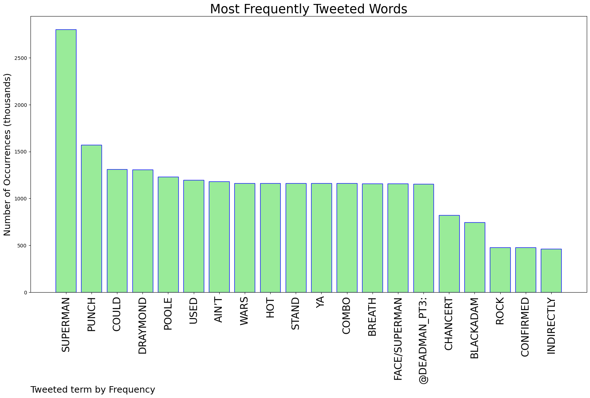
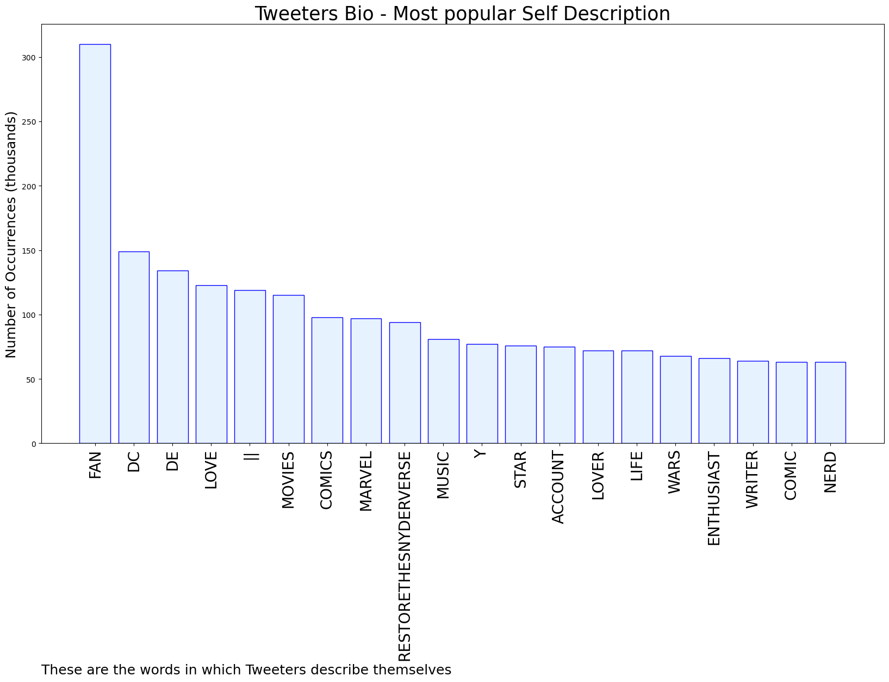
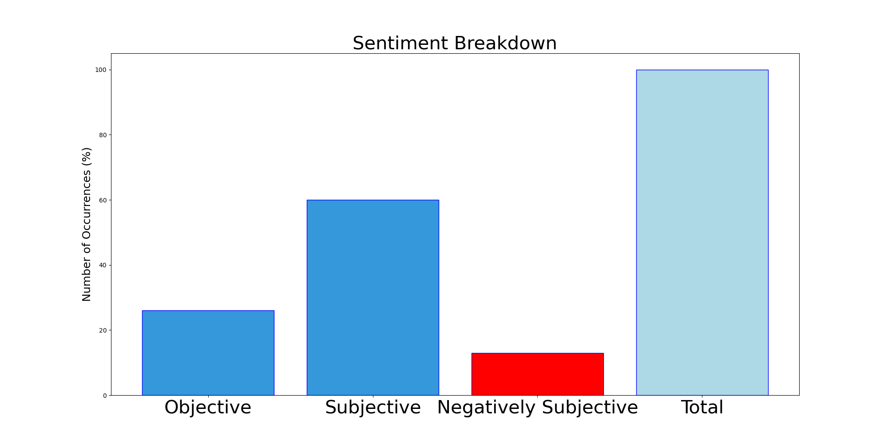

# MURCHIE85 TWITTER PROCESSING 
&#x1F34E; **TOPIC = "Superman"**

## AUTOMATED RESEARCH SUMMARY

*note: Image pulled from web automatically, not connected to author.
  
<b> This report is AUTOMATED and not hand crafted, it is designed for pulling metrics on a given keyword or hashtag and performs a series of reporting and analysis.</b>

|                **Sample-Tweets**        |
| :-------------: |
| RT @DEADMAN_pt3: That Draymond hot breath in ya face/Superman punch combo could be used in wars. Poole ain’t stand a chance. |
| “ Who was the subject ? Bruce ? Tim ? Superman ? The Superman 2.0 clone ? “ https://t.co/tE391tcW8Z |
| RT @CQuill97: I need twitter to stop talking about this movie as if its some ancient dated relic. This movie got Superman and it honored th… |

The most popular user is: **Mr_H_G_Superman**

 RT @DarkLiterata: I'm sorry but "non-fungible" will always mean "impossible to turn into a mushroom" to me

## RELATED METRICS 
| Metric | Value |
| ------------- | ------------- |
| #1 Most tweeted to  | **DEADMAN_pt3** |
| #2 Most tweeted to  | **Itssan17** |
| #3 Most tweeted to  | **TheRock** |
| NewProfiles (less than 10 days) | 0.56%  |
| Tweeters with < 10 followers  | 4.62%|
| Tweeters with > 1000000 followers  | 0.04%  |

## MOST POPULAR TWEET TERMS 

| Popularity Rank  | Term |
| ------------- | ------------- |
| first  | **SUPERMAN**  |
| second  | **PUNCH**  |
| third  | **COULD** |
| fourth  | **DRAYMOND**  |
| fifth  | **POOLE**  |

## Twitter Bio Analysis
### SENTIMENT ANALYSIS

VIEWS WERE : **SUBJECTIVE**  (60.0%) & **NEGATIVELY-SUBJECTIVE** (13.33%) **OBJECTIVE** (26.67%)

### TWEET SAMPLE 
| Random value picked from array |
| ------------- |
|RT @ManLikeGinola: Lmao he baited him into the push so he could have an excuse to do that superman punch he been practicing in the mirror |

### MOST RETWEETED 

| The most retweeted user is: **Mr_H_G_Superman**  |
| ------------- |
| RT @DarkLiterata: I'm sorry but "non-fungible" will always mean "impossible to turn into a mushroom" to me |

### CONCLUSION & EXTERNAL ANALYSIS

*This is my [Adam McMurchie`s] opinion on the data from the tweets, it serves as no objective truth.Since the tweets themselves are a mixture of fact & opinion. 
Authors analytical summary on request.
**RECOMMENDATIONS** WILL BE UPDATED IN NEXT  24 HOURS  