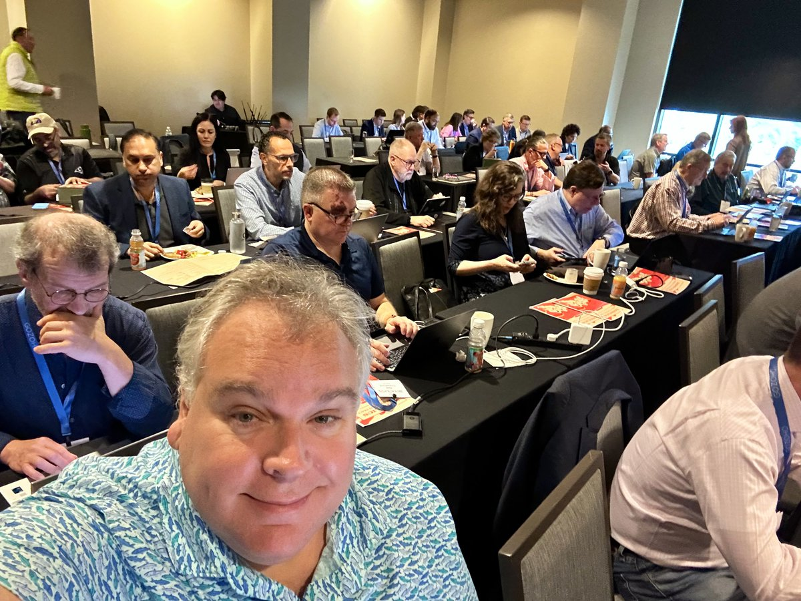
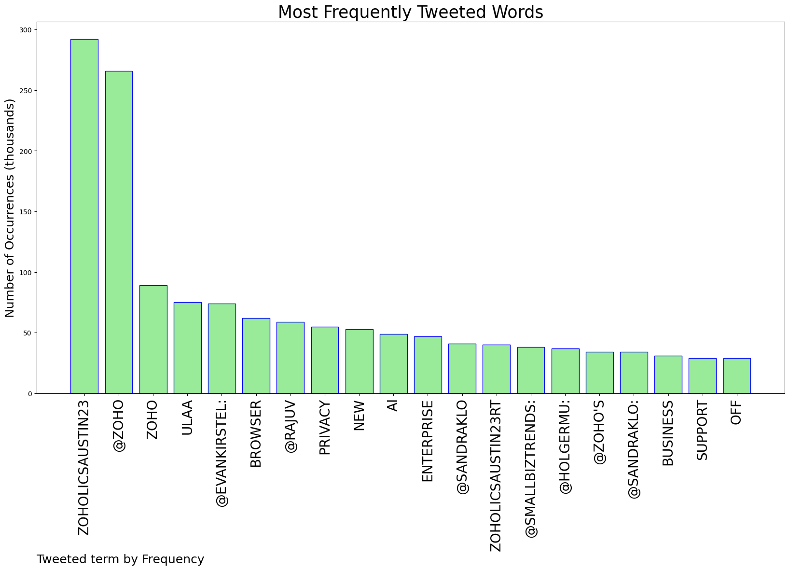
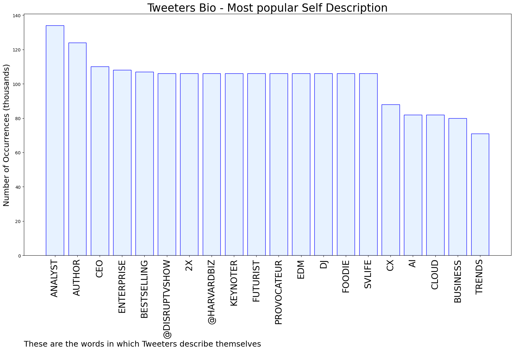

# MURCHIE85 TWITTER PROCESSING 
&#x1F34E; **TOPIC = "#ZoholicsAustin23"**

## AUTOMATED RESEARCH SUMMARY

*note: Image pulled from web automatically, not connected to author.
  
<b> This report is AUTOMATED and not hand crafted, it is designed for pulling metrics on a given keyword or hashtag and performs a series of reporting and analysis.</b>

|                **Sample-Tweets**        |
| :-------------: |
| @tcrawford @rajuv It's always about value. Or even better outcomes. #ZoholicsAustin23 |
| #ZoholicsAustin23 @Zoho’s new offerings for SMB mkt includes Zoho Tables, a no code/low code product to help their… https://t.co/2GMBlcdWZT |
| RT @sandraklo: Thanks for coming to your first @Zoho event, @EvanKirstel! #ZoholicsAustin23 |

The most popular user is: **ColderICE**

 RT @EvanKirstel: 😝 How many analysts can you fit in a room!? #CaptionThis  #ZoholicsAustin23 @zoho https://t.co/ZpPsuC5Ywr

## RELATED METRICS 
| Metric | Value |
| ------------- | ------------- |
| #1 Most tweeted to  | **Zoho** |
| #2 Most tweeted to  | **sandraklo** |
| #3 Most tweeted to  | **EvanKirstel** |
| NewProfiles (less than 10 days) | 0.0%  |
| Tweeters with < 10 followers  | 1.1%|
| Tweeters with > 1000000 followers  | 0.0%  |

## MOST POPULAR TWEET TERMS 

| Popularity Rank  | Term |
| ------------- | ------------- |
| first  | **ZOHOLICSAUSTIN23**  |
| second  | **@ZOHO**  |
| third  | **ZOHO** |
| fourth  | **ULAA**  |
| fifth  | **@EVANKIRSTEL:**  |

## Twitter Bio Analysis
### SENTIMENT ANALYSIS

VIEWS WERE : **SUBJECTIVE**  (40.0%) & **NEGATIVELY-SUBJECTIVE** (0.0%) **OBJECTIVE** (60.0%)

### TWEET SAMPLE 
| Random value picked from array |
| ------------- |
|RT @EvanKirstel: Hilarious! #ZoholicsAustin23 #ChatGPT #Marketing |

### MOST RETWEETED 

| The most retweeted user is: **ColderICE**  |
| ------------- |
| RT @EvanKirstel: 😝 How many analysts can you fit in a room!? #CaptionThis  #ZoholicsAustin23 @zoho https://t.co/ZpPsuC5Ywr |

### CONCLUSION & EXTERNAL ANALYSIS

*This is my [Adam McMurchie`s] opinion on the data from the tweets, it serves as no objective truth.Since the tweets themselves are a mixture of fact & opinion. 
Authors analytical summary on request.
**RECOMMENDATIONS** WILL BE UPDATED IN NEXT  24 HOURS  