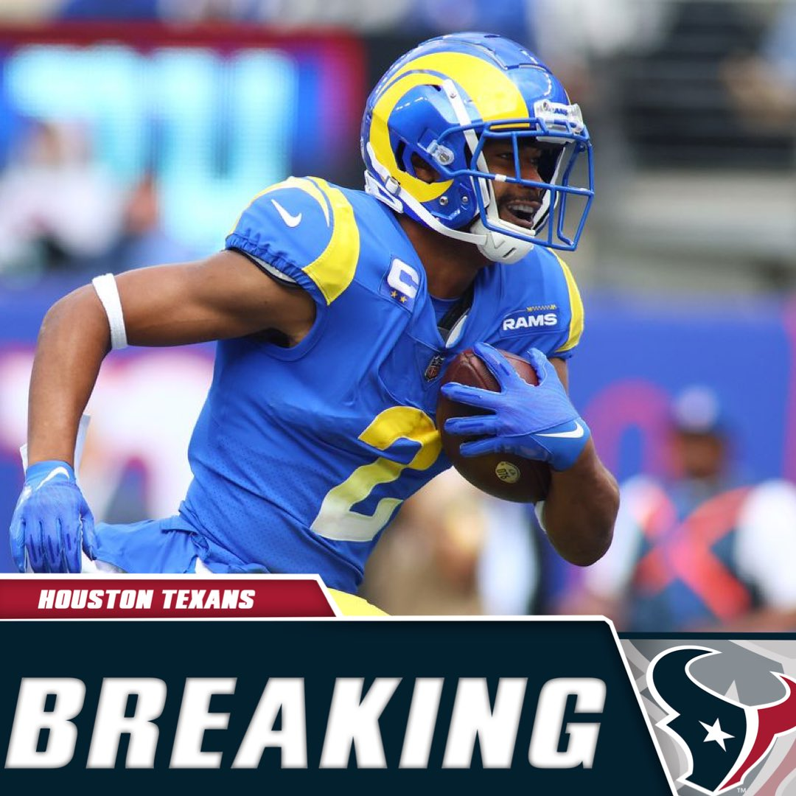
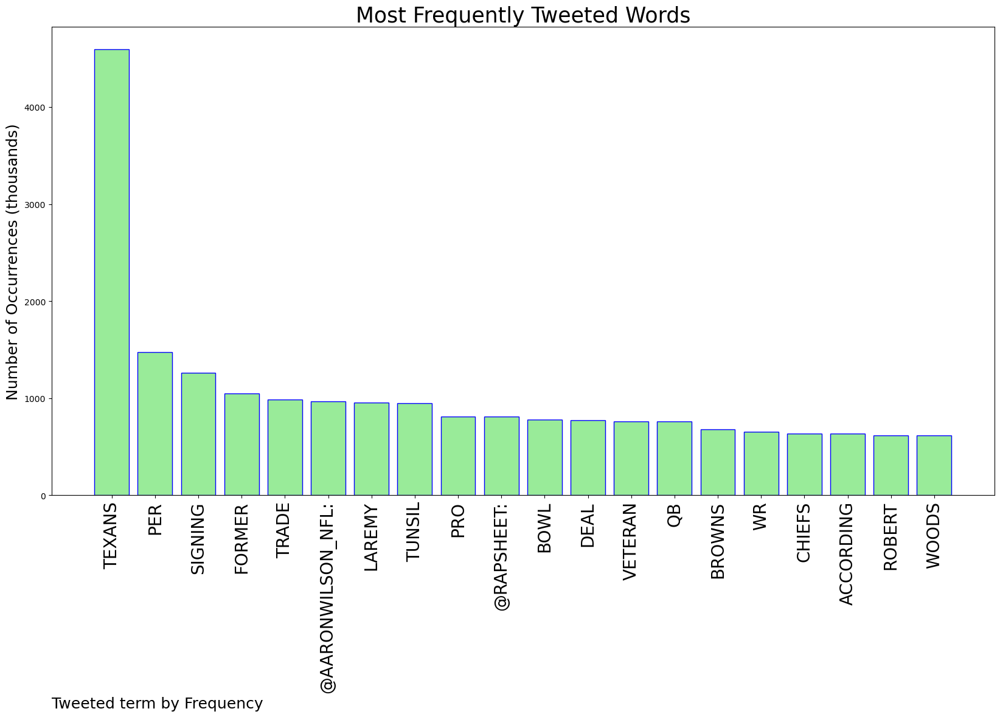
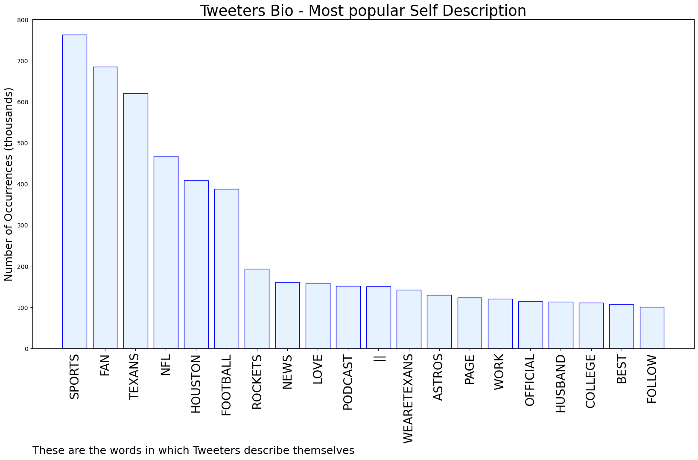

# MURCHIE85 TWITTER PROCESSING 
&#x1F34E; **TOPIC = "#Texans"**

## AUTOMATED RESEARCH SUMMARY

*note: Image pulled from web automatically, not connected to author.
  
<b> This report is AUTOMATED and not hand crafted, it is designed for pulling metrics on a given keyword or hashtag and performs a series of reporting and analysis.</b>

|                **Sample-Tweets**        |
| :-------------: |
| RT @Djbienaime: WR Phillip Dorsett, who spent the last two seasons with the #Texans, has received interest from the Raiders and Patriots so… |
| RT @NFL_DovKleiman: Update: There could be a potential trade involving #Texans Pro Bowl LT Laremy Tunsil, per rumors shared by ESPN reporte… |
| RT @NickSchwagerNFL: Jimmy Garoppolo only makes sense if the #Texans draft a QB like Anthony Richardson or Hendon Hooker. If they draft B… |

The most popular user is: **TheKardiac_Kid**

 RT @RapSheet: Deshaun Watson plans to waive his no-trade clause to the #Browns, sources tell me and @TomPelissero. Yes, the Browns!!

Trade…

## RELATED METRICS 
| Metric | Value |
| ------------- | ------------- |
| #1 Most tweeted to  | **AaronWilson_NFL** |
| #2 Most tweeted to  | **RapSheet** |
| #3 Most tweeted to  | **NFL_DovKleiman** |
| NewProfiles (less than 10 days) | 0.5%  |
| Tweeters with < 10 followers  | 2.02%|
| Tweeters with > 1000000 followers  | 0.04%  |

## MOST POPULAR TWEET TERMS 

| Popularity Rank  | Term |
| ------------- | ------------- |
| first  | **TEXANS**  |
| second  | **PER**  |
| third  | **SIGNING** |
| fourth  | **FORMER**  |
| fifth  | **TRADE**  |

## Twitter Bio Analysis
### SENTIMENT ANALYSIS

VIEWS WERE : **SUBJECTIVE**  (46.67%) & **NEGATIVELY-SUBJECTIVE** (13.33%) **OBJECTIVE** (40.0%)

### TWEET SAMPLE 
| Random value picked from array |
| ------------- |
|RT @jasrifootball: 𝙍𝙪𝙢𝙤𝙧𝙨 : There have been rumors about a trade involving #Texans pro bowl LT Laremy Tunsil, per @Djbienaime Houston tra… |

### MOST RETWEETED 

| The most retweeted user is: **TheKardiac_Kid**  |
| ------------- |
| RT @RapSheet: Deshaun Watson plans to waive his no-trade clause to the #Browns, sources tell me and @TomPelissero. Yes, the Browns!!Trade… |

### CONCLUSION & EXTERNAL ANALYSIS

*This is my [Adam McMurchie`s] opinion on the data from the tweets, it serves as no objective truth.Since the tweets themselves are a mixture of fact & opinion. 
Authors analytical summary on request.
**RECOMMENDATIONS** WILL BE UPDATED IN NEXT  24 HOURS  