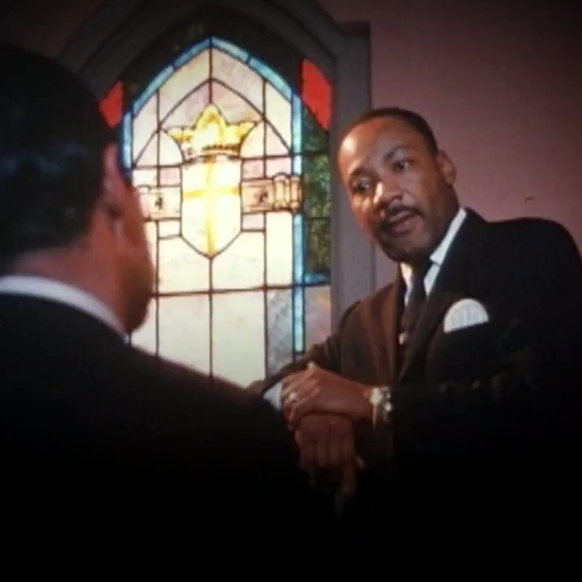
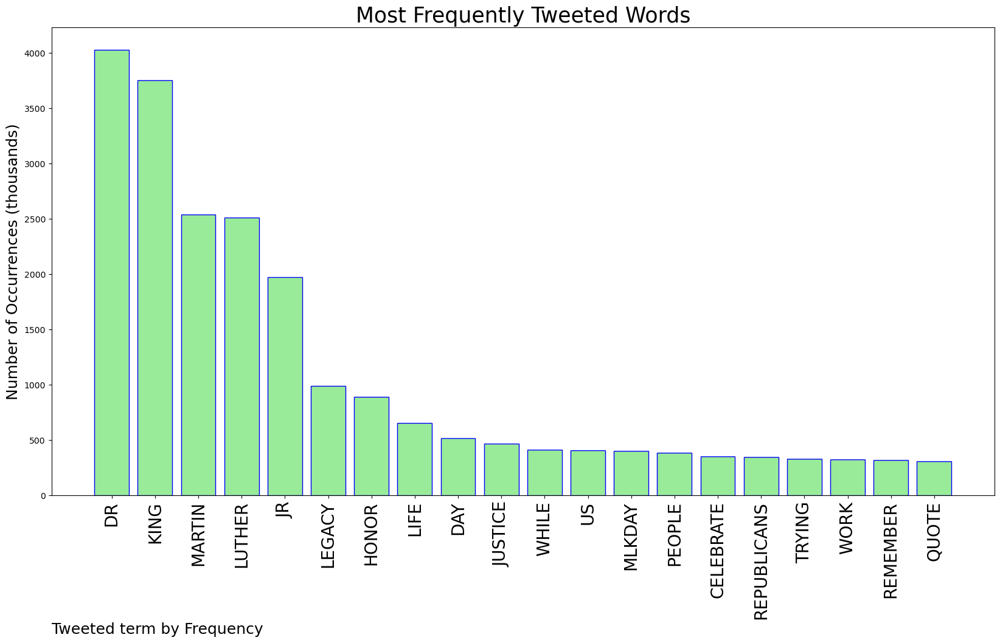

# MURCHIE85 TWITTER PROCESSING 
&#x1F34E; **TOPIC = "Dr. King"**

## AUTOMATED RESEARCH SUMMARY

*note: Image pulled from web automatically, not connected to author.
  
<b> This report is AUTOMATED and not hand crafted, it is designed for pulling metrics on a given keyword or hashtag and performs a series of reporting and analysis.</b>

|                **Sample-Tweets**        |
| :-------------: |
| RT @JDunlap1974: 🚂🚂 🇺🇲MONDAY MORNING PATRIOT FOLLOW " Dr. Martin Luther King Jr. would not support Joe Biden " DROP YOUR HANDLES AND RETWEE… |
| Today we honor the life, legacy, and leadership of Dr. Martin Luther King, Jr. Parc Gardens •… https://t.co/Tyh17QdtAl |
| RT @CAIRMN: “The time is always right to do what is right.” You could start right now by doing a small part to treat people with dignity, c… |

The most popular user is: **mathillustrated**

 RT @ava: An ignorant question leads Dr. King to offer a strong lesson in black history in two minutes flat. I can tell that he’s slightly i…

## RELATED METRICS 
| Metric | Value |
| ------------- | ------------- |
| #1 Most tweeted to  | **POTUS** |
| #2 Most tweeted to  | **DarrigoMelanie** |
| #3 Most tweeted to  | **Phil_Lewis_** |
| NewProfiles (less than 10 days) | 0.3%  |
| Tweeters with < 10 followers  | 3.24%|
| Tweeters with > 1000000 followers  | 0.22%  |

## MOST POPULAR TWEET TERMS 

| Popularity Rank  | Term |
| ------------- | ------------- |
| first  | **DR**  |
| second  | **KING**  |
| third  | **MARTIN** |
| fourth  | **LUTHER**  |
| fifth  | **JR**  |

## Twitter Bio Analysis
### SENTIMENT ANALYSIS

VIEWS WERE : **SUBJECTIVE**  (60.0%) & **NEGATIVELY-SUBJECTIVE** (6.67%) **OBJECTIVE** (33.33%)

### TWEET SAMPLE 
| Random value picked from array |
| ------------- |
|On this day we celebrate the life &amp; legacy of Dr Martin Luther King Jr. We must always strive for equality &amp; to do… https://t.co/BkI1BJD00z |

### MOST RETWEETED 

| The most retweeted user is: **mathillustrated**  |
| ------------- |
| RT @ava: An ignorant question leads Dr. King to offer a strong lesson in black history in two minutes flat. I can tell that he’s slightly i… |

### CONCLUSION & EXTERNAL ANALYSIS

*This is my [Adam McMurchie`s] opinion on the data from the tweets, it serves as no objective truth.Since the tweets themselves are a mixture of fact & opinion. 
Authors analytical summary on request.
**RECOMMENDATIONS** WILL BE UPDATED IN NEXT  24 HOURS  