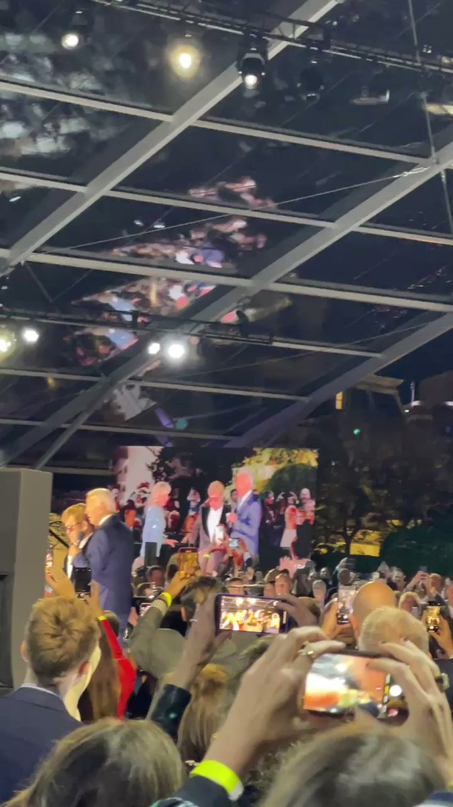
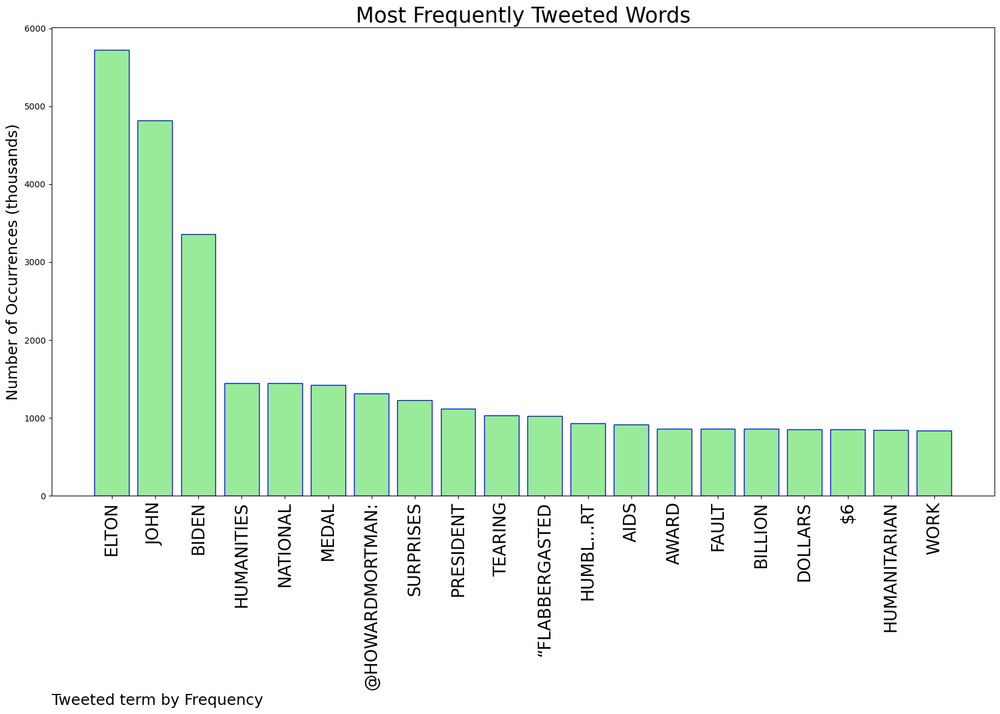
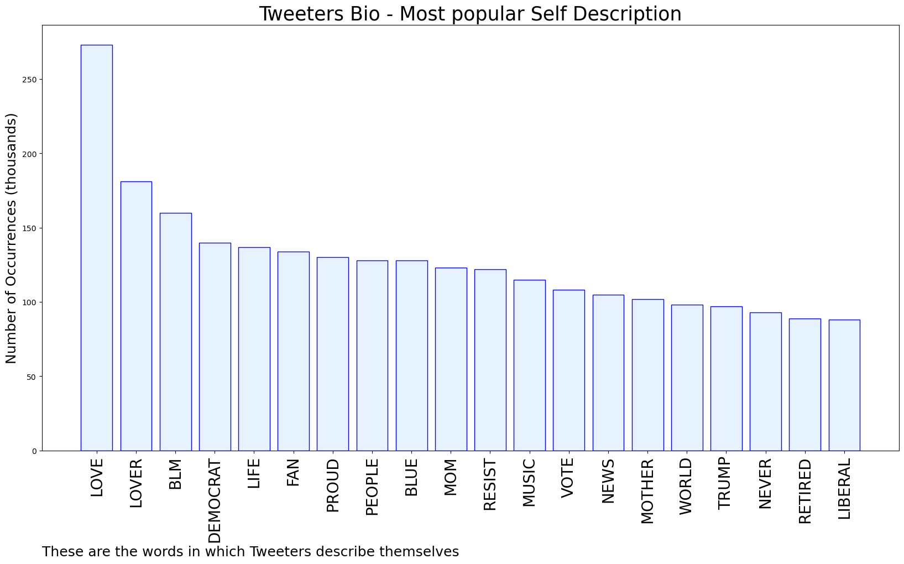

# MURCHIE85 TWITTER PROCESSING 
&#x1F34E; **TOPIC = "Elton John"**

## AUTOMATED RESEARCH SUMMARY

*note: Image pulled from web automatically, not connected to author.
  
<b> This report is AUTOMATED and not hand crafted, it is designed for pulling metrics on a given keyword or hashtag and performs a series of reporting and analysis.</b>

|                **Sample-Tweets**        |
| :-------------: |
| RT @HowardMortman: Biden Surprises Elton John With National Humanities Medal .. tearing up, Elton John said he was “flabbergasted and humbl… |
| RT @antifaoperative: President Biden gave Elton John the Humanitarian Award for his work to end AIDS and assist those living with the condi… |
| RT @TitusNation: If Elton John didn’t exist, we’d be…less. https://t.co/YSRsTnlfnT |

The most popular user is: **Hellkite422**

 RT @HowardMortman: Biden Surprises Elton John With National Humanities Medal .. tearing up, Elton John said he was “flabbergasted and humbl…

## RELATED METRICS 
| Metric | Value |
| ------------- | ------------- |
| #1 Most tweeted to  | **HowardMortman** |
| #2 Most tweeted to  | **antifaoperative** |
| #3 Most tweeted to  | **CitizenFreePres** |
| NewProfiles (less than 10 days) | 1.0%  |
| Tweeters with < 10 followers  | 3.64%|
| Tweeters with > 1000000 followers  | 0.06%  |

## MOST POPULAR TWEET TERMS 

| Popularity Rank  | Term |
| ------------- | ------------- |
| first  | **ELTON**  |
| second  | **JOHN**  |
| third  | **BIDEN** |
| fourth  | **HUMANITIES**  |
| fifth  | **NATIONAL**  |

## Twitter Bio Analysis
### SENTIMENT ANALYSIS

VIEWS WERE : **SUBJECTIVE**  (13.33%) & **NEGATIVELY-SUBJECTIVE** (0.0%) **OBJECTIVE** (86.67%)

### TWEET SAMPLE 
| Random value picked from array |
| ------------- |
|RT @RandyRRQuaid: Brandon hired “Rocket Man” Elton John to serenade a night of “Hope and Rhyme”(whatever the hell that is). I prefer a Pres… |

### MOST RETWEETED 

| The most retweeted user is: **Hellkite422**  |
| ------------- |
| RT @HowardMortman: Biden Surprises Elton John With National Humanities Medal .. tearing up, Elton John said he was “flabbergasted and humbl… |

### CONCLUSION & EXTERNAL ANALYSIS

*This is my [Adam McMurchie`s] opinion on the data from the tweets, it serves as no objective truth.Since the tweets themselves are a mixture of fact & opinion. 
Authors analytical summary on request.
**RECOMMENDATIONS** WILL BE UPDATED IN NEXT  24 HOURS  