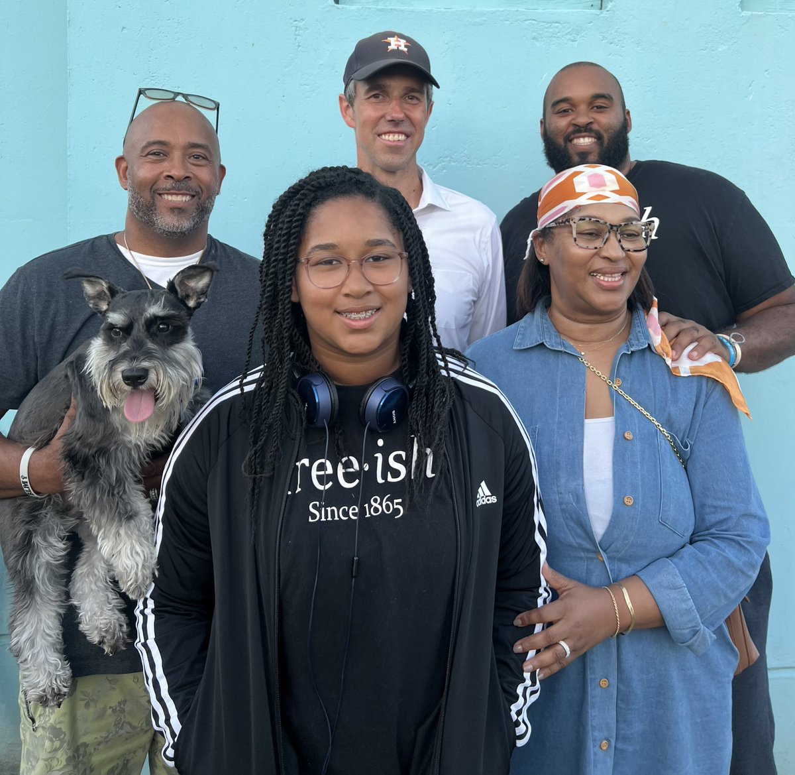
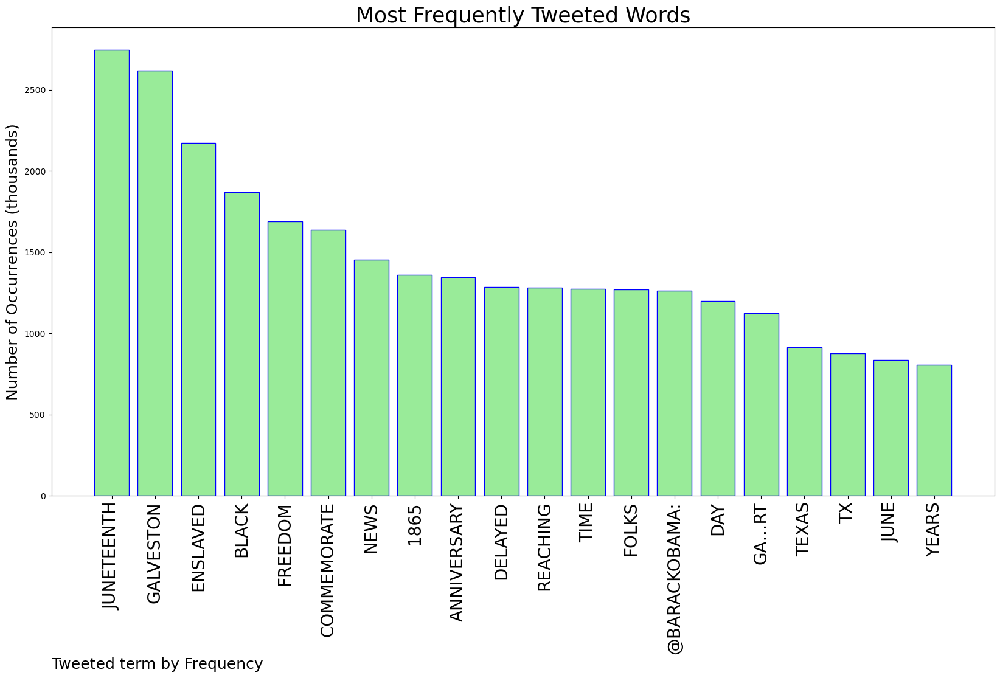
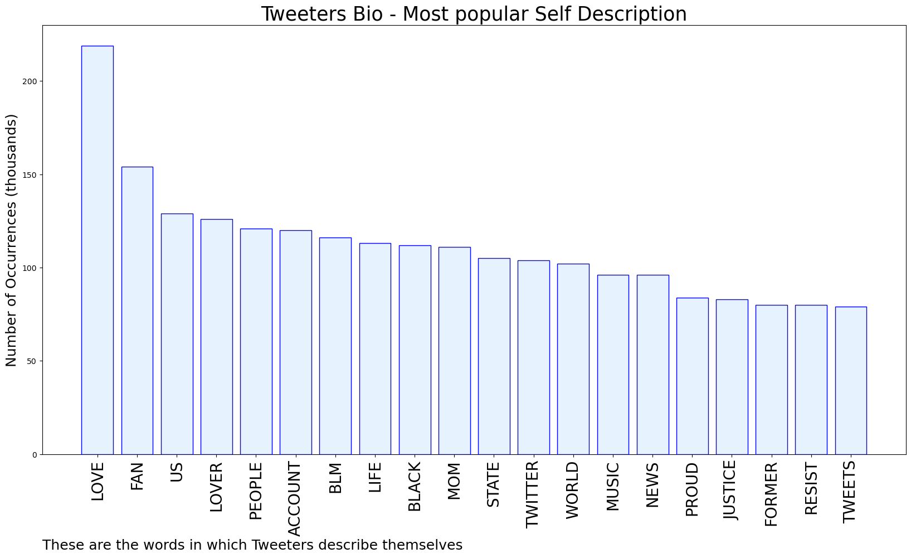

# MURCHIE85 TWITTER PROCESSING 
&#x1F34E; **TOPIC = "Galveston"**

## AUTOMATED RESEARCH SUMMARY

*note: Image pulled from web automatically, not connected to author.
  
<b> This report is AUTOMATED and not hand crafted, it is designed for pulling metrics on a given keyword or hashtag and performs a series of reporting and analysis.</b>

|                **Sample-Tweets**        |
| :-------------: |
| RT @BetoORourke: The lesson I take from Opal Lee and from those I had the chance to listen to in Galveston — the birthplace of Juneteenth —… |
| RT @RepKatiePorter: Today, we commemorate #Juneteenth: the day the Union Army marched to Galveston, TX and freed Black Americans who were i… |
| 156 yrs ago Union soldiers rode into Galveston, TX to deliver the news that all enslaved Black people were legally… https://t.co/HsVC2Gas8Y |

The most popular user is: **ybfloresca**

 RT @BarackObama: Juneteenth is a time to commemorate the anniversary of the delayed news of freedom reaching the enslaved Black folks in Ga…

## RELATED METRICS 
| Metric | Value |
| ------------- | ------------- |
| #1 Most tweeted to  | **BarackObama** |
| #2 Most tweeted to  | **BetoORourke** |
| #3 Most tweeted to  | **RepKatiePorter** |
| NewProfiles (less than 10 days) | 0.32%  |
| Tweeters with < 10 followers  | 2.48%|
| Tweeters with > 1000000 followers  | 0.14%  |

## MOST POPULAR TWEET TERMS 

| Popularity Rank  | Term |
| ------------- | ------------- |
| first  | **JUNETEENTH**  |
| second  | **GALVESTON**  |
| third  | **ENSLAVED** |
| fourth  | **BLACK**  |
| fifth  | **FREEDOM**  |

## Twitter Bio Analysis
### SENTIMENT ANALYSIS

VIEWS WERE : **SUBJECTIVE**  (26.67%) & **NEGATIVELY-SUBJECTIVE** (26.67%) **OBJECTIVE** (46.67%)

### TWEET SAMPLE 
| Random value picked from array |
| ------------- |
|RT @4PFmusic: Today we celebrate FREEDOM on the anniversary of the emancipation of the country's last enslaved African Americans in Galvest… |

### MOST RETWEETED 

| The most retweeted user is: **ybfloresca**  |
| ------------- |
| RT @BarackObama: Juneteenth is a time to commemorate the anniversary of the delayed news of freedom reaching the enslaved Black folks in Ga… |

### CONCLUSION & EXTERNAL ANALYSIS

*This is my [Adam McMurchie`s] opinion on the data from the tweets, it serves as no objective truth.Since the tweets themselves are a mixture of fact & opinion. 
Authors analytical summary on request.
**RECOMMENDATIONS** WILL BE UPDATED IN NEXT  24 HOURS  