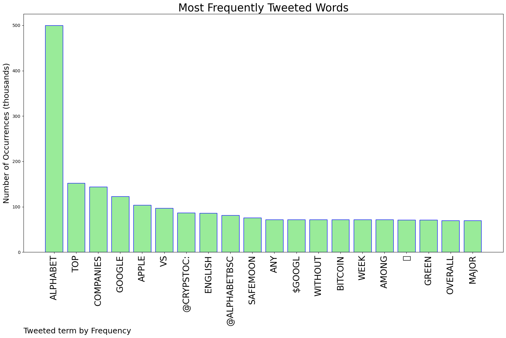
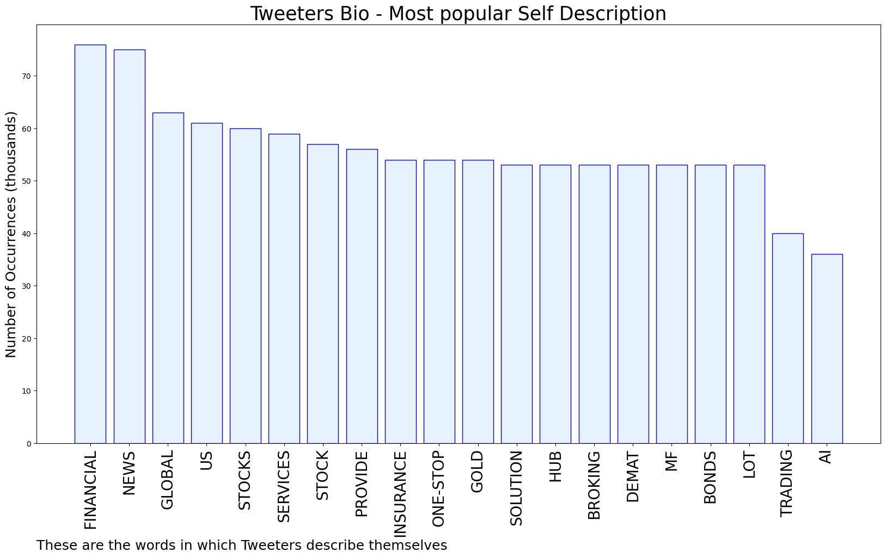
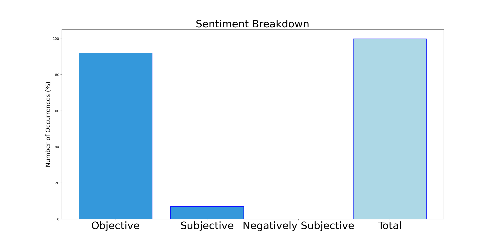

# MURCHIE85 TWITTER PROCESSING 
&#x1F34E; **TOPIC = "#alphabet"**

## AUTOMATED RESEARCH SUMMARY

*note: Image pulled from web automatically, not connected to author.
  
<b> This report is AUTOMATED and not hand crafted, it is designed for pulling metrics on a given keyword or hashtag and performs a series of reporting and analysis.</b>

|                **Sample-Tweets**        |
| :-------------: |
| RT @LHSEBLC: Mixed-Up Letter Hunt @LHSEBLC  #Alphabet #ABCs #UppercaseLetters #LowercaseLetters #LetterHunt https://t.co/I811Tvjaye |
| Helping kids learn their ABCs with fun rhymes and stories. See more at https://t.co/E56YR5kfHj #ABCs #alphabet… https://t.co/ECVBD51Mxk |
| As a device maker, #Apple isn't at risk the way a company like Alphabet is.@JimHarris #ai #alphabet #chatgpt… https://t.co/o8sPsRfBGc |

The most popular user is: **carla_pirez**

 RT @CoinMarketCap: #CMCStats: #Bitcoin vs Top Companies ✨

An overall green week. without any major changes among top companies 💪

#Apple #…

## RELATED METRICS 
| Metric | Value |
| ------------- | ------------- |
| #1 Most tweeted to  | **crypstoc** |
| #2 Most tweeted to  | **Alphabetbsc** |
| #3 Most tweeted to  | **CoinMarketCap** |
| NewProfiles (less than 10 days) | 2.18%  |
| Tweeters with < 10 followers  | 12.5%|
| Tweeters with > 1000000 followers  | 0.79%  |

## MOST POPULAR TWEET TERMS 

| Popularity Rank  | Term |
| ------------- | ------------- |
| first  | **ALPHABET**  |
| second  | **TOP**  |
| third  | **COMPANIES** |
| fourth  | **GOOGLE**  |
| fifth  | **APPLE**  |

## Twitter Bio Analysis
### SENTIMENT ANALYSIS

VIEWS WERE : **SUBJECTIVE**  (7.69%) & **NEGATIVELY-SUBJECTIVE** (0.0%) **OBJECTIVE** (92.31%)

### TWEET SAMPLE 
| Random value picked from array |
| ------------- |
|$GOOG vs. $NVDA vs. $PYPL: which stock is the best to buy? #Alphabet https://t.co/mWhuW5BcHZ https://t.co/DCkrPqToLN |

### MOST RETWEETED 

| The most retweeted user is: **carla_pirez**  |
| ------------- |
| RT @CoinMarketCap: #CMCStats: #Bitcoin vs Top Companies ✨An overall green week. without any major changes among top companies 💪#Apple #… |

### CONCLUSION & EXTERNAL ANALYSIS

*This is my [Adam McMurchie`s] opinion on the data from the tweets, it serves as no objective truth.Since the tweets themselves are a mixture of fact & opinion. 
Authors analytical summary on request.
**RECOMMENDATIONS** WILL BE UPDATED IN NEXT  24 HOURS  